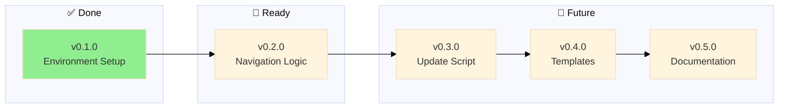

# Backstage - Changelog

> 🤖
>
> - [README](../README.md) - Our project
> - [CHANGELOG](CHANGELOG.md) — What we did
> - [ROADMAP](ROADMAP.md) — What we wanna do
> - [POLICY](POLICY.md) [project](POLICY.md) / [global](global/POLICY.md) — How we do it
> - [HEALTH](HEALTH.md) — What we accept
> - 👷 Wanna collaborate? Connect via [signal group](https://signal.group/#CjQKIKD7zJjxP9sryI9vE5ATQZVqYsWGN_3yYURA5giGogh3EhAWfvK2Fw_kaFtt-MQ6Jlp8)
>
> 🤖

---

## v0.1.0

### Environment Setup

✅ Initialize backstage repository with git, ignore rules, and IDE configuration

**Problem:** Starting fresh backstage repo needs foundational infrastructure
**Solution:** Set up version control, configure what to track/ignore, prepare IDE

**Tasks:**

- [x] Initialize git repository
- [x] Add remote (git@github.com:nonlinear/MGMT.git)
- [x] Create/verify .gitignore
- [x] Fix README navigation paths
- [x] Configure IDE project settings (VS Code workspace)
- [x] Initial commit
- [x] Push to GitHub
