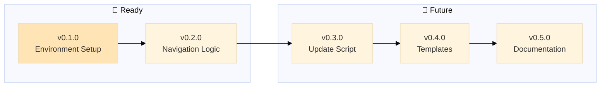

# Backstage - Stability Checks

> 🤖
>
> - [README](../README.md) - Our project
> - [CHANGELOG](CHANGELOG.md) — What we did
> - [ROADMAP](ROADMAP.md) — What we wanna do
> - [POLICY](POLICY.md) [project](POLICY.md) / [global](global/POLICY.md) — How we do it
> - [CHECKS](CHECKS.md) — What we accept
> - 👷 Wanna collaborate? Connect via [signal group](https://signal.group/#CjQKIKD7zJjxP9sryI9vE5ATQZVqYsWGN_3yYURA5giGogh3EhAWfvK2Fw_kaFtt-MQ6Jlp8)
>
> 🤖



---

## 🎯 Backstage-Specific Project Checks

> **Note:** This section contains checks specific to backstage as a project, not universal checks.
> Universal checks live in [global/CHECKS.md](global/CHECKS.md)

**Backstage is meta:** It's both a framework (global/) AND a project using that framework (root files).

---

### 📂 Dual-Layer Structure

**Test: Global and project files coexist properly**

```bash
# Global framework files must exist
test -d global && \
test -f global/POLICY.md && \
test -f global/CHECKS.md && \
test -f global/update-backstage.py && \
echo '✅ Global framework files exist' || echo '❌ Missing global framework'
```

Expected: Global framework complete
Pass: ✅ Global framework files exist

**Test: Project status files exist at root**

```bash
test -f README.md && \
test -f ROADMAP.md && \
test -f CHANGELOG.md && \
test -f POLICY.md && \
test -f CHECKS.md && \
echo '✅ Project status files exist' || echo '❌ Missing project files'
```

Expected: Project files at root level
Pass: ✅ Project status files exist

---

### 🔄 Self-Reference Consistency

**Test: Backstage follows its own rules**

```bash
# backstage must have navigation blocks (per its own global/CHECKS.md)
grep -q '> 🤖' README.md && \
grep -q '> 🤖' ROADMAP.md && \
grep -q '> 🤖' CHANGELOG.md && \
echo '✅ Backstage follows navigation block rule' || echo '❌ Backstage violates its own rules'
```

Expected: Backstage practices what it preaches
Pass: ✅ Self-consistent

**Test: Backstage has epics in ROADMAP**

```bash
grep -E "^## v[0-9]+\.[0-9]+\.[0-9]+" ROADMAP.md >/dev/null && \
echo '✅ Backstage tracks its own development' || echo '⚠️ No epics - backstage not using epic format'
```

Expected: Backstage uses epic format for its own development
Pass: ✅ Epics exist

---

### 📝 Documentation Clarity

**Test: Global vs Project distinction is clear**

```bash
# global/POLICY.md should say "universal" or "all projects"
# POLICY.md should reference global or say "backstage-specific"
grep -qi "universal\|all projects" global/POLICY.md && \
echo '✅ Clear global vs project distinction' || echo '⚠️ Clarify what is universal vs project-specific'
```

Expected: Documentation makes layering clear
Pass: ✅ Distinction documented

---

### 🔗 Prompt Files Reference Correct Paths

**Test: backstage-start prompt references global files correctly**

```bash
# backstage-start should tell AIs to read global/POLICY.md for epic format
grep -q "global/POLICY.md" .github/prompts/backstage-start.prompt.md && \
echo '✅ Prompt references global policy' || echo '⚠️ Prompt may have hardcoded paths'
```

Expected: Prompts reference global/ for universal rules
Pass: ✅ Prompts reference framework correctly

---

### 🎯 Meta-Awareness

**Test: README explains the meta nature**

```bash
grep -qi "framework\|polycentric\|meta" README.md && \
echo '✅ README explains backstage is both framework and project' || echo '⚠️ Add explanation of meta nature'
```

Expected: Users understand backstage's dual role
Pass: ✅ Meta nature documented

---

## Summary

**Backstage project-specific checks ensure:**

- ✅ Dual-layer structure (global framework + project files)
- ✅ Backstage follows its own rules (dogfooding)
- ✅ Clear documentation of what's universal vs project-specific
- ✅ Prompts reference the framework correctly
- ✅ Meta nature is explained to users

---

**Run all checks:**

````bash
# Universal checks (apply to all backstage projects)
bash -c "$(grep -A 1 '^```bash' global/CHECKS.md | grep -v '^```' | grep -v '^--$')"

# Backstage-specific checks (this project only)
bash -c "$(grep -A 1 '^```bash' CHECKS.md | grep -v '^```' | grep -v '^--$')"
````

---

**Last updated:** 2026-01-28
**Version:** 0.1.0 (backstage tracking its own development)
