```mermaid
%%{init: {'theme':'base', 'themeVariables': { 'fontSize':'14px'}}}%%
graph LR
    subgraph "🎯 Ready"
        V01[v0.1.0<br/>Environment Setup]
        V02[v0.2.0<br/>Navigation Logic]
    end

    subgraph "📅 Future"
        V03[v0.3.0<br/>Update Script]
        V04[v0.4.0<br/>Templates]
        V05[v0.5.0<br/>Documentation]
    end

    V01 --> V02
    V02 --> V03
    V03 --> V04
    V04 --> V05

    style V01 fill:#FFE4B5
```

# MGMT - Stability Checks

> 🤖
>
> - [README](../README.md) - Our project
> - [CHANGELOG](CHANGELOG.md) — What we did
> - [ROADMAP](ROADMAP.md) — What we wanna do
> - [POLICY](POLICY.md) [project](POLICY.md) / [global](global/POLICY.md) — How we do it
> - [CHECKS](CHECKS.md) — What we accept
> - 👷 Wanna collaborate? Connect via [signal group](https://signal.group/#CjQKIKD7zJjxP9sryI9vE5ATQZVqYsWGN_3yYURA5giGogh3EhAWfvK2Fw_kaFtt-MQ6Jlp8)
>
> 🤖

