```mermaid
%%{init: {'theme':'base', 'themeVariables': { 'fontSize':'14px'}}}%%
graph LR
    subgraph "🎯 Ready"
        V01[v0.1.0<br/>Environment Setup]
        V02[v0.2.0<br/>Navigation Logic]
    end

    subgraph "📅 Future"
        V03[v0.3.0<br/>Update Script]
        V04[v0.4.0<br/>Templates]
        V05[v0.5.0<br/>Documentation]
    end

    V01 --> V02
    V02 --> V03
    V03 --> V04
    V04 --> V05

    style V01 fill:#FFE4B5
```

# Backstage - Health Metrics

> 🤖
>
> - [README](../README.md) - Our project
> - [CHANGELOG](CHANGELOG.md) — What we did
> - [ROADMAP](ROADMAP.md) — What we wanna do
> - [POLICY](POLICY.md) [project](POLICY.md) / [global](global/POLICY.md) — How we do it
> - [HEALTH](HEALTH.md) — What we accept
> - 👷 Wanna collaborate? Connect via [signal group](https://signal.group/#CjQKIKD7zJjxP9sryI9vE5ATQZVqYsWGN_3yYURA5giGogh3EhAWfvK2Fw_kaFtt-MQ6Jlp8)
>
> 🤖



---

## 🎯 Backstage-Specific Project Checks

> **Note:** This section contains checks specific to backstage as a project, not universal checks.
> Universal checks live in [global/HEALTH.md](global/HEALTH.md)

**Backstage is meta:** It's both a framework (global/) AND a project using that framework (root files).

---

### 📂 Dual-Layer Structure

**Test: Global and project files coexist properly**

```bash
# Global framework files must exist
test -d global && \
test -f global/POLICY.md && \
test -f global/HEALTH.md && \
test -f global/backstage-update.py && \
echo '✅ Global framework files exist' || echo '❌ Missing global framework'
```

Expected: Global framework complete
Pass: ✅ Global framework files exist

**Test: Project status files exist at root**

```bash
test -f README.md && \
test -f ROADMAP.md && \
test -f CHANGELOG.md && \
test -f POLICY.md && \
test -f HEALTH.md && \
echo '✅ Project status files exist' || echo '❌ Missing project files'
```

Expected: Project files at root level
Pass: ✅ Project status files exist

---

### 🔗 Skill Symlink (Epic Development Only)

**Context:** When developing the OpenClaw skill (`epic/v0.3.0-openclaw-skill`), we need to edit source and test instantly.

**Setup (at epic start):**

```bash
# Replace placeholder with symlink to source
rm -rf ~/.openclaw/skills/backstage-placeholder
ln -s ~/Documents/backstage/skill ~/.openclaw/skills/backstage
```

**Verify:**

```bash
ls -la ~/.openclaw/skills/backstage | grep -q "skill$" && \
echo '✅ Symlink active (edit source, test instantly)' || \
echo '❌ Symlink missing or wrong target'
```

**Teardown (before merge to main OR backstage close):**

```bash
# Remove symlink
rm ~/.openclaw/skills/backstage

# Restore original placeholder (until skill is published)
git checkout ~/.openclaw/skills/backstage-placeholder
```

**Why:** Edit `~/Documents/backstage/skill/`, test via OpenClaw instantly. Keep `.openclaw/skills/` clean when epic closes.

**🚨 CRITICAL:** Remove symlink before merging to main. Other users shouldn't have dev symlinks.

---

### 🔄 Self-Reference Consistency

**Test: Backstage follows its own rules**

```bash
# backstage must have navigation blocks (per its own global/HEALTH.md)
grep -q '> 🤖' README.md && \
grep -q '> 🤖' ROADMAP.md && \
grep -q '> 🤖' CHANGELOG.md && \
echo '✅ Backstage follows navigation block rule' || echo '❌ Backstage violates its own rules'
```

Expected: Backstage practices what it preaches
Pass: ✅ Self-consistent

**Test: Version in navigation block matches latest CHANGELOG epic**

```bash
# Extract version from global/POLICY.md navigation template
NAV_VERSION=$(grep "backstage rules.*v[0-9]" global/POLICY.md | sed 's/.*v\([0-9.]*\).*/\1/')

# Extract latest version from CHANGELOG
CHANGELOG_VERSION=$(grep -m1 "^## v[0-9]" CHANGELOG.md | sed 's/^## v//' | cut -d' ' -f1)

# Compare
if [ "$NAV_VERSION" = "$CHANGELOG_VERSION" ]; then
  echo "✅ Version sync correct: v$NAV_VERSION"
else
  echo "❌ FAIL: Nav template has v$NAV_VERSION but CHANGELOG latest is v$CHANGELOG_VERSION"
  echo "Fix: Update global/POLICY.md navigation template version"
fi
```

Expected: Versions match (navigation template = latest CHANGELOG epic)
Pass: 🚨 **CRITICAL** - Must pass before merging epic to main

**Why this matters:**

- Projects check nav block version to know framework version
- `/backstage-update` compares project version vs latest to show updates
- Mismatch breaks version detection for all projects using backstage

**Test: Backstage has epics in ROADMAP**

```bash
grep -E "^## v[0-9]+\.[0-9]+\.[0-9]+" ROADMAP.md >/dev/null && \
echo '✅ Backstage tracks its own development' || echo '⚠️ No epics - backstage not using epic format'
```

Expected: Backstage uses epic format for its own development
Pass: ✅ Epics exist

---

### 📝 Documentation Clarity

**Test: Global vs Project distinction is clear**

```bash
# global/POLICY.md should say "universal" or "all projects"
# POLICY.md should reference global or say "backstage-specific"
grep -qi "universal\|all projects" global/POLICY.md && \
echo '✅ Clear global vs project distinction' || echo '⚠️ Clarify what is universal vs project-specific'
```

Expected: Documentation makes layering clear
Pass: ✅ Distinction documented

---

### 🔗 Prompt Files Reference Correct Paths

**Test: backstage-start prompt references global files correctly**

```bash
# backstage-start should tell AIs to read global/POLICY.md for epic format
grep -q "global/POLICY.md" .github/prompts/backstage-start.prompt.md && \
echo '✅ Prompt references global policy' || echo '⚠️ Prompt may have hardcoded paths'
```

Expected: Prompts reference global/ for universal rules
Pass: ✅ Prompts reference framework correctly

---

### 🎯 Meta-Awareness

**Test: README explains the meta nature**

```bash
grep -qi "framework\|polycentric\|meta" README.md && \
echo '✅ README explains backstage is both framework and project' || echo '⚠️ Add explanation of meta nature'
```

Expected: Users understand backstage's dual role
Pass: ✅ Meta nature documented

---

## 🏥 Product Health Metrics

> **What makes backstage "production ready"?**
>
> These metrics define system health across all workflow components.

### Workflow Component Health

**Success threshold:** Each component must pass ≥90% of its metrics to ship.

---

#### backstage-start Health (8 metrics)

**Purpose:** Pre-commit validation, doc sync, determine next steps

| #   | Metric                       | Type   | Test                                  |
| --- | ---------------------------- | ------ | ------------------------------------- |
| 1   | Reads README 🤖 block        | MUST   | Has STEP 0 dedicated to finding paths |
| 2   | Runs global + project CHECKS | MUST   | Documents polycentric governance      |
| 3   | Stops on check failures      | MUST   | STEP 2C validation gate exists        |
| 4   | Auto-updates ROADMAP         | SHOULD | STEP 3A marks checkboxes              |
| 5   | Auto-updates CHANGELOG       | SHOULD | STEP 3B moves complete epics          |
| 6   | References global/POLICY.md  | MUST   | NO hardcoded epic format examples     |
| 7   | Provides 5 outcomes          | MUST   | STEP 4 documents all states           |
| 8   | Shows time context           | SHOULD | Displays "last worked X ago"          |

**Test:**

```bash
# Metric 6: Critical - must reference global/POLICY.md, not hardcode format
! grep -q "## v0.*\[🚧\]" .github/prompts/backstage-start.prompt.md && \
grep -q "global/POLICY.md.*epic.*format" .github/prompts/backstage-start.prompt.md && \
echo '✅ References global/POLICY.md for epic syntax' || \
echo '❌ FAIL: Epic format hardcoded in prompt'
```

Expected: No epic format examples, has reference to global/POLICY.md
Pass: ✅ Must pass before shipping

---

#### backstage-close Health (6 metrics)

**Purpose:** Safe pause, share progress, preserve context

| #   | Metric                 | Type   | Test                         |
| --- | ---------------------- | ------ | ---------------------------- |
| 1   | Runs CHECKS validation | MUST   | Step 1 documented            |
| 2   | Handles check failures | MUST   | Step 2 adds fixes to ROADMAP |
| 3   | Commit + push on pass  | MUST   | Step 3 has git commands      |
| 4   | Victory lap brief      | SHOULD | Respects user context        |
| 5   | Body check reminder    | SHOULD | Step 5 asks physical needs   |
| 6   | Fix task format        | SHOULD | Uses 🔧 **FIX:** prefix      |

**Test:**

```bash
grep -q "Run.*CHECKS" .github/prompts/backstage-close.prompt.md && \
grep -q "🔧.*FIX:" .github/prompts/backstage-close.prompt.md && \
grep -q "git commit" .github/prompts/backstage-close.prompt.md && \
echo '✅ backstage-close has all critical steps' || \
echo '❌ FAIL: Missing required workflow steps'
```

Expected: All steps documented
Pass: ✅ backstage-close is production ready

---

#### backstage-update (prompt) Health (7 metrics)

**Purpose:** Update global backstage files from GitHub repo

| #   | Metric                   | Type   | Test                               |
| --- | ------------------------ | ------ | ---------------------------------- |
| 1   | Check current version    | MUST   | Step 1 reads from global/README.md |
| 2   | Fetch remote CHANGELOG   | MUST   | Step 2 has fetch logic             |
| 3   | Compare versions         | MUST   | Step 3 shows version diff          |
| 4   | Show changes per epic    | SHOULD | Step 3 lists improvements          |
| 5   | User confirmation        | MUST   | Step 4 asks yes/no                 |
| 6   | Calls .py script         | MUST   | Step 5 runs backstage-update.py    |
| 7   | Suggests backstage-start | SHOULD | Step 6 reminds validation          |

**Test:**

```bash
# Blocked until repo published
test -f .github/prompts/backstage-update.prompt.md && \
echo '✅ Prompt exists (blocked on repo publication)' || \
echo '❌ FAIL: Prompt missing'
```

Expected: Prompt exists with all steps
Pass: 🚧 Blocked on GitHub repo publication

---

#### backstage-update.py Health (13 metrics)

**Purpose:** Download and overwrite global framework files

**Scaffolding mode (7 metrics):**

| #   | Metric                  | Type   | Test                        |
| --- | ----------------------- | ------ | --------------------------- |
| 1   | Detect missing files    | MUST   | Checks if ROADMAP.md exists |
| 2   | Copy ROADMAP template   | MUST   | From templates/             |
| 3   | Copy CHANGELOG template | MUST   | From templates/             |
| 4   | Copy POLICY template    | MUST   | From templates/             |
| 5   | Copy CHECKS template    | MUST   | From templates/             |
| 6   | Copy .github/prompts    | MUST   | All 3 workflow prompts      |
| 7   | Explain what files do   | SHOULD | User guidance               |

**Update mode (6 metrics):**

| #   | Metric                    | Type   | Test                          |
| --- | ------------------------- | ------ | ----------------------------- |
| 1   | Fetch global/POLICY.md    | MUST   | From GitHub raw URL           |
| 2   | Fetch global/HEALTH.md    | MUST   | From GitHub raw URL           |
| 3   | Fetch backstage-update.py | MUST   | Self-update capability        |
| 4   | Fetch 3 prompt files      | MUST   | All backstage-\*.prompt.md    |
| 5   | Preserve project files    | MUST   | Never touch ROADMAP/CHANGELOG |
| 6   | Show progress             | SHOULD | Download indicators           |

**Test:**

```bash
# Check if it's still a placeholder
grep -q "This script is a placeholder" global/backstage-update.py && \
echo '❌ FAIL: Still placeholder (0% implementation)' || \
echo '✅ Implementation exists'
```

Expected: No placeholder message, has real implementation
Pass: ❌ Currently 0% implemented - **BLOCKS v0.2.0 RELEASE**

---

### Overall System Health

**Ship criteria:**

- [ ] backstage-start: ≥90% (currently 87.5% - needs metric 6 fix)
- [x] backstage-close: ≥90% (currently 100% ✅)
- [ ] backstage-update (prompt): ≥90% (currently 86% - blocked on infra)
- [ ] backstage-update.py: ≥90% (currently 0% - not implemented)

**v0.2.0 Shippability:** ❌ **2 of 4 components failing**

**Action items:**

1. Fix backstage-start metric 6 (remove hardcoded epic format)
2. Implement backstage-update.py (0% → 100%)
3. Publish backstage repo to GitHub (unblocks update testing)

---

## Summary

**Backstage project-specific checks ensure:**

- ✅ Dual-layer structure (global framework + project files)
- ✅ Backstage follows its own rules (dogfooding)
- ✅ Clear documentation of what's universal vs project-specific
- ✅ Prompts reference the framework correctly
- ✅ Meta nature is explained to users

---

**Run all checks:**

````bash
# Universal checks (apply to all backstage projects)
bash -c "$(grep -A 1 '^```bash' global/HEALTH.md | grep -v '^```' | grep -v '^--$')"

# Backstage-specific checks (this project only)
bash -c "$(grep -A 1 '^```bash' HEALTH.md | grep -v '^```' | grep -v '^--$')"
````

---

**Last updated:** 2026-01-28
**Version:** 0.1.0 (backstage tracking its own development)
