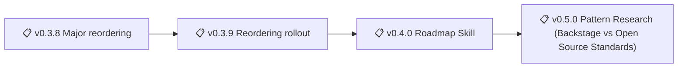

# Backstage

A protocol for AI-assisted development that allows you to be in your zone while AI ensures best practices:

- sandboxing ideas on epics, sandboxing experimentations on branches (no more messy fixes going all places at once)
- enforcing policies for documentation
- checks for stability
- automatic documentation of epic notes
- automatic documentation for these pesky knowledge gaps (no more your AI running in circles on same failed experiments)

> Main is protected with only stable, vetted code + documentation. Branches allow free experimentation to dig in. Get your hyperfocus AND stability.

> Make AI your secretary: "I had this idea about XYZ, create a new epic for it" (instead of coding it now, getting confused because mixing priorities)

---

## Installation & usage

1. **Via Prompt**
   1. Install [backstage prompt](https://github.com/nonlinear/backstage/blob/main/backstage.prompt.md)
   2. Run `/backstage` in your project
2. **Via OpenClaw Skill**
   1. Install skill: `clawdhub install backstage`
   2. Say `good morning, <project-path>` to start the workflow

---

## Usage

Running skill regularly acts as anti-drift, by enforcing deterministic and interpretative checks, both local and global (local wins if conflict), like:

- [Forces work in epic branches, keeping main clean](backstage/checks/global/epic-branch.sh)
- [Commit before edit](backstage/checks/global/git.sh)
- [Completed work marked in ROADMAP](backstage/checks/global/roadmap-tasks.sh)
- [Semantic versioning](backstage/checks/global/semver-syntax.sh)
- [Documentation matches system reality](backstage/checks/global/doc-parity.md)
- [Merge to main when epic complete](backstage/checks/global/merge-to-main.md)
- (or write your own)

View [skill diagram](skills/backstage/SKILL.md#workflow-diagram) of what it does every time it runs

📖 [How to write your own checks](backstage/ROADMAP.md) (see epic v1.0.2: Writing Custom Checks)

## Philosophy: Polycentric Governance

Backstage follows a **polycentric structure**—not hierarchical "levels" but **overlapping jurisdictions** where global and project concerns coexist with two centers of authority: global (universal) and project (local, free to extend or deviate)

- 📗 Learn more about [polycentric governance here](polycentric-governance.md)
- 👷 Join [backstage signal group](https://signal.group/#CjQKIAinD80_cDPyyVP0xRDUQ9Io2PMN9DeJSBzKM1mrXpEYEhAMdewh5mBrTUcmujYApgMx)

---

> 🤖
>
> This project follows [backstage protocol](https://github.com/nonlinear/backstage) v1.0.0
>
> [README](README.md) 👏 [ROADMAP](backstage/ROADMAP.md) 👏 [CHANGELOG](backstage/CHANGELOG.md) 👏 policies: [local](backstage/policies/local/) 5, [global](backstage/policies/global/) 11 👏 checks: [local](backstage/checks/local/) 4, [global](backstage/checks/global/) 11
>
> 🤖

