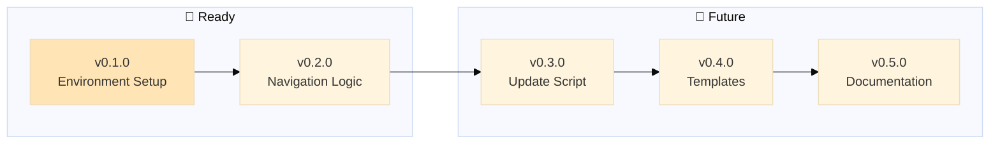

# Backstage

A project management system for AI-assisted development that allows you to be in your zone while AI ensures best practices:

- sandboxing ideas on epics, sandboxing experimentations on branches (no more messy fixes going all places at once)
- enforcing policies for documentation
- checks for stability
- automatic documentation of epic notes
- automatic documentation for these pesky knowledge gaps (no more your AI running in circles on same failed experiments)

> Main is protected with only stable, vetted code + documentation. Branches allow free experimentation to dig in. Get your hyperfocus AND stability.

> Make AI your secretary: "I had this idea about XYZ, create a new epic for it" (instead of coding it now, getting confused because mixing priorities)

---

> 🤖
>
> - [README](README.md) - Our project
> - [CHANGELOG](CHANGELOG.md) — What we did
> - [ROADMAP](ROADMAP.md) — What we wanna do
> - POLICY ([project](POLICY.md), [global](global/POLICY.md)) — How we do it
> - HEALTH ([project](HEALTH.md), [global](global/HEALTH.md)) — What we accept
>
> 🤖

---

## Installation & Usage

### Via Prompt
1. Install backstage prompt in your AI assistant
2. Run `/backstage-start` in your project
3. Prompt auto-installs backstage if needed, then starts workflow

### Via Skill (OpenClaw)
1. Install skill: `clawdhub install backstage` or `ln -s ~/path/to/backstage/skill ~/.openclaw/skills/backstage`
2. Run `backstage start` in your project
3. Skill auto-installs backstage if needed, then starts workflow

**Both methods:**
- Detect if project has backstage
- Install templates + global/ if missing
- Check for updates (once/day)
- Run POLICY + HEALTH protocols
- Show active epics

---

## Philosophy: Polycentric Governance

Backstage follows a **polycentric structure**—not hierarchical "levels" but **overlapping jurisdictions** where global and project concerns coexist with two centers of authority: global (universal) and project (local, free to extend or deviate)

- 📗 Learn more about [polycentric governance here](polycentric-governance.md)
- 👷 Join [backstage signal group](https://signal.group/#CjQKIAinD80_cDPyyVP0xRDUQ9Io2PMN9DeJSBzKM1mrXpEYEhAMdewh5mBrTUcmujYApgMx)
