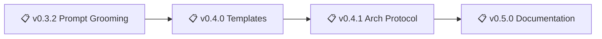

# Backstage

A project management system for AI-assisted development that allows you to be in your zone while AI ensures best practices:

- sandboxing ideas on epics, sandboxing experimentations on branches (no more messy fixes going all places at once)
- enforcing policies for documentation
- checks for stability
- automatic documentation of epic notes
- automatic documentation for these pesky knowledge gaps (no more your AI running in circles on same failed experiments)

> Main is protected with only stable, vetted code + documentation. Branches allow free experimentation to dig in. Get your hyperfocus AND stability.

> Make AI your secretary: "I had this idea about XYZ, create a new epic for it" (instead of coding it now, getting confused because mixing priorities)

---

## Installation & usage

1. **Via Prompt**
   1. Install [backstage prompt](https://github.com/nonlinear/backstage/blob/main/backstage.prompt.md)
   2. Run `/backstage` in your project
2. **Via OpenClaw Skill**
   1. Install skill: `clawdhub install backstage` 
   2. Say `backstage <project-path>` to start the workflow

Prompt/skill auto-installs backstage if needed, then [starts workflow](epic-notes/v0.3.0-openclaw-skill-prompt.md#workflow)

---

## Philosophy: Polycentric Governance

Backstage follows a **polycentric structure**—not hierarchical "levels" but **overlapping jurisdictions** where global and project concerns coexist with two centers of authority: global (universal) and project (local, free to extend or deviate)

- 📗 Learn more about [polycentric governance here](polycentric-governance.md)
- 👷 Join [backstage signal group](https://signal.group/#CjQKIAinD80_cDPyyVP0xRDUQ9Io2PMN9DeJSBzKM1mrXpEYEhAMdewh5mBrTUcmujYApgMx)

---

> 🤖
> | Backstage files | Description |
> | ---------------------------------------------------------------------------- | ------------------ |
> | [README](backstage/README.md) | Our project |
> | [CHANGELOG](backstage/CHANGELOG.md) | What we did |
> | [ROADMAP](backstage/ROADMAP.md) | What we wanna do |
> | POLICY: [project](backstage/POLICY.md), [global](backstage/global/POLICY.md) | How we go about it |
> | HEALTH: [project](backstage/HEALTH.md), [global](backstage/global/HEALTH.md) | What we accept |
> | We use **[backstage protocol](https://github.com/nonlinear/backstage)**, v0.3.4 |
> 🤖

