# Backstage

An anti-drift protocol for AI-assisted development, so you're in the zone while AI enforces:

- [sandboxing ideas on epics, and epics on branches](backstage/checks/global/epic-branch.sh) (no more messy fixes going all places at once)
- [enforcing parity between docs and system](backstage/checks/global/doc-parity.md)
- [completion of tasks](backstage/checks/global/roadmap-tasks.sh)
- [automatic documentation of epic notes](backstage/checks/global/epic-notes-link.sh)
- [automatic documentation for these pesky knowledge gaps](backstage/checks/global/gaps-list.sh) (no more your AI running in circles on same failed experiments)
- [and others](backstage/checks/global/gaps-list.sh) (or write your own)

> Main is protected with only stable, vetted code + documentation. Branches allow free experimentation to dig in. Get your hyperfocus AND stability.

> Make AI your secretary: "I had this idea about XYZ, create a new epic for it" (instead of coding it now, getting confused because mixing priorities)

---

## Installation & usage

1. **Via Prompt**
   1. Install [backstage prompt](https://github.com/nonlinear/backstage/blob/main/backstage.prompt.md)
   2. Run `/backstage` in your project
2. **Via OpenClaw Skill**
   1. Install skill: `clawdhub install backstage`
   2. Say `good morning, <project-path>` to start the workflow

---

## Usage

Running skill regularly enforces anti-drift, with deterministic and interpretative checks, both local and global (local wins if conflict).

```mermaid
flowchart TD
    READ_CHK["Read checks/<br/>global + local<br/>[Deterministic .sh + Interpretive .md]"]

    CONFLICT{Conflict?}
    MERGE[Merge compatible rules]
    LOCAL[Local wins]

    AI["AI interprets .md checks<br/>[Contextual enforcement]"]
    SH["Bash executes .sh checks<br/>[Deterministic validation]"]

    AI_ACT[✅ Enforce or discuss]
    AI_AMBIG[⚠️ Ask user]

    SH_OK[✅ All checks pass]
    SH_FAIL[❌ Checks failed]

    REPORT["Report:<br/>📋 Interpretive (always ✅)<br/>🔍 Deterministic (✅/❌)"]

    READ_CHK --> CONFLICT
    CONFLICT -->|No| MERGE
    CONFLICT -->|Yes| LOCAL
    MERGE --> AI
    MERGE --> SH
    LOCAL --> AI
    LOCAL --> SH

    AI -->|Clear| AI_ACT
    AI -->|Ambiguous| AI_AMBIG

    SH -->|Pass| SH_OK
    SH -->|Fail| SH_FAIL

    AI_ACT --> REPORT
    AI_AMBIG --> REPORT
    SH_OK --> REPORT
    SH_FAIL --> REPORT
```

## Philosophy: Polycentric Governance

Backstage follows a **polycentric structure**—not hierarchical "levels" but **overlapping jurisdictions** where global and project concerns coexist with two centers of authority: global (universal) and project (local, free to extend or deviate)

- 📗 Learn more about [polycentric governance here](polycentric-governance.md)
- 👷 Join [backstage signal group](https://signal.group/#CjQKIAinD80_cDPyyVP0xRDUQ9Io2PMN9DeJSBzKM1mrXpEYEhAMdewh5mBrTUcmujYApgMx)

---

> 🤖
>
> This project follows [backstage protocol](https://github.com/nonlinear/backstage) v1.0.1
>
> [README](README.md) 👠[ROADMAP](backstage/ROADMAP.md) 👠[CHANGELOG](backstage/CHANGELOG.md) 👠checks: [local](backstage/checks/local/) 10, [global](backstage/checks/global/) 26
>
> 🤖
