# Backstage

**Status:** Published Skill  
**ClawHub:** https://clawhub.com/nonlinear/backstage

An anti-drift protocol for AI-assisted development, so you're in the zone while AI enforces:

- [sandboxing ideas on epics, and epics on branches](backstage/checks/global/epic-branch.sh) (no more messy fixes going all places at once)
- [enforcing parity between docs and system](backstage/checks/global/doc-parity.md)
- [completion of tasks](backstage/checks/global/roadmap-tasks.sh)
- [automatic documentation of epic notes](backstage/checks/global/epic-notes-link.sh)
- [automatic documentation for these pesky knowledge gaps](backstage/checks/global/gaps-list.sh) (no more your AI running in circles on same failed experiments)
- [and others](backstage/checks/global/gaps-list.sh) (or write your own)

> Main is protected with only stable, vetted code + documentation. Branches allow free experimentation to dig in. Get your hyperfocus AND stability.

> Make AI your secretary: "I had this idea about XYZ, create a new epic for it" (instead of coding it now, getting confused because mixing priorities)

---

## Installation & usage

1. **Via Prompt**
   1. Install [backstage prompt](https://github.com/nonlinear/backstage/blob/main/backstage.prompt.md)
   2. Run `/backstage` in your project
2. **Via OpenClaw Skill**
   1. Install skill: `openclaw skill install nonlinear/backstage`
   2. Say `good morning, <project-path>` to start the workflow

---

## Usage

Running skill regularly enforces anti-drift, with deterministic and interpretative checks, both local and global (local wins if conflict).

```mermaid
flowchart TD
    READ_CHK["Read checks/<br/>global + local<br/>[Deterministic .sh + Interpretive .md]"]
    
    CONFLICT{Conflict?}
    MERGE[Merge compatible rules]
    LOCAL[Local wins]
    
    AI["AI interprets .md checks<br/>[Contextual enforcement]"]
    SH["Bash executes .sh checks<br/>[Deterministic validation]"]
    
    AI_ACT[✅ Enforce or discuss]
    AI_AMBIG[⚠️ Ask user]
    
    SH_OK[✅ All checks pass]
    SH_FAIL[❌ Checks failed]
    
    REPORT["Report:<br/>📋 Interpretive (always ✅)<br/>🔍 Deterministic (✅/❌)"]
    
    READ_CHK --> CONFLICT
    CONFLICT -->|No| MERGE
    CONFLICT -->|Yes| LOCAL
    MERGE --> AI
    MERGE --> SH
    LOCAL --> AI
    LOCAL --> SH
    
    AI -->|Clear| AI_ACT
    AI -->|Ambiguous| AI_AMBIG
    
    SH -->|Pass| SH_OK
    SH -->|Fail| SH_FAIL
    
    AI_ACT --> REPORT
    AI_AMBIG --> REPORT
    SH_OK --> REPORT
    SH_FAIL --> REPORT
```

```mermaid
flowchart TD
    START["Trigger 1️⃣<br/>[SH]"]
    MODE{"Session mode?"}
    
    %% Common enforcement module
    READ_POL["Read checks/<br/>global + local<br/>[AI interprets MD]"]
    EXEC_CHK["Execute checks/<br/>global + local<br/>[Bash runs SH]"]
    
    REPORT["Report 6️⃣<br/>📋 Interpretive (✅)<br/>🔍 Checks (✅/❌)"]
    CHECKS_GATE{"All checks<br/>passed?"}
    
    %% Start Branch
    START_BRANCH["Read README 🤖 block 2️⃣<br/>[MD → AI]"]
    START_FILES["Locate status files 3️⃣<br/>[SH]"]
    START_GIT["Check git branch 4️⃣<br/>[SH]"]
    START_WORK["Analyze changes 5️⃣<br/>[SH]"]
    START_FIX["🛑 STOP: Fix issues<br/>[AI + SH]"]
    START_UPDATE["Update docs 7️⃣<br/>[SH writes MD]"]
    START_REPORT["Developer context 8️⃣<br/>[AI reads MD]"]
    START_PUSH["Push / Groom 9️⃣<br/>[SH]"]
    
    %% End Branch
    END_FIXES["Add fixes to roadmap<br/>[AI writes MD]"]
    END_PUSH["Commit + push<br/>[SH]"]
    END_VICTORY["Victory lap 🏆<br/>[AI reads MD]"]
    END_BODY["Body check ⏸️<br/>[AI prompt]"]
    END_CLOSE["Close VS Code 🌙<br/>[SH]"]
    END_SILENT["[STAY SILENT]"]
    
    %% Flow
    START --> MODE
    
    MODE -->|Start| START_BRANCH
    START_BRANCH --> START_FILES
    START_FILES --> START_GIT
    START_GIT --> START_WORK
    START_WORK --> READ_POL
    START_WORK --> EXEC_CHK
    
    READ_POL --> REPORT
    EXEC_CHK --> REPORT
    REPORT --> CHECKS_GATE
    
    CHECKS_GATE -->|No, start mode| START_FIX
    START_FIX --> READ_POL
    CHECKS_GATE -->|Yes| START_UPDATE
    START_UPDATE --> START_REPORT
    START_REPORT --> START_PUSH
    
    MODE -->|End| READ_POL
    MODE -->|End| EXEC_CHK
    CHECKS_GATE -->|No, end mode| END_FIXES
    CHECKS_GATE -->|Yes| END_PUSH
    END_FIXES --> END_VICTORY
    END_PUSH --> END_VICTORY
    END_VICTORY --> END_BODY
    END_BODY --> END_CLOSE
    END_CLOSE --> END_SILENT
```






```mermaid
flowchart TD
    START["Trigger 1️⃣<br/>[SH]"]
    MODE{"Session mode?"}
    
    %% Common enforcement module
    READ_POL["Read checks/<br/>global + local<br/>[AI interprets MD]"]
    EXEC_CHK["Execute checks/<br/>global + local<br/>[Bash runs SH]"]
    
    REPORT["Report 6️⃣<br/>📋 Interpretive (✅)<br/>🔍 Checks (✅/❌)"]
    CHECKS_GATE{"All checks<br/>passed?"}
    
    %% Start Branch
    START_BRANCH["Read README 🤖 block 2️⃣<br/>[MD → AI]"]
    START_FILES["Locate status files 3️⃣<br/>[SH]"]
    START_GIT["Check git branch 4️⃣<br/>[SH]"]
    START_WORK["Analyze changes 5️⃣<br/>[SH]"]
    START_FIX["🛑 STOP: Fix issues<br/>[AI + SH]"]
    START_UPDATE["Update docs 7️⃣<br/>[SH writes MD]"]
    START_REPORT["Developer context 8️⃣<br/>[AI reads MD]"]
    START_PUSH["Push / Groom 9️⃣<br/>[SH]"]
    
    %% End Branch
    END_FIXES["Add fixes to roadmap<br/>[AI writes MD]"]
    END_PUSH["Commit + push<br/>[SH]"]
    END_VICTORY["Victory lap 🏆<br/>[AI reads MD]"]
    END_BODY["Body check ⏸️<br/>[AI prompt]"]
    END_CLOSE["Close VS Code 🌙<br/>[SH]"]
    END_SILENT["[STAY SILENT]"]
    
    %% Flow
    START --> MODE
    
    MODE -->|Start| START_BRANCH
    START_BRANCH --> START_FILES
    START_FILES --> START_GIT
    START_GIT --> START_WORK
    START_WORK --> READ_POL
    START_WORK --> EXEC_CHK
    
    READ_POL --> REPORT
    EXEC_CHK --> REPORT
    REPORT --> CHECKS_GATE
    
    CHECKS_GATE -->|No, start mode| START_FIX
    START_FIX --> READ_POL
    CHECKS_GATE -->|Yes| START_UPDATE
    START_UPDATE --> START_REPORT
    START_REPORT --> START_PUSH
    
    MODE -->|End| READ_POL
    MODE -->|End| EXEC_CHK
    CHECKS_GATE -->|No, end mode| END_FIXES
    CHECKS_GATE -->|Yes| END_PUSH
    END_FIXES --> END_VICTORY
    END_PUSH --> END_VICTORY
    END_VICTORY --> END_BODY
    END_BODY --> END_CLOSE
    END_CLOSE --> END_SILENT
```
```mermaid
flowchart TD
    READ_CHK["Read checks/<br/>global + local<br/>[Deterministic .sh + Interpretive .md]"]
    
    CONFLICT{Conflict?}
    MERGE[Merge compatible rules]
    LOCAL[Local wins]
    
    AI["AI interprets .md checks<br/>[Contextual enforcement]"]
    SH["Bash executes .sh checks<br/>[Deterministic validation]"]
    
    AI_ACT[✅ Enforce or discuss]
    AI_AMBIG[⚠️ Ask user]
    
    SH_OK[✅ All checks pass]
    SH_FAIL[❌ Checks failed]
    
    REPORT["Report:<br/>📋 Interpretive (always ✅)<br/>🔍 Deterministic (✅/❌)"]
    
    READ_CHK --> CONFLICT
    CONFLICT -->|No| MERGE
    CONFLICT -->|Yes| LOCAL
    MERGE --> AI
    MERGE --> SH
    LOCAL --> AI
    LOCAL --> SH
    
    AI -->|Clear| AI_ACT
    AI -->|Ambiguous| AI_AMBIG
    
    SH -->|Pass| SH_OK
    SH -->|Fail| SH_FAIL
    
    AI_ACT --> REPORT
    AI_AMBIG --> REPORT
    SH_OK --> REPORT
    SH_FAIL --> REPORT
```
```mermaid
flowchart TD
    GLOBAL_POL[checks/global/*.md<br/>Universal rules]
    LOCAL_POL[checks/local/*.md<br/>Project-specific overrides]
    
    GLOBAL_CHK[checks/global/*.sh<br/>Universal tests]
    LOCAL_CHK[checks/local/*.sh<br/>Project-specific tests]
    
    AI[AI reads checks/]
    BASH[Bash executes checks/]
    CONFLICT{Conflict?}
    
    GLOBAL_POL --> AI
    LOCAL_POL --> AI
    GLOBAL_CHK --> BASH
    LOCAL_CHK --> BASH
    
    AI --> CONFLICT
    CONFLICT -->|Yes| LOCAL_POL
    CONFLICT -->|No| MERGE[Merge rules]
    
    MERGE --> ACTION[Execute workflow]
    LOCAL_POL --> ACTION
    BASH --> ACTION
```
```mermaid
flowchart TD
    START["Trigger 1️⃣<br/>[SH]"]
    MODE{"Session mode?"}
    
    %% Common enforcement module
    READ_POL["Read checks/<br/>global + local<br/>[AI interprets MD]"]
    EXEC_CHK["Execute checks/<br/>global + local<br/>[Bash runs SH]"]
    
    REPORT["Report 6️⃣<br/>📋 Interpretive (✅)<br/>🔍 Checks (✅/❌)"]
    CHECKS_GATE{"All checks<br/>passed?"}
    
    %% Start Branch
    START_BRANCH["Read README 🤖 block 2️⃣<br/>[MD → AI]"]
    START_FILES["Locate status files 3️⃣<br/>[SH]"]
    START_GIT["Check git branch 4️⃣<br/>[SH]"]
    START_WORK["Analyze changes 5️⃣<br/>[SH]"]
    START_FIX["🛑 STOP: Fix issues<br/>[AI + SH]"]
    START_UPDATE["Update docs 7️⃣<br/>[SH writes MD]"]
    START_REPORT["Developer context 8️⃣<br/>[AI reads MD]"]
    START_PUSH["Push / Groom 9️⃣<br/>[SH]"]
    
    %% End Branch
    END_FIXES["Add fixes to roadmap<br/>[AI writes MD]"]
    END_PUSH["Commit + push<br/>[SH]"]
    END_VICTORY["Victory lap 🏆<br/>[AI reads MD]"]
    END_BODY["Body check ⏸️<br/>[AI prompt]"]
    END_CLOSE["Close VS Code 🌙<br/>[SH]"]
    END_SILENT["[STAY SILENT]"]
    
    %% Flow
    START --> MODE
    
    MODE -->|Start| START_BRANCH
    START_BRANCH --> START_FILES
    START_FILES --> START_GIT
    START_GIT --> START_WORK
    START_WORK --> READ_POL
    START_WORK --> EXEC_CHK
    
    READ_POL --> REPORT
    EXEC_CHK --> REPORT
    REPORT --> CHECKS_GATE
    
    CHECKS_GATE -->|No, start mode| START_FIX
    START_FIX --> READ_POL
    CHECKS_GATE -->|Yes| START_UPDATE
    START_UPDATE --> START_REPORT
    START_REPORT --> START_PUSH
    
    MODE -->|End| READ_POL
    MODE -->|End| EXEC_CHK
    CHECKS_GATE -->|No, end mode| END_FIXES
    CHECKS_GATE -->|Yes| END_PUSH
    END_FIXES --> END_VICTORY
    END_PUSH --> END_VICTORY
    END_VICTORY --> END_BODY
    END_BODY --> END_CLOSE
    END_CLOSE --> END_SILENT
```
```mermaid
flowchart TD
    READ_CHK["Read checks/<br/>global + local<br/>[Deterministic .sh + Interpretive .md]"]
    
    CONFLICT{Conflict?}
    MERGE[Merge compatible rules]
    LOCAL[Local wins]
    
    AI["AI interprets .md checks<br/>[Contextual enforcement]"]
    SH["Bash executes .sh checks<br/>[Deterministic validation]"]
    
    AI_ACT[✅ Enforce or discuss]
    AI_AMBIG[⚠️ Ask user]
    
    SH_OK[✅ All checks pass]
    SH_FAIL[❌ Checks failed]
    
    REPORT["Report:<br/>📋 Interpretive (always ✅)<br/>🔍 Deterministic (✅/❌)"]
    
    READ_CHK --> CONFLICT
    CONFLICT -->|No| MERGE
    CONFLICT -->|Yes| LOCAL
    MERGE --> AI
    MERGE --> SH
    LOCAL --> AI
    LOCAL --> SH
    
    AI -->|Clear| AI_ACT
    AI -->|Ambiguous| AI_AMBIG
    
    SH -->|Pass| SH_OK
    SH -->|Fail| SH_FAIL
    
    AI_ACT --> REPORT
    AI_AMBIG --> REPORT
    SH_OK --> REPORT
    SH_FAIL --> REPORT
```
```mermaid
flowchart TD
    GLOBAL_POL[checks/global/*.md<br/>Universal rules]
    LOCAL_POL[checks/local/*.md<br/>Project-specific overrides]
    
    GLOBAL_CHK[checks/global/*.sh<br/>Universal tests]
    LOCAL_CHK[checks/local/*.sh<br/>Project-specific tests]
    
    AI[AI reads checks/]
    BASH[Bash executes checks/]
    CONFLICT{Conflict?}
    
    GLOBAL_POL --> AI
    LOCAL_POL --> AI
    GLOBAL_CHK --> BASH
    LOCAL_CHK --> BASH
    
    AI --> CONFLICT
    CONFLICT -->|Yes| LOCAL_POL
    CONFLICT -->|No| MERGE[Merge rules]
    
    MERGE --> ACTION[Execute workflow]
    LOCAL_POL --> ACTION
    BASH --> ACTION
```
```mermaid
flowchart TD
    START["Trigger 1️⃣<br/>[SH]"]
    MODE{"Session mode?"}
    
    %% Common enforcement module
    READ_POL["Read checks/<br/>global + local<br/>[AI interprets MD]"]
    EXEC_CHK["Execute checks/<br/>global + local<br/>[Bash runs SH]"]
    
    REPORT["Report 6️⃣<br/>📋 Interpretive (✅)<br/>🔍 Checks (✅/❌)"]
    CHECKS_GATE{"All checks<br/>passed?"}
    
    %% Start Branch
    START_BRANCH["Read README 🤖 block 2️⃣<br/>[MD → AI]"]
    START_FILES["Locate status files 3️⃣<br/>[SH]"]
    START_GIT["Check git branch 4️⃣<br/>[SH]"]
    START_WORK["Analyze changes 5️⃣<br/>[SH]"]
    START_FIX["🛑 STOP: Fix issues<br/>[AI + SH]"]
    START_UPDATE["Update docs 7️⃣<br/>[SH writes MD]"]
    START_REPORT["Developer context 8️⃣<br/>[AI reads MD]"]
    START_PUSH["Push / Groom 9️⃣<br/>[SH]"]
    
    %% End Branch
    END_FIXES["Add fixes to roadmap<br/>[AI writes MD]"]
    END_PUSH["Commit + push<br/>[SH]"]
    END_VICTORY["Victory lap 🏆<br/>[AI reads MD]"]
    END_BODY["Body check ⏸️<br/>[AI prompt]"]
    END_CLOSE["Close VS Code 🌙<br/>[SH]"]
    END_SILENT["[STAY SILENT]"]
    
    %% Flow
    START --> MODE
    
    MODE -->|Start| START_BRANCH
    START_BRANCH --> START_FILES
    START_FILES --> START_GIT
    START_GIT --> START_WORK
    START_WORK --> READ_POL
    START_WORK --> EXEC_CHK
    
    READ_POL --> REPORT
    EXEC_CHK --> REPORT
    REPORT --> CHECKS_GATE
    
    CHECKS_GATE -->|No, start mode| START_FIX
    START_FIX --> READ_POL
    CHECKS_GATE -->|Yes| START_UPDATE
    START_UPDATE --> START_REPORT
    START_REPORT --> START_PUSH
    
    MODE -->|End| READ_POL
    MODE -->|End| EXEC_CHK
    CHECKS_GATE -->|No, end mode| END_FIXES
    CHECKS_GATE -->|Yes| END_PUSH
    END_FIXES --> END_VICTORY
    END_PUSH --> END_VICTORY
    END_VICTORY --> END_BODY
    END_BODY --> END_CLOSE
    END_CLOSE --> END_SILENT
```

## Philosophy: Polycentric Governance

Backstage follows a **polycentric structure**—not hierarchical "levels" but **overlapping jurisdictions** where global and project concerns coexist with two centers of authority: global (universal) and project (local, free to extend or deviate)

- 📗 Learn more about [polycentric governance here](polycentric-governance.md)
- 👷 Join [backstage signal group](https://signal.group/#CjQKIAinD80_cDPyyVP0xRDUQ9Io2PMN9DeJSBzKM1mrXpEYEhAMdewh5mBrTUcmujYApgMx)

---


> 🤖
>
> This project follows [backstage protocol](https://github.com/nonlinear/backstage) v1.0.0
>
> [README](README.md) 👏 [ROADMAP](backstage/ROADMAP.md) 👏 [CHANGELOG](backstage/CHANGELOG.md) 👏 checks: [local](backstage/checks/local/) <sup>11</sup>, [global](backstage/checks/global/) <sup>33</sup>
>
> 🤖


