```mermaid
graph LR
    A[📋 v0.3.8 Major reordering]
    B[📋 v0.3.9 Reordering rollout]
    A --> B
    C[📋 v0.4.0 Roadmap Skill]
    B --> C
    D["📋 v0.5.0 Pattern Research (Backstage vs Open Source Standards)"]
    C --> D
```

# Backstage

A protocol for AI-assisted development that allows you to be in your zone while AI ensures best practices:

- sandboxing ideas on epics, sandboxing experimentations on branches (no more messy fixes going all places at once)
- enforcing policies for documentation
- checks for stability
- automatic documentation of epic notes
- automatic documentation for these pesky knowledge gaps (no more your AI running in circles on same failed experiments)

> Main is protected with only stable, vetted code + documentation. Branches allow free experimentation to dig in. Get your hyperfocus AND stability.

> Make AI your secretary: "I had this idea about XYZ, create a new epic for it" (instead of coding it now, getting confused because mixing priorities)

---

## Installation & usage

1. **Via Prompt**
   1. Install [backstage prompt](https://github.com/nonlinear/backstage/blob/main/backstage.prompt.md)
   2. Run `/backstage` in your project
2. **Via OpenClaw Skill**
   1. Install skill: `clawdhub install backstage` 
   2. Say `backstage <project-path>` to start the workflow

Prompt/skill auto-installs backstage if needed, then [starts workflow](epic-notes/v0.3.0-openclaw-skill-prompt.md#workflow)

---

## Philosophy: Polycentric Governance

Backstage follows a **polycentric structure**—not hierarchical "levels" but **overlapping jurisdictions** where global and project concerns coexist with two centers of authority: global (universal) and project (local, free to extend or deviate)

- 📗 Learn more about [polycentric governance here](polycentric-governance.md)
- 👷 Join [backstage signal group](https://signal.group/#CjQKIAinD80_cDPyyVP0xRDUQ9Io2PMN9DeJSBzKM1mrXpEYEhAMdewh5mBrTUcmujYApgMx)

---

> 🤖
>
> This project follows [backstage protocol](https://github.com/nonlinear/backstage) v1.0.0
>
> [README](README.md) 👠[ROADMAP](backstage/ROADMAP.md) 👠 [CHANGELOG](backstage/CHANGELOG.md) 👠policies: [local](backstage/policies/local/) 5, [global](backstage/policies/global/) 11 👠checks: [local](backstage/checks/local/) 4, [global](backstage/checks/global/) 11
>
> 🤖

