```mermaid
%%{init: {'theme':'base', 'themeVariables': { 'fontSize':'14px'}}}%%
graph LR
    subgraph "🎯 Ready"
        V01[v0.1.0<br/>Environment Setup]
        V02[v0.2.0<br/>Navigation Logic]
    end

    subgraph "📅 Future"
        V03[v0.3.0<br/>Update Script]
        V04[v0.4.0<br/>Templates]
        V05[v0.5.0<br/>Documentation]
    end

    V01 --> V02
    V02 --> V03
    V03 --> V04
    V04 --> V05

    style V01 fill:#FFE4B5
```

# Backstage

A project management system for AI-assisted development that allows you to be in your zone while AI ensure best practices:

- sandboxing ideas on epics, sandboxing experimentations on branches (no more messy fixes going all places at once)
- enforcing policies for documentation
- checks for stability
- automatic documentation of epic notes
- automatic documentation for these pesky knowledge gaps (no more your AI runing in circles on same failed experiments)

> Main is protected with only stable, vetted code + documentation. Branches allow free experimentation to dig in. Get your hyperfocus AND stability.

> Make AI your secretary: "I had this idea about XYZ, create a new epic for it" (instead of coding it now, getting confused because mixing priorities)

---

> 🤖
>
> - [README](README.md) - Our project
> - [CHANGELOG](CHANGELOG.md) — What we did
> - [ROADMAP](ROADMAP.md) — What we wanna do
> - POLICY ([project](POLICY.md), [global](global/POLICY.md)) — How we do it
> - HEALTH ([project](HEALTH.md), [global](global/HEALTH.md)) — What we accept
>
> 🤖

---

## Installation

1. Download [backstage-update.py](global/backstage-update.py) to your project root (same level as README.md)
2. Run `python backstage-update.py` (creates backstage/ folder with everything)
3. Run [/backstage-start](.github/prompts/backstage-start.prompt.md) prompt to validate setup
4. Start grooming your [ROADMAP](templates/ROADMAP-template.md). Big picture first, then code in epic branches. Measure twice, cut once.
5. We use VSCode logic for prompts. If you're using another IDE, manually move to your corresponding IDE prompt logic:
   - [backstage-start.prompt.md](.github/prompts/backstage-start.prompt.md)
   - [backstage-close.prompt.md](.github/prompts/backstage-close.prompt.md)
   - [backstage-update.prompt.md](.github/prompts/backstage-update.prompt.md)

---

## Workflow Prompts

| Prompt                                                         | When to Use                    | What It Does                                                                                                              |
| -------------------------------------------------------------- | ------------------------------ | ------------------------------------------------------------------------------------------------------------------------- |
| [backstage-start](.github/prompts/backstage-start.prompt.md)   | Before starting work session   | Validates project health, checks navigation blocks, runs all health checks (global + project), identifies epic to work on |
| [backstage-close](.github/prompts/backstage-close.prompt.md)   | When pausing/ending session    | Runs health checks, commits progress on pass (adds fixes to ROADMAP on fail), victory lap, body check reminder            |
| [backstage-update](.github/prompts/backstage-update.prompt.md) | When you want latest backstage | Fetches CHANGELOG from repo, shows what changed, runs `backstage-update.py` to refresh global/ and .github/prompts/       |

**Typical workflow:**

1. `/backstage-start` → AI does all checks and inform you what we did last time + what we can do today
2. **the zone**
3. `/backstage-close` → AI wraps up and celebrates progress, **turns off your app** (Get a life, hydrate, fuck!)

---

## Philosophy: Polycentric Governance

Backstage follows a **polycentric structure**—not hierarchical "levels" but **overlapping jurisdictions** where global and project concerns coexist with two centers of authority: global (universal) and project (local, free to extend or deviate)

- 📗 Learn more about [polycentric governance here](polycentric-governance.md)
- 👷 Join [backstage signal group](https://signal.group/#CjQKIAinD80_cDPyyVP0xRDUQ9Io2PMN9DeJSBzKM1mrXpEYEhAMdewh5mBrTUcmujYApgMx)

---
