```mermaid
%%{init: {'theme':'base', 'themeVariables': { 'fontSize':'14px'}}}%%
graph LR
    subgraph "🎯 Ready"
        V01[v0.1.0<br/>Environment Setup]
        V02[v0.2.0<br/>Navigation Logic]
    end

    subgraph "📅 Future"
        V03[v0.3.0<br/>Update Script]
        V04[v0.4.0<br/>Templates]
        V05[v0.5.0<br/>Documentation]
    end

    V01 --> V02
    V02 --> V03
    V03 --> V04
    V04 --> V05

    style V01 fill:#FFE4B5
```

# Backstage

A project management system for AI-assisted development that allows you to be in your zone while AI ensures best practices:

- sandboxing ideas on epics, sandboxing experimentations on branches (no more messy fixes going all places at once)
- enforcing policies for documentation
- checks for stability
- automatic documentation of epic notes
- automatic documentation for these pesky knowledge gaps (no more your AI running in circles on same failed experiments)

> Main is protected with only stable, vetted code + documentation. Branches allow free experimentation to dig in. Get your hyperfocus AND stability.

> Make AI your secretary: "I had this idea about XYZ, create a new epic for it" (instead of coding it now, getting confused because mixing priorities)

---

> 🤖
>
> - [README](README.md) - Our project
> - [CHANGELOG](CHANGELOG.md) — What we did
> - [ROADMAP](ROADMAP.md) — What we wanna do
> - POLICY ([project](POLICY.md), [global](global/POLICY.md)) — How we do it
> - HEALTH ([project](HEALTH.md), [global](global/HEALTH.md)) — What we accept
>
> 🤖

---

## Installation & usage

1. **Via Prompt**
   1. Install [backstage prompt]({link here to main version})
   2. Run `/backstage` in your project
2. **Via OpenClaw Skill**
   1. Install skill: `clawdhub install backstage` 
   1. Say `backstage project` {wuats the rtrigger for backstage? can we FOR SURE SAY if they say it, it will run protocol?} (Backstage needs a `README.md` to orient itself)

Prompt/skills auto-installs backstage if needed, then [starts workflow]({link pro diagrama que criamos aqui, mas relative pr servir pra branch e main})

---

## Philosophy: Polycentric Governance

Backstage follows a **polycentric structure**—not hierarchical "levels" but **overlapping jurisdictions** where global and project concerns coexist with two centers of authority: global (universal) and project (local, free to extend or deviate)

- 📗 Learn more about [polycentric governance here](polycentric-governance.md)
- 👷 Join [backstage signal group](https://signal.group/#CjQKIAinD80_cDPyyVP0xRDUQ9Io2PMN9DeJSBzKM1mrXpEYEhAMdewh5mBrTUcmujYApgMx)
