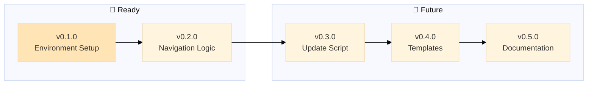

# MGMT - Roadmap

> 🤖
>
> - [README](../README.md) - Our project
> - [CHANGELOG](CHANGELOG.md) — What we did
> - [ROADMAP](ROADMAP.md) — What we wanna do
> - [POLICY](POLICY.md) [project](POLICY.md) / [global](global/POLICY.md) — How we do it
> - [CHECKS](CHECKS.md) — What we accept
> - 👷 Wanna collaborate? Connect via [signal group](https://signal.group/#CjQKIKD7zJjxP9sryI9vE5ATQZVqYsWGN_3yYURA5giGogh3EhAWfvK2Fw_kaFtt-MQ6Jlp8)
>
> 🤖

---

## v0.1.0

### Environment Setup

⏳ Initialize MGMT repository with git, ignore rules, and IDE configuration

**Problem:** Starting fresh MGMT repo needs foundational infrastructure
**Solution:** Set up version control, configure what to track/ignore, prepare IDE

**Tasks:**

- [x] Initialize git repository
- [x] Add remote (git@github.com:nonlinear/MGMT.git)
- [x] Create/verify .gitignore
- [x] Fix README navigation paths
- [ ] Configure IDE project settings (VS Code workspace)
- [x] Initial commit
- [x] Push to GitHub

---

## v0.2.0

### Navigation Logic to Global Policy

⏳ Move navigation block & diagram creation logic from README to global/POLICY.md

**Problem:** Navigation/diagram syntax scattered in README, should be in global POLICY as universal rule
**Solution:** Document in global/POLICY.md how to create/distribute 🤖 blocks and mermaid diagrams

**Tasks:**

- [ ] Document 🤖 navigation block rules in global/POLICY.md
- [ ] Document mermaid diagram placement rules in global/POLICY.md
- [ ] Document path adjustment logic in global/POLICY.md
- [ ] Add examples of proper navigation blocks
- [ ] Clarify README vs status files (where each goes)
- [ ] Update MGMT-start prompt to reference global/POLICY.md for syntax

---

## v0.3.0

### Update Script

⏳ Smart update script to fetch MGMT framework updates from GitHub

**Problem:** Projects need easy way to update MGMT framework files
**Solution:** Interactive script compares versions, shows changes, gets user approval

**Tasks:**

- [ ] Fetch remote CHANGELOG from GitHub
- [ ] Compare local vs remote version
- [ ] Enumerate improvements per version (from CHANGELOG epics)
- [ ] Show user what changed
- [ ] User confirms yes/no to update
- [ ] Download and overwrite global/ files on approval
- [ ] Download and overwrite .github/prompts/MGMT-\* files
- [ ] Preserve project-specific files (ROADMAP, CHANGELOG, POLICY, CHECKS at root)

---

## v0.4.0

### Project Templates

⏳ Create template for new projects with starter structure

**Problem:** New projects need boilerplate setup
**Solution:** Template with default structure and optional starter epics

**Tasks:**

- [ ] Create empty ROADMAP template structure
- [ ] Include v0.1.0 Environment Setup as default first epic in template
- [ ] Create empty CHANGELOG template
- [ ] Create empty POLICY template (references global/POLICY.md)
- [ ] Create empty CHECKS template (references global/CHECKS.md)
- [ ] Add template README with navigation block
- [ ] Document how update-MGMT.py creates missing files from templates
- [ ] Add option: create with/without starter epics

---

## v0.5.0

### Documentation & Diagrams

⏳ Improve README value proposition and create better diagrams

**Problem:** MGMT needs clearer benefits and more useful visualizations
**Solution:** Enhanced README, dynamic diagrams generated from local files

**Tasks:**

- [ ] Add "why it's good" section to README (benefits, use cases)
- [ ] Research better diagram types (timeline? dependency graph? progress tracker?)
- [ ] Implement chosen diagram format in mermaid
- [ ] Add diagram generation logic to global/POLICY.md
- [ ] Update all status files with new diagram

---
