```mermaid
%%{init: {'theme':'base', 'themeVariables': { 'fontSize':'14px'}}}%%
graph LR
    subgraph "🎯 Ready"
        V02[v0.2.0<br/>Navigation Logic]
    end

    subgraph "📅 Future"
        V03[v0.3.0<br/>Update Script]
        V04[v0.4.0<br/>Templates]
        V05[v0.5.0<br/>Documentation]
    end

    V02 --> V03
    V03 --> V04
    V04 --> V05
```

# Backstage - Roadmap

> 🤖
>
> - [README](../README.md) - Our project
> - [CHANGELOG](CHANGELOG.md) — What we did
> - [ROADMAP](ROADMAP.md) — What we wanna do
> - [POLICY](POLICY.md) [project](POLICY.md) / [global](global/POLICY.md) — How we do it
> - [CHECKS](CHECKS.md) — What we accept
> - 👷 Wanna collaborate? Connect via [signal group](https://signal.group/#CjQKIKD7zJjxP9sryI9vE5ATQZVqYsWGN_3yYURA5giGogh3EhAWfvK2Fw_kaFtt-MQ6Jlp8)
>
> 🤖

---

## v0.2.0

### [🚧](https://github.com/nonlinear/backstage/tree/v0.2.0) Rebrand to Backstage + Navigation Logic

Rebrand framework from MGMT to "backstage" and document navigation logic in global/POLICY.md

**Problem:** "MGMT" is too generic and vague. "backstage" better captures the behind-the-scenes workflow system
**Solution:** Systematic rename across repo, docs, and prompts

**Tasks:**

**Rebranding:**

- [x] Rename GitHub repo: nonlinear/MGMT → nonlinear/backstage
- [x] Update all documentation: MGMT → backstage (README, POLICY, CHECKS, CHANGELOG, ROADMAP)
- [x] Rename prompts: MGMT-start → backstage-start, MGMT-end → backstage-close, MGMT-update → backstage-update
- [x] Update prompt instructions to reference "backstage" framework
- [x] Update folder references in documentation
- [x] Update global/update-MGMT.py → global/update-backstage.py

**Templates:**

- [x] Create global/templates/ folder
- [x] Create ROADMAP-template.md (empty with optional v0.1.0 starter)
- [x] Create CHANGELOG-template.md (empty - starts when project starts)
- [x] Create POLICY-template.md (empty)
- [x] Create CHECKS-template.md (empty)
- [x] Document template usage in project POLICY.md (what to do when files missing)

**Navigation Logic:**

- [x] Document 🤖 navigation block rules in global/POLICY.md
- [x] Document mermaid diagram placement rules in global/POLICY.md
- [x] Document path adjustment logic in global/POLICY.md
- [x] Add examples of proper navigation blocks
- [x] Clarify README vs backstage files (README is spine/public, others are production)
- [ ] Update backstage-start prompt to reference global/POLICY.md for syntax

---

## v0.3.0

### Update Script

⏳ Smart update script to fetch backstage framework updates from GitHub

**Problem:** Projects need easy way to update backstage framework files
**Solution:** Interactive script compares versions, shows changes, gets user approval

**Tasks:**

- [ ] Fetch remote CHANGELOG from GitHub
- [ ] Compare local vs remote version
- [ ] Enumerate improvements per version (from CHANGELOG epics)
- [ ] Show user what changed
- [ ] User confirms yes/no to update
- [ ] Download and overwrite global/ files on approval
- [ ] Download and overwrite .github/prompts/backstage-\* files
- [ ] Preserve project-specific files (ROADMAP, CHANGELOG, POLICY, CHECKS at root)

---

## v0.4.0

### Project Templates

⏳ Create template for new projects with starter structure

**Problem:** New projects need boilerplate setup
**Solution:** Template with default structure and optional starter epics

**Tasks:**

- [ ] Create empty ROADMAP template structure
- [ ] Include v0.1.0 Environment Setup as default first epic in template
- [ ] Create empty CHANGELOG template
- [ ] Create empty POLICY template (references global/POLICY.md)
- [ ] Create empty CHECKS template (references global/CHECKS.md)
- [ ] Add template README with navigation block
- [ ] Document how update-backstage.py creates missing files from templates
- [ ] Add option: create with/without starter epics

---

## v0.5.0

### Documentation & Diagrams

⏳ Improve README value proposition and create better diagrams

**Problem:** Backstage needs clearer benefits and more useful visualizations
**Solution:** Enhanced README, dynamic diagrams generated from local files

**Tasks:**

- [ ] Add "why it's good" section to README (benefits, use cases)
- [ ] Research better diagram types (timeline? dependency graph? progress tracker?)
- [ ] Implement chosen diagram format in mermaid
- [ ] Add diagram generation logic to global/POLICY.md
- [ ] Update all status files with new diagram

---
