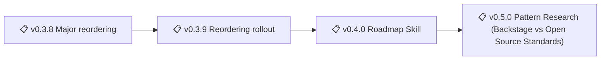
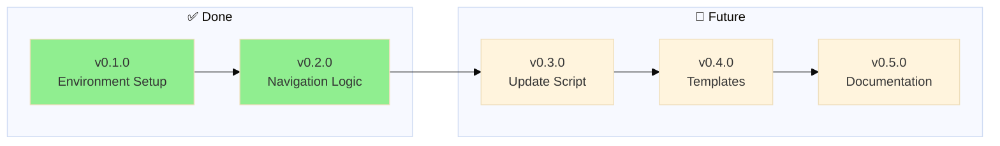
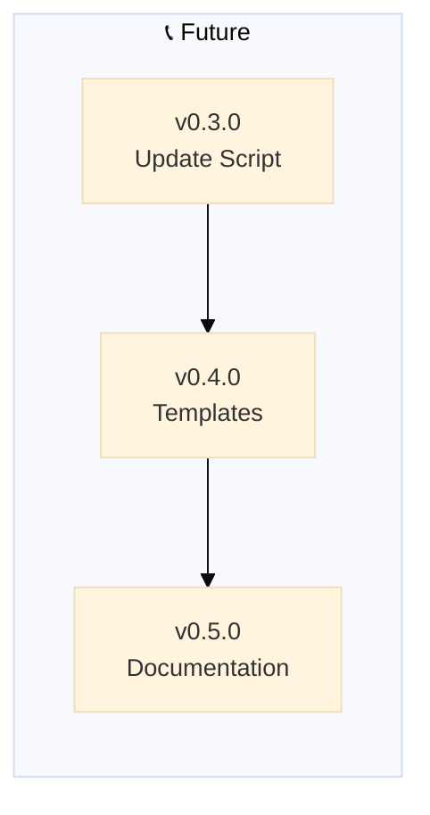

# Backstage - Changelog

> 🤖
> This project follows [backstage protocol](https://github.com/nonlinear/backstage) v1.0.0
>
> - [README](../README.md) 👏 [ROADMAP](ROADMAP.md) 👏 [CHANGELOG](CHANGELOG.md) 👏 checks: [local](checks/local/) 11, [global](checks/global/) 29
>
> 🤖

## v1.0.5 - 2026-02-25

### Update Backstage + Security Notice + Minimalism Checks

**Type:** Patch

**Completed:**
- Added "update backstage" trigger (sync checks/global/ with upstream)
- Created update-backstage.sh script (git clone, diff, mini changelog, user approval, rsync)
- Added security notice to SKILL.md (⚠️ admin tool warning)
- Added workflow notes for update trigger
- Added update branch to workflow diagram
- Created contract-diagram-discipline.md check (if contract exists, update it first)
- Created published-skill-minimalism.md check (minimal language, files, structure)
- Removed contract.html (unused visualizer)
- Created v1.1.0 epic (contract diagram adoption - future work)
- Documented update flow in epic-notes/update-backstage-flow-diagram.md

**Success criteria met:**
- Update backstage trigger works (detects symlinks, compares upstream, prompts user)
- Security notice visible (ClawHub feedback addressed)
- Checks enforce discipline (contract-first, minimalism before publishing)
- Cleanup complete (no unused files in skill)
- Workflow fully documented (triggers, diagrams, edge cases)

---

## v1.0.4 - 2026-02-25

### Patch Dance + Project Definition + Skill Publish Warning

**Type:** Patch

**Completed:**
- Documented patch dance protocol (epic-notes/patch-dance-protocol.md)
- Documented project definition guidelines (epic-notes/definition-of-project.md)
- Created global check: skill-publish-warning.sh (detects unpublished changes before merge, prompts ClawHub + Finder)
- Added ClawHub link to README frontmatter (auto-detected by check)
- **Added "bom dia PROJECT" / "good morning PROJECT" trigger** to backstage skill (loads project context + health checks)
- Tested patch workflow (this epic)

**Success criteria met:**
- Publishing patches is now documented + semi-automated
- Project scope ambiguity addressed (what belongs where)
- Skills can't accidentally merge unpublished changes to main (check warns)
- ClawHub link auto-opens for republishing
- **"bom dia PROJECT" trigger enables morning context loading** (functional change)

---

## v1.0.1 - 2026-02-20

### Merge Policies with Checks

**Type:** Patch

**Description:** Consolidate policies/ and checks/ into unified enforcement system

**Problem:**

- Current: policies/_.md (interpretive) + checks/_.sh (deterministic) separated

**Tasks:**

- can we merge? what do we use? (decided: merge into checks/)
- Frontmatter for each (all checks have DESCRIPTION, TYPE, SCOPE)
- change index (block?), remove policy (README updated, policies removed from nav)
- Design merged structure (checks/global/, checks/local/) (structure exists)
- Migrate existing policies → checks/\*.md (partially done, policies/ folder still exists)
- Update backstage-start.sh to read .md + .sh together (checks.sh reads .md from checks/)
- o report do bom dia tb tem que dizer o branch que estamos (not implemented)
- backstage-start becomes backstage (renamed in commit 7d8e3a1)
- delete backstage-close (backstage-end.sh deleted in commit 7d8e3a1)
- Created epic-branch.sh (forces work in epic branches, keeps main clean)
- Created roadmap-tasks check (syncs tasks with actual work done)
- Created merge-to-main.md (merge workflow protocol)
- Created doc-parity.md (detects doc-reality drift)
- Standardized check naming (removed -sync suffix, patterns: -syntax/-list/none)
- Consolidated redundant checks (navigation-block-\* → navigation-syntax, etc.)
- Fixed bugs (navigation-syntax typo, roadmap-tasks regex)

- Single source of truth (checks/ directory)
- Each rule has docs (.md) + validation (.sh)
- No confusion where to add new rules

## v1.0.0 - 2026-02-18

### Modular Policies & Checks (MAJOR)

**Goal:** Explode monolithic POLICY/HEALTH files into modular folders - composable cards instead of 8000+ line files

**Completed:**
- Exploded global POLICY.md → policies/global/*.md (12 cards)
- Exploded local POLICY.md → policies/local/*.md (5 cards)
- Exploded global HEALTH.md → checks/global/*.sh (9 scripts)
- Exploded local HEALTH.md → checks/local/*.sh (3 scripts)
- Renamed health/ → checks/ (better semantics)
- Updated SKILL.md diagrams (folders not files)
- Rewrote checks.sh (read from folders)
- Updated backstage-start.sh (use checks.sh)
- Updated backstage-end.sh (use checks.sh)
- Updated all checks scripts (validate folders)
- Generalized epic notes (remove POLICY.md/HEALTH.md refs)
- Tested enforcement (all passed!)
- Renamed branch v0.3.8 → v1.0.0
- Deleted old POLICY.md/HEALTH.md files
- Navigation blocks auto-update (deterministic check)

**Success:**
- ✅ Modular structure works (checks + policies separated)
- ✅ Local override mechanism (same filename = takes precedence)
- ✅ Old scheme completely obsolete
- ✅ Enforcement passed (15 checks, 17 policies)
- ✅ Dynamic version from branch name
- ✅ Auto-count policies/checks in navigation blocks

---

---

## v0.3.5 - 2026-02-14

### Protocol Stabilization

**Description:** Major protocol evolution day - semantic versioning, manual merge protocol, automation improvements

**Context:**
- 30 commits in one day implementing core backstage features
- Skills v0.1.0 needed merge → discovered manual better than auto
- Diagram generation + navigation blocks automation
- Epic format standardization

**Accomplished (retrospective):**

**Semantic Versioning + Epic Format:**
- Add semantic versioning rules to global POLICY (MAJOR.MINOR.PATCH)
- Standardize epic format (## vX.Y.Z + ### Epic Title, separate)
- Add "Approve to merge" task to epic workflow
- Add post-merge validation step to epic protocol

**Manual Merge Protocol:**
- Document manual merge protocol (ROADMAP→CHANGELOG format)
- Create commit message format (Release vX.Y.Z: Title + bullets)
- Define CHANGELOG entry format (date, past tense tasks, no checkboxes)
- Test protocol with skills v0.1.0 (successful merge)

**Auto-Merge Attempt (implemented → removed):**
- Implement auto-merge workflow detection
- Add auto-add "Approve to merge" logic
- Debug BSD awk compatibility issues (7 commits)
- Decide manual > auto (simpler, more control)
- Remove all auto-merge code (160 lines deleted)

**Mermaid Diagram Auto-Generation:**
- Implement ROADMAP parser → mermaid syntax
- Auto-insert diagrams after 🤖 navigation block
- Fix BSD awk temp file pattern (diagram insertion)
- Update all backstage files with diagrams

**Navigation Blocks:**
- Implement ensure_navigation_blocks() in backstage-start.sh
- Auto-create 🤖 blocks in README/ROADMAP/CHANGELOG/POLICY/HEALTH
- Fix BSD sed compatibility (awk + cat method)

**New Epics Created:**
- v0.3.1 - VISION Core Prompt
- v0.3.2 - Parent Project Support
- v0.3.3 - Auto-generate Mermaid Diagrams
- v0.3.4 - Diagram Redesign
- v0.3.6 - Auto-Update Navigation Version
- v0.6.0 - Branch Lifecycle Management
- v0.7.0 - Back to Main Rituals

**Success:**
- Manual merge protocol proven (skills v0.1.0 released)
- Backstage-start.sh robust (navigation blocks, diagrams, BSD awk compatible)
- Epic format standardized across all projects
- Clear decision: manual > auto (when cost > benefit)

---

## v0.3.4 - 2026-02-13

### 🔧 Patch: Mermaid Diagram Generation Rules

**Type:** Patch (documentation + tooling)

**What we did:**

- Added mermaid diagram generation rules to global/POLICY.md:
  - Default format: Linear graph (`graph LR`)
  - Include: All epics (version + status emoji + name)
  - Status mapping: 🏗️ ACTIVE, 📋 BACKLOG, ✅ DONE, ⏳ WAITING
  - Project overrides: Can customize diagram type or disable (`diagram: none`)
- Created `parse-roadmap.sh` in backstage-skill (extract version|status|name from ROADMAP.md)
- Updated backstage-skill/SKILL.md:
  - Added mermaid diagram generation workflow
  - Documented AI prompt for diagram enforcement
  - Hybrid approach (SH parsing + AI generation)

**Why patch?**

- No breaking changes (diagrams optional, project can disable)
- Adds automation rules (not new feature)
- Polycentric governance: global suggests, project decides

**Impact:** 

- Backstage-skill now auto-generates + propagates roadmap diagrams
- POLICY defines diagram format (single source of truth)
- Projects can customize or opt-out (polycentric governance)
- Anti-drift: diagram always matches current ROADMAP

---

## v0.3.3 - 2026-02-13

### 🔧 Patch: Remove Deprecated Update Scripts

**Type:** Patch (cleanup)

**What we did:**

- Deleted `global/backstage-update.py` (deprecated - symlinks replace sync scripts)
- Deleted `global/backstage-update-test.py` (test file for deprecated script)
- Removed all references from `global/HEALTH.md`:
  - Removed backstage-update.py existence check
  - Removed backstage-update prompt health metrics
  - Removed backstage-update.py implementation metrics
  - Updated ship criteria (2 components, not 4)

**Why deprecated?**

- **For admins (Nicholas):** Symlink `backstage/global/` → instant sync, no script needed
- **For external users:** Epic exists to construct backstage folder if missing (future)
- **Self-contained skill:** backstage-skill has all prompts in SKILL.md, no external files

**Impact:** Cleaner global/ folder, no confusion about which files to follow. Anti-drift via symlinks (admins) or initial construction (external users).

---

## v0.3.2 - 2026-02-13

### 🔧 Patch: POLICY Cleanup + Fast Track Rule

**Type:** Patch (bug fix / quick fix)

**What we did:**

- Removed incorrect diagram from global/POLICY.md (showed backstage-skill workflow, not POLICY content)
- Added semantic versioning fast-track rule to global/POLICY.md:
  - Major/Minor = epic + branch + ROADMAP (traditional flow)
  - Patch = straight to CHANGELOG (no branch, no ROADMAP needed)
- Updated navigation block template version: v0.3.0 → v0.3.1
- **Meta:** This CHANGELOG entry uses the fast-track rule it documents

**Why patch?**
- Small corrections (diagram placement, version number)
- No breaking changes
- No new features
- Fixes documentation accuracy

**Impact:** POLICY now correctly separates governance structure (in POLICY text) from enforcement mechanism (in backstage-skill SKILL.md). Fast-track rule enables quick fixes without epic overhead.

---

## v0.3.1 - 2026-02-07

### ✅ Prompt Cleanup

**Completed:** Removed redundant prompts, renamed to match skill

**What we did:**

- Deleted backstage-close.prompt.md (logic in POLICY, not separate prompt)
- Deleted backstage-update.prompt.md (logic in POLICY, not separate prompt)
- Renamed backstage-start.prompt.md → backstage.prompt.md (root, matches skill name)
- Removed close/update commands from skill (only start+health remain)
- Fixed README links (backstage.prompt.md path)
- Added workflow anchor to epic-notes

**Impact:** One prompt (backstage.prompt.md), one skill (backstage.sh), both in sync. Logic lives in POLICY/HEALTH.

---

## v0.3.0 - 2026-02-07

### [✅](https://github.com/nonlinear/backstage/tree/epic/v0.3.0-openclaw-skill) OpenClaw Skill

**Completed:** AI-driven skill that reads POLICY and executes protocol

**What we did:**

- Created skill/backstage.sh (thin wrapper - 80 lines, not 500+)
- Created skill/SKILL.md (architecture documentation)
- Added AI EXECUTION PROTOCOL to global POLICY.md
- Inventory global vs project POLICY/HEALTH (removed 1275+ lines of duplication)
- Cleaned all backstage prompts (removed redundancy, reference POLICY)
- Added merge workflow to backstage-close (no split prompts)
- Added post-merge checks to project HEALTH (update skill on merge)

**Impact:** Backstage is now AI-driven protocol (logic in POLICY, not code)

---

---

## v0.2.0

### [✅](https://github.com/nonlinear/backstage/tree/v0.2.0) Rebrand to Backstage + Navigation Logic

Rebrand framework to "backstage" and document navigation logic in global/POLICY.md

**Problem:** Previous naming was too generic and vague. "backstage" better captures the behind-the-scenes workflow system
**Solution:** Systematic rename across repo, docs, and prompts

**Completed:**

**Rebranding:**

- ✅ Rename GitHub repo: nonlinear/MGMT → nonlinear/backstage
- ✅ Update all documentation: MGMT → backstage (README, POLICY, HEALTH, CHANGELOG, ROADMAP)
- ✅ Rename prompts: MGMT-start → backstage-start, MGMT-end → backstage-close, MGMT-update → backstage-update
- ✅ Update prompt instructions to reference "backstage" framework
- ✅ Update folder references in documentation
- ✅ Rename global/update-MGMT.py → global/backstage-update.py

**Templates:**

- ✅ Create templates/ folder
- ✅ Create ROADMAP-template.md (empty with optional v0.1.0 starter)
- ✅ Create CHANGELOG-template.md (empty - starts when project starts)
- ✅ Create POLICY-template.md (empty)
- ✅ Create HEALTH-template.md (empty)
- ✅ Document template usage in project POLICY.md (what to do when files missing)

**Navigation Logic:**

- ✅ Document 🤖 navigation block rules in global/POLICY.md
- ✅ Document mermaid diagram placement rules in global/POLICY.md
- ✅ Document path adjustment logic in global/POLICY.md
- ✅ Add examples of proper navigation blocks
- ✅ Clarify README vs backstage files (README is spine/public, others are production)
- ✅ Update backstage-start prompt to reference global/POLICY.md for syntax (removed hardcoded examples)
- ✅ Add product health metrics to HEALTH.md (8+6+7+13 = 34 metrics)
- ✅ Rename CHECKS → HEALTH (clearer purpose: "definition of healthy system")
- ✅ Update HEALTH titles and descriptions in all files
- ✅ Fix backstage-start STEP 2: Read BOTH global + project HEALTH files
- ✅ Implement global/backstage-update.py fetch logic (scaffold + update modes)
- ✅ Add prompt usage table to README (when to use each prompt)

---

## v0.1.0

### Environment Setup

✅ Initialize backstage repository with git, ignore rules, and IDE configuration

**Problem:** Starting fresh backstage repo needs foundational infrastructure
**Solution:** Set up version control, configure what to track/ignore, prepare IDE

**Tasks:**

- [x] Initialize git repository
- [x] Add remote (git@github.com:nonlinear/backstage.git)
- [x] Create/verify .gitignore
- [x] Fix README navigation paths
- [x] Configure IDE project settings (VS Code workspace)
- [x] Initial commit
- [x] Push to GitHub

