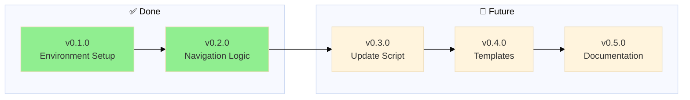
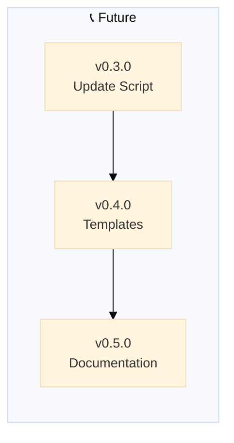

# Backstage - Changelog

---

## v0.2.0

### [✅](https://github.com/nonlinear/backstage/tree/v0.2.0) Rebrand to Backstage + Navigation Logic

Rebrand framework to "backstage" and document navigation logic in global/POLICY.md

**Problem:** Previous naming was too generic and vague. "backstage" better captures the behind-the-scenes workflow system
**Solution:** Systematic rename across repo, docs, and prompts

**Completed:**

**Rebranding:**

- ✅ Rename GitHub repo: nonlinear/MGMT → nonlinear/backstage
- ✅ Update all documentation: MGMT → backstage (README, POLICY, HEALTH, CHANGELOG, ROADMAP)
- ✅ Rename prompts: MGMT-start → backstage-start, MGMT-end → backstage-close, MGMT-update → backstage-update
- ✅ Update prompt instructions to reference "backstage" framework
- ✅ Update folder references in documentation
- ✅ Rename global/update-MGMT.py → global/backstage-update.py

**Templates:**

- ✅ Create templates/ folder
- ✅ Create ROADMAP-template.md (empty with optional v0.1.0 starter)
- ✅ Create CHANGELOG-template.md (empty - starts when project starts)
- ✅ Create POLICY-template.md (empty)
- ✅ Create HEALTH-template.md (empty)
- ✅ Document template usage in project POLICY.md (what to do when files missing)

**Navigation Logic:**

- ✅ Document 🤖 navigation block rules in global/POLICY.md
- ✅ Document mermaid diagram placement rules in global/POLICY.md
- ✅ Document path adjustment logic in global/POLICY.md
- ✅ Add examples of proper navigation blocks
- ✅ Clarify README vs backstage files (README is spine/public, others are production)
- ✅ Update backstage-start prompt to reference global/POLICY.md for syntax (removed hardcoded examples)
- ✅ Add product health metrics to HEALTH.md (8+6+7+13 = 34 metrics)
- ✅ Rename CHECKS → HEALTH (clearer purpose: "definition of healthy system")
- ✅ Update HEALTH titles and descriptions in all files
- ✅ Fix backstage-start STEP 2: Read BOTH global + project HEALTH files
- ✅ Implement global/backstage-update.py fetch logic (scaffold + update modes)
- ✅ Add prompt usage table to README (when to use each prompt)

---

## v0.1.0

### Environment Setup

✅ Initialize backstage repository with git, ignore rules, and IDE configuration

**Problem:** Starting fresh backstage repo needs foundational infrastructure
**Solution:** Set up version control, configure what to track/ignore, prepare IDE

**Tasks:**

- [x] Initialize git repository
- [x] Add remote (git@github.com:nonlinear/backstage.git)
- [x] Create/verify .gitignore
- [x] Fix README navigation paths
- [x] Configure IDE project settings (VS Code workspace)
- [x] Initial commit
- [x] Push to GitHub

> 🤖
> | Backstage files | Description |
> | ---------------------------------------------------------------------------- | ------------------ |
> | [README](../README.md) | Our project |
> | [CHANGELOG](CHANGELOG.md) | What we did |
> | [ROADMAP](ROADMAP.md) | What we wanna do |
> | POLICY: [project](POLICY.md), [global](global/POLICY.md) | How we go about it |
> | HEALTH: [project](HEALTH.md), [global](global/HEALTH.md) | What we accept |
> | We use **[backstage rules](https://github.com/nonlinear/backstage)**, v0.3.0 |
> 🤖

