```mermaid
%%{init: {'theme':'base', 'themeVariables': { 'fontSize':'14px'}}}%%
graph LR
    subgraph "📞 Future"
        V03[v0.3.0<br/>Update Script]
        V04[v0.4.0<br/>Templates]
        V05[v0.5.0<br/>Documentation]
    end

    V03 --> V04
    V04 --> V05
```

# Backstage - Changelog

```mermaid
%%{init: {'theme':'base', 'themeVariables': { 'fontSize':'14px'}}}%%
graph LR
    subgraph "✅ Done"
        V01[v0.1.0<br/>Environment Setup]
        V02[v0.2.0<br/>Navigation Logic]
    end

    subgraph "📅 Future"
        V03[v0.3.0<br/>Update Script]
        V04[v0.4.0<br/>Templates]
        V05[v0.5.0<br/>Documentation]
    end

    V01 --> V02
    V02 --> V03
    V03 --> V04
    V04 --> V05

    style V01 fill:#90EE90
    style V02 fill:#90EE90
```

## v0.3.3 - 2026-02-13

### 🔧 Patch: Remove Deprecated Update Scripts

**Type:** Patch (cleanup)

**What we did:**

- Deleted `global/backstage-update.py` (deprecated - symlinks replace sync scripts)
- Deleted `global/backstage-update-test.py` (test file for deprecated script)
- Removed all references from `global/HEALTH.md`:
  - Removed backstage-update.py existence check
  - Removed backstage-update prompt health metrics
  - Removed backstage-update.py implementation metrics
  - Updated ship criteria (2 components, not 4)

**Why deprecated?**

- **For admins (Nicholas):** Symlink `backstage/global/` → instant sync, no script needed
- **For external users:** Epic exists to construct backstage folder if missing (future)
- **Self-contained skill:** backstage-skill has all prompts in SKILL.md, no external files

**Impact:** Cleaner global/ folder, no confusion about which files to follow. Anti-drift via symlinks (admins) or initial construction (external users).

---

## v0.3.2 - 2026-02-13

### 🔧 Patch: POLICY Cleanup + Fast Track Rule

**Type:** Patch (bug fix / quick fix)

**What we did:**

- Removed incorrect diagram from global/POLICY.md (showed backstage-skill workflow, not POLICY content)
- Added semantic versioning fast-track rule to global/POLICY.md:
  - Major/Minor = epic + branch + ROADMAP (traditional flow)
  - Patch = straight to CHANGELOG (no branch, no ROADMAP needed)
- Updated navigation block template version: v0.3.0 → v0.3.1
- **Meta:** This CHANGELOG entry uses the fast-track rule it documents

**Why patch?**
- Small corrections (diagram placement, version number)
- No breaking changes
- No new features
- Fixes documentation accuracy

**Impact:** POLICY now correctly separates governance structure (in POLICY text) from enforcement mechanism (in backstage-skill SKILL.md). Fast-track rule enables quick fixes without epic overhead.

---

## v0.3.1 - 2026-02-07

### ✅ Prompt Cleanup

**Completed:** Removed redundant prompts, renamed to match skill

**What we did:**

- Deleted backstage-close.prompt.md (logic in POLICY, not separate prompt)
- Deleted backstage-update.prompt.md (logic in POLICY, not separate prompt)
- Renamed backstage-start.prompt.md → backstage.prompt.md (root, matches skill name)
- Removed close/update commands from skill (only start+health remain)
- Fixed README links (backstage.prompt.md path)
- Added workflow anchor to epic-notes

**Impact:** One prompt (backstage.prompt.md), one skill (backstage.sh), both in sync. Logic lives in POLICY/HEALTH.

---

## v0.3.0 - 2026-02-07

### [✅](https://github.com/nonlinear/backstage/tree/epic/v0.3.0-openclaw-skill) OpenClaw Skill

**Completed:** AI-driven skill that reads POLICY and executes protocol

**What we did:**

- Created skill/backstage.sh (thin wrapper - 80 lines, not 500+)
- Created skill/SKILL.md (architecture documentation)
- Added AI EXECUTION PROTOCOL to global POLICY.md
- Inventory global vs project POLICY/HEALTH (removed 1275+ lines of duplication)
- Cleaned all backstage prompts (removed redundancy, reference POLICY)
- Added merge workflow to backstage-close (no split prompts)
- Added post-merge checks to project HEALTH (update skill on merge)

**Impact:** Backstage is now AI-driven protocol (logic in POLICY, not code)

---

---

## v0.2.0

### [✅](https://github.com/nonlinear/backstage/tree/v0.2.0) Rebrand to Backstage + Navigation Logic

Rebrand framework to "backstage" and document navigation logic in global/POLICY.md

**Problem:** Previous naming was too generic and vague. "backstage" better captures the behind-the-scenes workflow system
**Solution:** Systematic rename across repo, docs, and prompts

**Completed:**

**Rebranding:**

- ✅ Rename GitHub repo: nonlinear/MGMT → nonlinear/backstage
- ✅ Update all documentation: MGMT → backstage (README, POLICY, HEALTH, CHANGELOG, ROADMAP)
- ✅ Rename prompts: MGMT-start → backstage-start, MGMT-end → backstage-close, MGMT-update → backstage-update
- ✅ Update prompt instructions to reference "backstage" framework
- ✅ Update folder references in documentation
- ✅ Rename global/update-MGMT.py → global/backstage-update.py

**Templates:**

- ✅ Create templates/ folder
- ✅ Create ROADMAP-template.md (empty with optional v0.1.0 starter)
- ✅ Create CHANGELOG-template.md (empty - starts when project starts)
- ✅ Create POLICY-template.md (empty)
- ✅ Create HEALTH-template.md (empty)
- ✅ Document template usage in project POLICY.md (what to do when files missing)

**Navigation Logic:**

- ✅ Document 🤖 navigation block rules in global/POLICY.md
- ✅ Document mermaid diagram placement rules in global/POLICY.md
- ✅ Document path adjustment logic in global/POLICY.md
- ✅ Add examples of proper navigation blocks
- ✅ Clarify README vs backstage files (README is spine/public, others are production)
- ✅ Update backstage-start prompt to reference global/POLICY.md for syntax (removed hardcoded examples)
- ✅ Add product health metrics to HEALTH.md (8+6+7+13 = 34 metrics)
- ✅ Rename CHECKS → HEALTH (clearer purpose: "definition of healthy system")
- ✅ Update HEALTH titles and descriptions in all files
- ✅ Fix backstage-start STEP 2: Read BOTH global + project HEALTH files
- ✅ Implement global/backstage-update.py fetch logic (scaffold + update modes)
- ✅ Add prompt usage table to README (when to use each prompt)

---

## v0.1.0

### Environment Setup

✅ Initialize backstage repository with git, ignore rules, and IDE configuration

**Problem:** Starting fresh backstage repo needs foundational infrastructure
**Solution:** Set up version control, configure what to track/ignore, prepare IDE

**Tasks:**

- [x] Initialize git repository
- [x] Add remote (git@github.com:nonlinear/backstage.git)
- [x] Create/verify .gitignore
- [x] Fix README navigation paths
- [x] Configure IDE project settings (VS Code workspace)
- [x] Initial commit
- [x] Push to GitHub

> 🤖
> | Backstage files | Description |
> | ---------------------------------------------------------------------------- | ------------------ |
> | [README](../README.md) | Our project |
> | [CHANGELOG](CHANGELOG.md) | What we did |
> | [ROADMAP](ROADMAP.md) | What we wanna do |
> | POLICY: [project](POLICY.md), [global](global/POLICY.md) | How we go about it |
> | HEALTH: [project](HEALTH.md), [global](global/HEALTH.md) | What we accept |
> | We use **[backstage rules](https://github.com/nonlinear/backstage)**, v0.3.0 |
> 🤖

