```mermaid
%%{init: {'theme':'base', 'themeVariables': { 'fontSize':'14px'}}}%%
graph LR
    subgraph "✅ Done"
        V01[v0.1.0<br/>Environment Setup]
        V02[v0.2.0<br/>Navigation Logic]
    end

    subgraph "📅 Future"
        V03[v0.3.0<br/>Update Script]
        V04[v0.4.0<br/>Templates]
        V05[v0.5.0<br/>Documentation]
    end

    V01 --> V02
    V02 --> V03
    V03 --> V04
    V04 --> V05

    style V01 fill:#90EE90
    style V02 fill:#90EE90
```

# Backstage - Changelog

> 🤖
> | Backstage files | Description |
> | ---------------------------------------------------------------------------- | ------------------ |
> | [README](../README.md) | Our project |
> | [CHANGELOG](CHANGELOG.md) | What we did |
> | [ROADMAP](ROADMAP.md) | What we wanna do |
> | POLICY: [project](POLICY.md), [global](global/POLICY.md) | How we go about it |
> | HEALTH: [project](HEALTH.md), [global](global/HEALTH.md) | What we accept |
>
> We use **[backstage protocol](https://github.com/nonlinear/backstage)**, v0.3.4
> 🤖

```mermaid
graph LR
    A[📋 v0.3.8 Major reordering]
    B[📋 v0.3.9 Reordering rollout]
    A --> B
    C[📋 v0.4.0 Roadmap Skill]
    B --> C
    D[📋 v0.5.0 Pattern Research (Backstage vs Open Source Standards)]
    C --> D
```


---

## v0.3.5 - 2026-02-14

### Protocol Stabilization

**Description:** Major protocol evolution day - semantic versioning, manual merge protocol, automation improvements

**Context:**
- 30 commits in one day implementing core backstage features
- Skills v0.1.0 needed merge → discovered manual better than auto
- Diagram generation + navigation blocks automation
- Epic format standardization

**Accomplished (retrospective):**

**Semantic Versioning + Epic Format:**
- Add semantic versioning rules to global POLICY (MAJOR.MINOR.PATCH)
- Standardize epic format (## vX.Y.Z + ### Epic Title, separate)
- Add "Approve to merge" task to epic workflow
- Add post-merge validation step to epic protocol

**Manual Merge Protocol:**
- Document manual merge protocol (ROADMAP→CHANGELOG format)
- Create commit message format (Release vX.Y.Z: Title + bullets)
- Define CHANGELOG entry format (date, past tense tasks, no checkboxes)
- Test protocol with skills v0.1.0 (successful merge)

**Auto-Merge Attempt (implemented → removed):**
- Implement auto-merge workflow detection
- Add auto-add "Approve to merge" logic
- Debug BSD awk compatibility issues (7 commits)
- Decide manual > auto (simpler, more control)
- Remove all auto-merge code (160 lines deleted)

**Mermaid Diagram Auto-Generation:**
- Implement ROADMAP parser → mermaid syntax
- Auto-insert diagrams after 🤖 navigation block
- Fix BSD awk temp file pattern (diagram insertion)
- Update all backstage files with diagrams

**Navigation Blocks:**
- Implement ensure_navigation_blocks() in backstage-start.sh
- Auto-create 🤖 blocks in README/ROADMAP/CHANGELOG/POLICY/HEALTH
- Fix BSD sed compatibility (awk + cat method)

**New Epics Created:**
- v0.3.1 - VISION Core Prompt
- v0.3.2 - Parent Project Support
- v0.3.3 - Auto-generate Mermaid Diagrams
- v0.3.4 - Diagram Redesign
- v0.3.6 - Auto-Update Navigation Version
- v0.6.0 - Branch Lifecycle Management
- v0.7.0 - Back to Main Rituals

**Success:**
- Manual merge protocol proven (skills v0.1.0 released)
- Backstage-start.sh robust (navigation blocks, diagrams, BSD awk compatible)
- Epic format standardized across all projects
- Clear decision: manual > auto (when cost > benefit)

---

## v0.3.4 - 2026-02-13

### 🔧 Patch: Mermaid Diagram Generation Rules

**Type:** Patch (documentation + tooling)

**What we did:**

- Added mermaid diagram generation rules to global/POLICY.md:
  - Default format: Linear graph (`graph LR`)
  - Include: All epics (version + status emoji + name)
  - Status mapping: 🏗️ ACTIVE, 📋 BACKLOG, ✅ DONE, ⏳ WAITING
  - Project overrides: Can customize diagram type or disable (`diagram: none`)
- Created `parse-roadmap.sh` in backstage-skill (extract version|status|name from ROADMAP.md)
- Updated backstage-skill/SKILL.md:
  - Added mermaid diagram generation workflow
  - Documented AI prompt for diagram enforcement
  - Hybrid approach (SH parsing + AI generation)

**Why patch?**

- No breaking changes (diagrams optional, project can disable)
- Adds automation rules (not new feature)
- Polycentric governance: global suggests, project decides

**Impact:** 

- Backstage-skill now auto-generates + propagates roadmap diagrams
- POLICY defines diagram format (single source of truth)
- Projects can customize or opt-out (polycentric governance)
- Anti-drift: diagram always matches current ROADMAP

---

## v0.3.3 - 2026-02-13

### 🔧 Patch: Remove Deprecated Update Scripts

**Type:** Patch (cleanup)

**What we did:**

- Deleted `global/backstage-update.py` (deprecated - symlinks replace sync scripts)
- Deleted `global/backstage-update-test.py` (test file for deprecated script)
- Removed all references from `global/HEALTH.md`:
  - Removed backstage-update.py existence check
  - Removed backstage-update prompt health metrics
  - Removed backstage-update.py implementation metrics
  - Updated ship criteria (2 components, not 4)

**Why deprecated?**

- **For admins (Nicholas):** Symlink `backstage/global/` → instant sync, no script needed
- **For external users:** Epic exists to construct backstage folder if missing (future)
- **Self-contained skill:** backstage-skill has all prompts in SKILL.md, no external files

**Impact:** Cleaner global/ folder, no confusion about which files to follow. Anti-drift via symlinks (admins) or initial construction (external users).

---

## v0.3.2 - 2026-02-13

### 🔧 Patch: POLICY Cleanup + Fast Track Rule

**Type:** Patch (bug fix / quick fix)

**What we did:**

- Removed incorrect diagram from global/POLICY.md (showed backstage-skill workflow, not POLICY content)
- Added semantic versioning fast-track rule to global/POLICY.md:
  - Major/Minor = epic + branch + ROADMAP (traditional flow)
  - Patch = straight to CHANGELOG (no branch, no ROADMAP needed)
- Updated navigation block template version: v0.3.0 → v0.3.1
- **Meta:** This CHANGELOG entry uses the fast-track rule it documents

**Why patch?**
- Small corrections (diagram placement, version number)
- No breaking changes
- No new features
- Fixes documentation accuracy

**Impact:** POLICY now correctly separates governance structure (in POLICY text) from enforcement mechanism (in backstage-skill SKILL.md). Fast-track rule enables quick fixes without epic overhead.

---

## v0.3.1 - 2026-02-07

### ✅ Prompt Cleanup

**Completed:** Removed redundant prompts, renamed to match skill

**What we did:**

- Deleted backstage-close.prompt.md (logic in POLICY, not separate prompt)
- Deleted backstage-update.prompt.md (logic in POLICY, not separate prompt)
- Renamed backstage-start.prompt.md → backstage.prompt.md (root, matches skill name)
- Removed close/update commands from skill (only start+health remain)
- Fixed README links (backstage.prompt.md path)
- Added workflow anchor to epic-notes

**Impact:** One prompt (backstage.prompt.md), one skill (backstage.sh), both in sync. Logic lives in POLICY/HEALTH.

---


## v0.3.0 - 2026-02-07

### [✅](https://github.com/nonlinear/backstage/tree/epic/v0.3.0-openclaw-skill) OpenClaw Skill

**Completed:** AI-driven skill that reads POLICY and executes protocol

**What we did:**

- Created skill/backstage.sh (thin wrapper - 80 lines, not 500+)
- Created skill/SKILL.md (architecture documentation)
- Added AI EXECUTION PROTOCOL to global POLICY.md
- Inventory global vs project POLICY/HEALTH (removed 1275+ lines of duplication)
- Cleaned all backstage prompts (removed redundancy, reference POLICY)
- Added merge workflow to backstage-close (no split prompts)
- Added post-merge checks to project HEALTH (update skill on merge)

**Impact:** Backstage is now AI-driven protocol (logic in POLICY, not code)

---




---

## v0.2.0

### [✅](https://github.com/nonlinear/backstage/tree/v0.2.0) Rebrand to Backstage + Navigation Logic

Rebrand framework to "backstage" and document navigation logic in global/POLICY.md

**Problem:** Previous naming was too generic and vague. "backstage" better captures the behind-the-scenes workflow system
**Solution:** Systematic rename across repo, docs, and prompts

**Completed:**

**Rebranding:**

- ✅ Rename GitHub repo: nonlinear/MGMT → nonlinear/backstage
- ✅ Update all documentation: MGMT → backstage (README, POLICY, HEALTH, CHANGELOG, ROADMAP)
- ✅ Rename prompts: MGMT-start → backstage-start, MGMT-end → backstage-close, MGMT-update → backstage-update
- ✅ Update prompt instructions to reference "backstage" framework
- ✅ Update folder references in documentation
- ✅ Rename global/update-MGMT.py → global/backstage-update.py

**Templates:**

- ✅ Create templates/ folder
- ✅ Create ROADMAP-template.md (empty with optional v0.1.0 starter)
- ✅ Create CHANGELOG-template.md (empty - starts when project starts)
- ✅ Create POLICY-template.md (empty)
- ✅ Create HEALTH-template.md (empty)
- ✅ Document template usage in project POLICY.md (what to do when files missing)

**Navigation Logic:**

- ✅ Document 🤖 navigation block rules in global/POLICY.md
- ✅ Document mermaid diagram placement rules in global/POLICY.md
- ✅ Document path adjustment logic in global/POLICY.md
- ✅ Add examples of proper navigation blocks
- ✅ Clarify README vs backstage files (README is spine/public, others are production)
- ✅ Update backstage-start prompt to reference global/POLICY.md for syntax (removed hardcoded examples)
- ✅ Add product health metrics to HEALTH.md (8+6+7+13 = 34 metrics)
- ✅ Rename CHECKS → HEALTH (clearer purpose: "definition of healthy system")
- ✅ Update HEALTH titles and descriptions in all files
- ✅ Fix backstage-start STEP 2: Read BOTH global + project HEALTH files
- ✅ Implement global/backstage-update.py fetch logic (scaffold + update modes)
- ✅ Add prompt usage table to README (when to use each prompt)

---

## v0.1.0

### Environment Setup

✅ Initialize backstage repository with git, ignore rules, and IDE configuration

**Problem:** Starting fresh backstage repo needs foundational infrastructure
**Solution:** Set up version control, configure what to track/ignore, prepare IDE

**Tasks:**

- [x] Initialize git repository
- [x] Add remote (git@github.com:nonlinear/backstage.git)
- [x] Create/verify .gitignore
- [x] Fix README navigation paths
- [x] Configure IDE project settings (VS Code workspace)
- [x] Initial commit
- [x] Push to GitHub

```mermaid
%%{init: {'theme':'base', 'themeVariables': { 'fontSize':'14px'}}}%%
graph LR
    subgraph "📞 Future"
        V03[v0.3.0<br/>Update Script]
        V04[v0.4.0<br/>Templates]
        V05[v0.5.0<br/>Documentation]
    end

    V03 --> V04
    V04 --> V05
```



