# Backstage - HEALTH

> 🤖
> | Backstage files | Description |
> | ---------------------------------------------------------------------------- | ------------------ |
> | [README](../README.md) | Our project |
> | [CHANGELOG](CHANGELOG.md) | What we did |
> | [ROADMAP](ROADMAP.md) | What we wanna do |
> | POLICY: [project](POLICY.md), [global](global/POLICY.md) | How we go about it |
> | HEALTH: [project](HEALTH.md), [global](global/HEALTH.md) | What we accept |
>
> We use **[backstage protocol](https://github.com/nonlinear/backstage)**, v0.3.4
> 🤖


---

## 🎯 Backstage-Specific Project Checks

> **Note:** This section contains checks specific to backstage as a project, not universal checks.
> Universal checks live in [global/HEALTH.md](global/HEALTH.md)

**Backstage is meta:** It's both a framework (global/) AND a project using that framework (root files).

---

### 📂 Dual-Layer Structure

**Test: Global and project files coexist properly**

```bash
# Global framework files must exist
test -d global && \
test -f global/POLICY.md && \
test -f global/HEALTH.md && \
test -f global/backstage-update.py && \
echo '✅ Global framework files exist' || echo '❌ Missing global framework'
```

Expected: Global framework complete
Pass: ✅ Global framework files exist

**Test: Project status files exist at root**

```bash
test -f README.md && \
test -f ROADMAP.md && \
test -f CHANGELOG.md && \
test -f POLICY.md && \
test -f HEALTH.md && \
echo '✅ Project status files exist' || echo '❌ Missing project files'
```

Expected: Project files at root level
Pass: ✅ Project status files exist

---

### 🔀 Merge to Main Workflow (Backstage Project)

**Context:** When merging epic to main, backstage project has specific requirements beyond global POLICY.

**Pre-Merge Checks (mirrors global POLICY Step 9):**

```bash
# 1. Run backstage-start (HEALTH checks + update docs)
# See global/POLICY.md "Step 9: Before Merging"

# 2. Ensure all tasks complete in ROADMAP
grep "^- \[ \]" ROADMAP.md && echo "❌ Incomplete tasks" || echo "✅ All tasks done"

# 3. Version sync check (CRITICAL for backstage)
NAV_VERSION=$(grep "backstage rules.*v[0-9]" global/POLICY.md | sed 's/.*v\([0-9.]*\).*/\1/')
EPIC_VERSION=$(grep -m1 "^## v[0-9]" ROADMAP.md | sed 's/^## v//' | cut -d' ' -f1)
[ "$NAV_VERSION" = "$EPIC_VERSION" ] && echo "✅ Version ready to merge" || echo "❌ Update global/POLICY.md version first"
```

**Merge Steps (mirrors global POLICY Step 10):**

```bash
# 1. Move epic from ROADMAP to CHANGELOG
# (backstage-start does this automatically if all tasks done)

# 2. Checkout main and merge
git checkout main
git pull origin main
git merge epic/v0.X.0-epicname --no-ff

# 3. Tag release
git tag v0.X.0 -m "Epic v0.X.0 complete"

# 4. Push
git push origin main
git push origin v0.X.0
```

**Post-Merge: Update OpenClaw Skill (Backstage-Specific)**

```bash
# 1. Remove dev symlink
rm ~/.openclaw/skills/backstage

# 2. Restore official skill (from merged main)
# Option A: Copy skill folder to OpenClaw
cp -r ~/Documents/backstage/skill ~/.openclaw/skills/backstage

# Option B: Symlink to main branch (not dev branch)
ln -s ~/Documents/backstage/skill ~/.openclaw/skills/backstage

# 3. Test
cd ~/Documents/backstage
backstage start .
```

Expected: Skill works with updated framework from main
Pass: ✅ Skill updated and functional

**Why backstage-specific:** Most projects don't have OpenClaw skills. Backstage does.

**Critical:** Remove dev symlink (points to epic branch) → restore official (points to main or installed version)

---

### 🔗 Skill Symlink (Epic Development Only)

**Context:** When developing the OpenClaw skill (`epic/v0.3.0-openclaw-skill`), we need to edit source and test instantly.

**Setup (at epic start):**

```bash
# Replace placeholder with symlink to source
rm -rf ~/.openclaw/skills/backstage-placeholder
ln -s ~/Documents/backstage/skill ~/.openclaw/skills/backstage
```

**Verify:**

```bash
ls -la ~/.openclaw/skills/backstage | grep -q "skill$" && \
echo '✅ Symlink active (edit source, test instantly)' || \
echo '❌ Symlink missing or wrong target'
```

**Teardown (before merge to main OR backstage close):**

```bash
# Remove symlink
rm ~/.openclaw/skills/backstage

# Restore original placeholder (until skill is published)
git checkout ~/.openclaw/skills/backstage-placeholder
```

**Why:** Edit `~/Documents/backstage/skill/`, test via OpenClaw instantly. Keep `.openclaw/skills/` clean when epic closes.

**🚨 CRITICAL:** Remove symlink before merging to main. Other users shouldn't have dev symlinks.

**On merge to main:**

```bash
# Publish skill to OpenClaw system
# (Remove placeholder, make skill official)
rm -rf ~/.openclaw/skills/backstage-placeholder
ln -s ~/Documents/backstage/skill ~/.openclaw/skills/backstage

# Or install via npm/clawdhub (when ready)
# clawdhub install backstage
```

---

### 🔄 Self-Reference Consistency

**Test: Backstage follows its own rules**

```bash
# backstage must have navigation blocks (per its own global/HEALTH.md)
grep -q '> 🤖' README.md && \
grep -q '> 🤖' ROADMAP.md && \
grep -q '> 🤖' CHANGELOG.md && \
echo '✅ Backstage follows navigation block rule' || echo '❌ Backstage violates its own rules'
```

Expected: Backstage practices what it preaches
Pass: ✅ Self-consistent

**Test: Version in navigation block matches latest CHANGELOG epic**

```bash
# Extract version from global/POLICY.md navigation template
NAV_VERSION=$(grep "backstage rules.*v[0-9]" global/POLICY.md | sed 's/.*v\([0-9.]*\).*/\1/')

# Extract latest version from CHANGELOG
CHANGELOG_VERSION=$(grep -m1 "^## v[0-9]" CHANGELOG.md | sed 's/^## v//' | cut -d' ' -f1)

# Compare
if [ "$NAV_VERSION" = "$CHANGELOG_VERSION" ]; then
  echo "✅ Version sync correct: v$NAV_VERSION"
else
  echo "❌ FAIL: Nav template has v$NAV_VERSION but CHANGELOG latest is v$CHANGELOG_VERSION"
  echo "Fix: Update global/POLICY.md navigation template version"
fi
```

Expected: Versions match (navigation template = latest CHANGELOG epic)
Pass: 🚨 **CRITICAL** - Must pass before merging epic to main

**Why this matters:**

- Projects check nav block version to know framework version
- `/backstage-update` compares project version vs latest to show updates
- Mismatch breaks version detection for all projects using backstage

**Test: Backstage has epics in ROADMAP**

```bash
grep -E "^## v[0-9]+\.[0-9]+\.[0-9]+" ROADMAP.md >/dev/null && \
echo '✅ Backstage tracks its own development' || echo '⚠️ No epics - backstage not using epic format'
```

Expected: Backstage uses epic format for its own development
Pass: ✅ Epics exist

---

### 📝 Documentation Clarity

**Test: Global vs Project distinction is clear**

```bash
# global/POLICY.md should say "universal" or "all projects"
# POLICY.md should reference global or say "backstage-specific"
grep -qi "universal\|all projects" global/POLICY.md && \
echo '✅ Clear global vs project distinction' || echo '⚠️ Clarify what is universal vs project-specific'
```

Expected: Documentation makes layering clear
Pass: ✅ Distinction documented

---

### 🔗 Prompt Files Reference Correct Paths

**Test: backstage-start prompt references global files correctly**

```bash
# backstage-start should tell AIs to read global/POLICY.md for epic format
grep -q "global/POLICY.md" .github/prompts/backstage-start.prompt.md && \
echo '✅ Prompt references global policy' || echo '⚠️ Prompt may have hardcoded paths'
```

Expected: Prompts reference global/ for universal rules
Pass: ✅ Prompts reference framework correctly

---

### 🎯 Meta-Awareness

**Test: README explains the meta nature**

```bash
grep -qi "framework\|polycentric\|meta" README.md && \
echo '✅ README explains backstage is both framework and project' || echo '⚠️ Add explanation of meta nature'
```

Expected: Users understand backstage's dual role
Pass: ✅ Meta nature documented

---


---

## Summary

**Backstage project-specific checks ensure:**

- ✅ Dual-layer structure (global framework + project files)
- ✅ Backstage follows its own rules (dogfooding)
- ✅ Clear documentation of what's universal vs project-specific
- ✅ Prompts reference the framework correctly
- ✅ Meta nature is explained to users

---

**Run all checks:**

````bash
# Universal checks (apply to all backstage projects)
bash -c "$(grep -A 1 '^```bash' global/HEALTH.md | grep -v '^```' | grep -v '^--$')"

# Backstage-specific checks (this project only)
bash -c "$(grep -A 1 '^```bash' HEALTH.md | grep -v '^```' | grep -v '^--$')"
````

---

**Last updated:** 2026-01-28
**Version:** 0.1.0 (backstage tracking its own development)

```mermaid
%%{init: {'theme':'base', 'themeVariables': { 'fontSize':'14px'}}}%%
graph LR
    subgraph "📞 Future"
        V03[v0.3.0<br/>Update Script]
        V04[v0.4.0<br/>Templates]
        V05[v0.5.0<br/>Documentation]
    end

    V03 --> V04
    V04 --> V05
```



