```mermaid
%%{init: {'theme':'base', 'themeVariables': { 'fontSize':'14px'}}}%%
graph LR
    subgraph "📞 Future"
        V03[v0.3.0<br/>Update Script]
        V04[v0.4.0<br/>Templates]
        V05[v0.5.0<br/>Documentation]
    end

    V03 --> V04
    V04 --> V05
```

# Project Health Checks

**Backstage-specific validation rules.**

---

## Skill Publication Check

**Before merging to main:** Ensure latest skill is published to OpenClaw/ClawdHub.

**Why:** Users install via `clawdhub install backstage` — if we merge without publishing, they get outdated version.

**Check:**

```bash
# Compare local skill version vs published version
LOCAL_VERSION=$(grep -m1 "backstage rules.*v[0-9]" backstage/global/POLICY.md | sed 's/.*v\([0-9.]*\).*/\1/')
echo "Local version: v$LOCAL_VERSION"
echo "Published version: Check https://clawdhub.com/skills/backstage"
```

**Pass criteria:**
- ✅ Local version = published version (already synced)
- ⚠️ Local version > published version (need to publish before merge)
- ❌ Local version < published version (something's wrong!)

**How to publish:**

```bash
# From skill/ directory
clawdhub publish
```

---


> 🤖
> | Backstage files | Description |
> | ---------------------------------------------------------------------------- | ------------------ |
> | [README](../README.md) | Our project |
> | [CHANGELOG](CHANGELOG.md) | What we did |
> | [ROADMAP](ROADMAP.md) | What we wanna do |
> | POLICY: [project](POLICY.md), [global](global/POLICY.md) | How we go about it |
> | CHECKS: [project](HEALTH.md), [global](global/HEALTH.md) | What we accept |
> | We use **[backstage rules](https://github.com/nonlinear/backstage)**, v0.3.0 |
> 🤖


