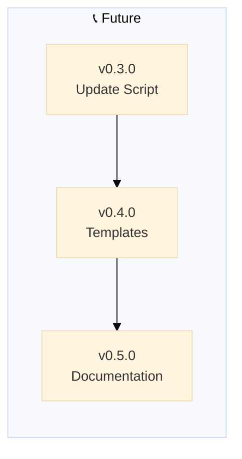

> 🤖
> | Backstage files | Description |
> | ---------------------------------------------------------------------------- | ------------------ |
> | [README](../README.md) | Our project |
> | [CHANGELOG](CHANGELOG.md) | What we did |
> | [ROADMAP](ROADMAP.md) | What we wanna do |
> | POLICY: [project](POLICY.md), [global](global/POLICY.md) | How we go about it |
> | CHECKS: [project](HEALTH.md), [global](global/HEALTH.md) | What we accept |
> | We use **[backstage rules](https://github.com/nonlinear/backstage)**, v0.3.0 |
> 🤖

