```mermaid
graph LR
    A[📋 v0.3.2 Prompt Grooming] --> B[📋 v0.4.0 Templates]
    B --> C[📋 v0.4.1 Arch Protocol]
    C --> D[📋 v0.5.0 Documentation]
```

# Backstage - POLICY

> 🤖
> | Backstage files | Description |
> | ---------------------------------------------------------------------------- | ------------------ |
> | [README](../README.md) | Our project |
> | [CHANGELOG](CHANGELOG.md) | What we did |
> | [ROADMAP](ROADMAP.md) | What we wanna do |
> | POLICY: [project](POLICY.md), [global](global/POLICY.md) | How we go about it |
> | HEALTH: [project](HEALTH.md), [global](global/HEALTH.md) | What we accept |
>
> We use **[backstage protocol](https://github.com/nonlinear/backstage)**, v0.3.4
> 🤖




---

## 🚨 CRITICAL: Understanding Global vs Project Files

**🔴 DO NOT CONFUSE THESE!**

### Global Files (global/POLICY.md, global/HEALTH.md)
**Scope:** ALL projects using backstage framework MUST follow these rules

**Content:**
- **global/POLICY.md** = Universal workflow rules (epic dance, commits, branching) - **FOR HUMANS**
- **global/HEALTH.md** = Universal health checks (code to run, validation tests) - **FOR CODE**

**Who edits:** Framework maintainers only (changes affect ALL projects)

---

### Project Files (POLICY.md, HEALTH.md)
**Scope:** THIS backstage project ONLY (dogfooding - we use our own framework)

**Content:**
- **POLICY.md** = Backstage-specific rules and deviations - **FOR HUMANS**
- **HEALTH.md** = Backstage-specific checks (dual-layer structure, symlinks, etc.) - **FOR CODE**

**Who edits:** Backstage project contributors

---

### Rule of Thumb
- **Global = framework (everyone follows)**
- **Project = this repo only (backstage dogfooding itself)**

**When in doubt:** If rule applies to ALL projects using backstage → global. If only backstage repo → project.

---

## Universal Workflow

**This project follows the [global backstage policy](global/POLICY.md)** for:

- Epic/branch workflow ("Epic Dance")
- Semantic versioning
- Branch strategy
- Commit messages
- Rebase vs merge rules
- Pre-commit workflow

**This file contains only backstage-specific rules and deviations.**

---

## Version Tracking in Navigation Block

**🚨 CRITICAL: Backstage framework version must stay in sync with CHANGELOG**

When completing an epic and merging to main:

1. Move epic from ROADMAP → CHANGELOG (standard workflow)
2. **Also update version number in global/POLICY.md navigation template**

**Why backstage-specific:**
- Most projects: version lives in package.json, pyproject.toml, etc.
- Backstage: version lives in POLICY.md (used by all projects)

**Location:** `backstage/global/POLICY.md` → search for `v0.X.0` in navigation block template

---

## Template System (Backstage-Specific)

**This repo maintains templates for new projects.**

**Structure:**

```
templates/
├── ROADMAP-template.md
├── CHANGELOG-template.md
├── POLICY-template.md
└── HEALTH-template.md
```

**When editing templates:**
- Keep placeholders clear: `[Project Name]`, `[Your Name]`
- Include example content (users learn by seeing)
- Test with fresh project before committing

---

## OpenClaw Skill Workflow

**Context:** The `skill/` folder contains the OpenClaw skill for backstage project management.

### Development Flow

**During epic development (e.g., v0.3.0):**

```bash
# Symlink skill to OpenClaw
ln -s ~/Documents/backstage/skill ~/.openclaw/skills/backstage

# Edit source, test instantly (no reinstall needed)
```

**After merge to main:**

```bash
# Publish to npm (if public)
# OR document manual install in README
```

---

## 🤖 Dogfooding: Backstage Uses Backstage

**We eat our own dog food.**

**What this means:**
- Root `ROADMAP.md`, `CHANGELOG.md`, `POLICY.md`, `HEALTH.md` = backstage project status
- `backstage/global/` = framework code (shared by all projects)
- We follow our own rules (epic dance, navigation blocks, health checks)

**Dual-layer structure:**
- `backstage/` = framework we're building
- Root files = us using that framework

**See HEALTH.md for dogfooding-specific checks.**

---

_For universal workflow rules (branching, commits, epic format), see [global/POLICY.md](global/POLICY.md)_
