```mermaid
%%{init: {'theme':'base', 'themeVariables': { 'fontSize':'14px'}}}%%
graph LR
    subgraph "📞 Future"
        V03[v0.3.0<br/>Update Script]
        V04[v0.4.0<br/>Templates]
        V05[v0.5.0<br/>Documentation]
    end

    V03 --> V04
    V04 --> V05
```

# Project Policy

```mermaid
%%{init: {'theme':'base', 'themeVariables': { 'fontSize':'14px'}}}%%
graph LR
    subgraph "🎯 Ready"
        V01[v0.1.0<br/>Environment Setup]
        V02[v0.2.0<br/>Navigation Logic]
    end

    subgraph "📅 Future"
        V03[v0.3.0<br/>Update Script]
        V04[v0.4.0<br/>Templates]
        V05[v0.5.0<br/>Documentation]
    end

    V01 --> V02
    V02 --> V03
    V03 --> V04
    V04 --> V05

    style V01 fill:#FFE4B5
```




---

## Universal Workflow

**This project follows the [global backstage policy](global/POLICY.md)** for:

- Epic/branch workflow ("Epic Dance")
- Semantic versioning
- Branch strategy
- Commit messages
- Rebase vs merge rules
- Pre-commit workflow

**This file contains only backstage-specific rules and deviations.**

---

## Version Tracking in Navigation Block

**🚨 CRITICAL: Backstage framework version must stay in sync with CHANGELOG**

When completing an epic and merging to main:

1. Move epic from ROADMAP → CHANGELOG (standard workflow)
2. **Also update version number in global/POLICY.md navigation template**
   - Template location: `global/POLICY.md` line ~168
   - Update: `v0.2.0` → `v0.3.0` (new completed version)

**Why this matters:**

- Projects using backstage check navigation block version to know what framework version they're on
- The `/backstage-update` prompt compares their version vs latest CHANGELOG to show available updates
- If template version ≠ latest CHANGELOG epic, version detection breaks

**Health check enforces this:** See HEALTH.md → "Version Sync Check"

---

### 🔄 Meta-Complexity: Global Version Must Match Epic Branch

**Backstage-specific constraint:** When working on an epic (e.g., `epic/v0.3.0-openclaw-skill`), the `global/POLICY.md` version in THAT BRANCH must reflect the version being developed.

**Problem:** If epic v0.3.0 is in progress but `global/POLICY.md` still says v0.2.0, the nav block version will be wrong when the epic merges.

**Solution - UPDATE global/POLICY.md version immediately when creating epic:**

```bash
# When creating epic/v0.3.0-openclaw-skill:
1. Create branch: git checkout -b epic/v0.3.0-openclaw-skill
2. Update global/POLICY.md navigation template: v0.2.0 → v0.3.0
3. Commit: "chore: update global/POLICY version to v0.3.0"
```

**During epic development:** Keep global/ in sync with epic version

**On merge to main:** Version is already correct (becomes "official" via CHANGELOG latest epic)

---

**Why it's tricky:**

- Other projects update global/ FROM main (stable)
- Backstage updates global/ IN epic branch (development)
- Both are correct for their context

**This is meta because:** Backstage uses its own protocol to build the protocol itself.

**When epic merges to main:** That version becomes the official version (latest CHANGELOG epic = source of truth).

---

**Example:**

```markdown
# When completing v0.2.0:

1. ROADMAP: Move v0.2.0 epic → CHANGELOG ✅
2. CHANGELOG: Add completion date ✅
3. global/POLICY.md: Update "v0.2.0" → "v0.3.0" in navigation template ✅
```

---

## Template System (Backstage-Specific)

**When backstage-start prompt doesn't find status files:**

Templates live in `templates/` and provide starter structure:

### ROADMAP-template.md

- Empty roadmap with v0.1.0 Environment Setup starter epic
- Copy to project root as `ROADMAP.md`
- Customize for your project's planned features

### CHANGELOG-template.md

- Empty changelog (starts when project starts)
- If you have existing changelog, paste it here
- Run backstage-start to groom format per POLICY

### POLICY-template.md

- References global/POLICY.md
- Add project-specific rules here
- Document any deviations from global workflow

### HEALTH-template.md

- Empty project checks structure
- Add your project-specific validation tests
- Inherits global/HEALTH.md universal tests

**Workflow:**

1. backstage-start detects missing file
2. Copies from templates/ to project root
3. Explains what the file does
4. Guides you to populate it

---

## 🚨 About This Project

**This is a personal library management system - NOT a collaborative repository.**

Each person runs their own instance with their own books. Nothing syncs to GitHub except code/scripts.

**Want to contribute code?** Contact me first to discuss environment setup - don't submit PRs directly.

**Just want to use it?** Fork it, clone it, use it. Your books/data stay 100% local.

### Setup After Clone

**1. Verify `.git/info/exclude` exists:**

```bash
cat .git/info/exclude
```

Expected content:

```
# BYOB: Bring Your Own Books/Models - Local files (don't sync to GitHub)
books/**/*.epub
books/**/*.pkl
books/**/*.index
books/metadata.json
engine/models/
```

**Why:** Keeps your library private + enables autocomplete for book links. See [epic-notes/v0.4.0.md](epic-notes/v0.4.0.md#autocomplete-investigation) for technical details.

**2. Add your books:**

```bash
# Organize books from Downloads
python3.11 .github/engine/scripts/organize_books.py

# Generate metadata + indices
python3.11 engine/scripts/indexer.py
```

---

## Librarian-Specific Versioning

| Type      | Version Change  | Requires Reindex? | Breaking? |
| --------- | --------------- | ----------------- | --------- |
| **Patch** | v0.2.0 → v0.2.1 | No                | No        |
| **Minor** | v0.2.x → v0.3.0 | Optional          | No        |
| **Major** | v0.x → v1.0     | Yes               | Yes       |

**Reindexing requirement examples:**

- ✅ **Requires reindex:** Schema changes, new embedding models, chunking algorithm changes
- ❌ **No reindex needed:** UI changes, prompt updates, MCP server improvements

---

## Epic Creation Rules

**If two features can be delivered separately, create separate epics.**

Example:

- ✅ Good: `v1.1.0: Hidden Files` + `v1.2.0: User Testing` (separate)
- ❌ Bad: `v1.1.0: Hygiene + Testing + Docs` (monolithic)

---

**Last updated:** 2026-01-26
**Version:** 1.1 (Decoupled from global policy)

Each person runs their own instance with their own books. Nothing syncs to GitHub except code/scripts.

**Want to contribute code?** Contact me first to discuss environment setup - don't submit PRs directly.

**Just want to use it?** Fork it, clone it, use it. Your books/data stay 100% local.

### Setup After Clone

**1. Verify `.git/info/exclude` exists:**

```bash
cat .git/info/exclude
```

Expected content:

```
# BYOB: Bring Your Own Books/Models - Local files (don't sync to GitHub)
books/**/*.epub
books/**/*.pkl
books/**/*.index
books/metadata.json
engine/models/
```

**Why:** Keeps your library private + enables autocomplete for book links. See [epic-notes/v0.4.0.md](epic-notes/v0.4.0.md#autocomplete-investigation) for technical details.

**2. Add your books:**

```bash
# Organize books from Downloads
python3.11 .github/engine/scripts/organize_books.py

# Generate metadata + indices
python3.11 engine/scripts/indexer.py
```

---

## Branch Strategy

**One branch per epic:**

```
main (stable releases only)
  ↓
v0.3-delta-indexing (feature branch)
v0.4-provider-integration (feature branch)
v0.5-automation (feature branch)
```

### Branch Naming

## Status Files Index

**Examples:**

- `v0.3-delta-indexing`
- `v0.4-provider-integration`
- `v1.0-breaking-changes`

### Workflow

1. **Create branch from main:**

---

## OpenClaw Skill Workflow

**Context:** The `skill/` folder contains the OpenClaw skill for backstage project management.

### Skill Flow Design Decisions (v0.3.0)

**1. Output Format: Structured (AI processes)**

Scripts output machine-readable format:
```
POLICY_FOUND|global|/path/to/POLICY.md
EPIC|v0.5.0|Self-Promotion|planned
HEALTH_CHECK_PASS
```

**Why:** AI can format contextually, add details, personalize response.

**2. POLICY/HEALTH Display: Paths + Summary**

Show file paths + extract `## headers` (structure overview).

**Why:** AI sees organization, reads full content only if needed (token efficiency).

**3. Epic Creation: Always Ask About Branch**

Script asks "Create branch? (y/n)" - manual, explicit.

**Why:** Safe default. Ship today, automate later. Different projects have different branch strategies.

**4. Health Checks: Hybrid Execution**

- Extract ````bash` blocks from HEALTH.md → run automatically
- List other checks (manual verification)

**Why:** Automation where possible, flexibility where needed. Hugo check example:

```markdown
## Hugo Build

```bash
rm -rf public/ docs/
hugo --config config.toml
[ -d "docs/" ] || exit 1
```
```

**5. Victory Lap: Minimal**

Show: health status + body check.

**Why:** Ship today. Can add git stats later (commits, files changed, epic progress).

### Polycentric Governance in Code

**Read order:**
1. `backstage/global/POLICY.md` (universal rules)
2. `backstage/POLICY.md` (project-specific - WINS)

**Same for HEALTH:**
1. `backstage/global/HEALTH.md` (universal checks)
2. `backstage/HEALTH.md` (project checks - WINS)

**Implementation:** `backstage.sh` reads both, shows both, executes both. Project overrides global when conflict.

---

## Epic/Branch Workflow ("Epic Dance")

### 🔍 Before Starting New Work: Review Epic Notes

**CRITICAL:** Always check existing epic notes before starting similar work to avoid reinventing the wheel.

```bash
# List all epic notes
ls epic-notes/

# Search for relevant keywords
grep -r "keyword" epic-notes/
```

**Why epic notes matter:**

- **Discovered blockers:** Previous epics may have hit technical limitations
  - Example: v0.4.0 found VS Code pill validation breaks with `#` fragments
- **Tested solutions:** Multiple approaches already tried and documented
  - Example: v0.4.0 tested 6 different anchor syntaxes (all failed)
- **Documented workarounds:** Pragmatic solutions when ideal ones don't work
- **Deferred features:** Features intentionally postponed with reasoning

**When to check:**

- Starting any new epic (especially similar features)
- Encountering unexpected behavior
- Considering a feature that "feels like it was tried before"
- Planning technical approaches

**Epic notes = knowledge base** - Treat them as first-class documentation, not just session logs.

---

### Step 1: Groom Epic in ROADMAP (on main)

**Before creating branch:**

1. **Add epic to ROADMAP.md** as next v0.X.0 (top of list)
2. **Renumber all existing epics** (+1 each)
3. **Update mermaid subway map** at top of ROADMAP.md:
   - Add new node for epic
   - Place in correct subgraph (Ready/Blocked/Future)
   - Add dependency arrows if needed
   - Update node styles (colors) based on status
4. **Write epic with:**
   - ⏳ Status indicator (planned, no branch yet)
   - Problem statement
   - Solution approach
   - Task checklist
5. **Review and refine** tasks (can spend time here)


**Syntax:**

```markdown
### v0.X

#### [🚧](link-to-branch) Epic Title

Epic description (what problem does this solve?)

- [ ] Task to complete (roadmap only)
- [x] Completed task (roadmap only)
- Completed task (changelog only, in past tense)

❌ Anti-pattern (what NOT to do)
✅ Best practice (with link if applicable)
🗒️ Note

---
```

**Status indicators:**

- `🚧` with link = active branch exists (in-progress epic)
- `⏳` no link = planned, no branch yet
- `✅` completed (changelog only)

**Examples:**

```markdown
> **v0.3**
> [🚧](https://github.com/user/repo/tree/v0.3-delta-indexing) **Delta Indexing**

Automatic change detection for incremental book indexing

- [x] Detect filesystem changes
- [ ] Auto-reindex affected topics

✅ Use folder_path from metadata for accuracy
❌ Don't parse topic_id with string splitting
```

---

## Epic Development Strategy

**Each epic = one feature branch:**

- Branch naming: `v{major}.{minor}-{feature-name}` (ex: `v0.3-delta-indexing`)
- Regular rebase from `main` to stay current
- When complete → merge to `main` → move to CHANGELOG.md

**When epic completes:**

1. Run `/whatsup` (marks checkboxes, validates checks)
2. Move entire epic from ROADMAP → CHANGELOG
3. Change status: `🚧` → `✅`
4. Merge branch to main with `--no-ff`
5. Tag release: `git tag v0.3.0 -m "Epic v0.3 complete"`
6. Delete feature branch (recommended, history preserved via tags)
7. Announce release

---

## Semantic Versioning

**For AI-assisted projects:**

| Type      | Version Change  | Requires Reindex? | Breaking? |
| --------- | --------------- | ----------------- | --------- |
| **Patch** | v0.2.0 → v0.2.1 | No                | No        |
| **Minor** | v0.2.x → v0.3.0 | Optional          | No        |
| **Major** | v0.x → v1.0     | Yes               | Yes       |

**Examples:**

- **Patch:** Bug fixes, typos, minor corrections
  - `fix: correct typo in metadata.json`
  - `fix: handle edge case in indexer`

- **Minor:** New features, backward compatible
  - `feat: add delta indexing support`
  - `feat: PDF support`

- **Major:** Breaking changes, architecture changes
  - `feat!: migrate to new storage format (BREAKING)`
  - `refactor!: change folder structure (requires reindex)`

---

## Rebase vs Merge

**Use rebase for:**

- ✅ Keeping feature branch current with main
- ✅ Cleaning up local history before pushing
- ✅ Maintaining linear git history

**Use merge for:**

- ✅ Integrating completed features into main
- ✅ Preserving complete feature development history
- ✅ Creating clear version boundaries

**Never rebase:**

- ❌ Public/shared branches after others have pulled
- ❌ Main branch itself
- ❌ After a branch has been merged

**Rebase conflicts?**

```bash
# During rebase, if conflicts occur:
git status                    # See conflicting files
# Fix conflicts in editor
git add <resolved-files>
git rebase --continue

# If rebase gets messy:
git rebase --abort           # Start over
```

---

## Commit Messages

**Format:**

```
<type>: <subject>

[optional body]
[optional footer]
```

**Types:**

- `feat:` New feature
- `fix:` Bug fix
- `docs:` Documentation only
- `refactor:` Code restructuring (no feature change)
- `test:` Adding tests
- `chore:` Maintenance (dependencies, build, etc.)

**Examples:**

```
feat: add delta indexing for books
fix: resolve STORAGE_DIR undefined error
docs: update ROADMAP with v0.3 epic
refactor: consolidate storage to books/ only
```

---

## Pre-Commit Workflow

**ALWAYS run before merging to main:**

1. **Use `/whatsup` prompt** (see [.github/prompts/whatsup.prompt.md](prompts/whatsup.prompt.md))
2. **Check HEALTH.md** for stability requirements (location in [README](/README.md))
3. **Update ROADMAP** - mark completed checkboxes
4. **Move to CHANGELOG** - if epic complete
5. **Run all tests** - ensure nothing broke

## Questions?

**Last updated:** 2026-01-20
**Version:** 1.0 (Initial workflow definition)

> 🤖
> | Backstage files | Description |
> | ---------------------------------------------------------------------------- | ------------------ |
> | [README](../README.md) | Our project |
> | [CHANGELOG](CHANGELOG.md) | What we did |
> | [ROADMAP](ROADMAP.md) | What we wanna do |
> | POLICY: [project](POLICY.md), [global](global/POLICY.md) | How we go about it |
> | CHECKS: [project](HEALTH.md), [global](global/HEALTH.md) | What we accept |
> | We use **[backstage rules](https://github.com/nonlinear/backstage)**, v0.3.0 |
> 🤖


