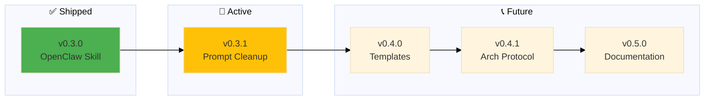

# Backstage - Roadmap

## v0.3.2

### 📝 Prompt Grooming

**Problem:** .github/prompts/ has 30+ prompts, many outdated/unused

**Solution:** Review, archive, and document active prompts

**Tasks:**

- [ ] Inventory all prompts in .github/prompts/
- [ ] Identify active vs unused prompts
- [ ] Archive unused prompts (move to _archived/)
- [ ] Document remaining prompts in PROMPTS.md
- [ ] Update README with prompt usage guide

---

## v0.3.3

### 🏴 Backstage to Win

**Description:** Merge context-switch + roadmap skills into backstage-skill

**Problem:**
- context-switch (project/epic transitions + HEALTH checks) should be part of backstage
- roadmap (epic planning, grooming, emoji shortcuts) should be part of backstage
- Three separate skills = fragmented workflow

**Solution:** Merge both into single backstage-skill (universal project management)

**Tasks:**
- [ ] Merge context-switch logic into backstage-skill
  - [ ] Morning/evening workflows ("bom dia", "boa noite")
  - [ ] Project/epic transitions with HEALTH checks
  - [ ] Context state tracking (.current-context.json)
- [ ] Merge roadmap logic into backstage-skill
  - [ ] Epic creation, grooming, emoji shortcuts
  - [ ] Roadmap management across projects
  - [ ] Task reordering, merging
- [ ] Update backstage-skill SKILL.md (new triggers, features)
- [ ] Test on multiple projects (life, librarian, wiley, skills)
- [ ] Archive context-switch + roadmap skills (mark deprecated in skills/)

**Success:**
- Single skill handles full project workflow
- context-switch + roadmap features accessible via backstage commands
- No workflow fragmentation

---

## v0.4.1

### 🏗️ Arch Protocol | [notes](https://github.com/nonlinear/librarian/blob/epic/v0.15.0-skill-protocol/backstage/epic-notes/v0.15.0-skill-protocol.md)

**arch: = PARIDADE - O COMO familiar e mage comunicam**

**Definition:** Shared language (visual = text = code) for architecture decisions

**Problem:** Todos epics mudam estrutura, precisa de arch (diagrama antes de código)

**Solution:** `arch:` prefix protocol - Nicholas says "arch: X" → I implement + document in diagram

**Paridade = same map, same territory:**
- Nicholas olha diagrama → sabe exatamente o que vai acontecer
- Claw olha diagrama → sabe exatamente o que fazer
- Screenshots → provam mapa = território (always)

**Key insight:**
- **First epic:** Create diagram from scratch (hard - 29 commits, 4 hours)
- **Subsequent epics:** ALTER existing diagram (easy - 1 commit)
- **Diagram = living document** - cada epic refina
- **Sandbox = safe** - epics isolated (branch), diagrams versioned (epic-notes/), nodes explicit (mermaid)

**Workflow:**
1. Planning (arch:) - Familiar opines freely, suggests, debates → diagram agreement
2. Execution (post-diagram) - Familiar executes without errors, everything agreed

**Learning source:** `~/Documents/librarian/backstage/epic-notes/arch-session-2026-02-08.md`

**Tasks:**
- [ ] Extract arch protocol from librarian v0.15.0 learnings
- [ ] Document `arch:` prefix convention in POLICY.md
- [ ] Create arch workflow template (mermaid → commits → screenshots)
- [ ] Add to epic-notes/ standard structure
- [ ] Test with 2+ different project types

**Success Criteria:**
- New epics start with `arch:` diagram creation
- Diagram changes = explicit (screenshots prove evolution)
- Low metabolic cost (alter > recreate)

---

## v0.4.0

### Templates

⏳ Create installable templates for new projects

**Problem:** Users need starter templates

**Solution:** GitHub templates/ folder with ROADMAP, CHANGELOG, POLICY, HEALTH templates

**Tasks:**

- [ ] Create templates/ROADMAP-template.md
- [ ] Create templates/CHANGELOG-template.md
- [ ] Create templates/POLICY-template.md
- [ ] Create templates/HEALTH-template.md
- [ ] **OPTIONAL:** Document when to use design-architecture exercise
  - Complex systems (APIs, integrations, workflows)
  - Architectural changes (not simple fixes)
  - Deliverable = approved diagram BEFORE implementation

---

## v0.5.0

### Documentation

⏳ Write comprehensive usage guide

**Problem:** People don't know how to use backstage

**Solution:** README with examples, philosophy, workflow diagrams

**Tasks:**

- [ ] Write README.md (philosophy + quick start)
- [ ] Add workflow diagrams (mermaid)
- [ ] Document epic dance
- [ ] Add examples from real projects

---

> 🤖
> | Backstage files | Description |
> | ---------------------------------------------------------------------------- | ------------------ |
> | [README](../README.md) | Our project |
> | [CHANGELOG](CHANGELOG.md) | What we did |
> | [ROADMAP](ROADMAP.md) | What we wanna do |
> | POLICY: [project](POLICY.md), [global](global/POLICY.md) | How we go about it |
> | HEALTH: [project](HEALTH.md), [global](global/HEALTH.md) | What we accept |
> | We use **[backstage rules](https://github.com/nonlinear/backstage)**, v0.3.0 |
> 🤖

