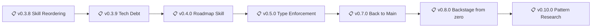

# Backstage - Roadmap

> 🤖
> | Backstage files | Description |
> | ---------------------------------------------------------------------------- | ------------------ |
> | [README](../README.md) | Our project |
> | [CHANGELOG](CHANGELOG.md) | What we did |
> | [ROADMAP](ROADMAP.md) | What we wanna do |
> | POLICY: [project](POLICY.md), [global](global/POLICY.md) | How we go about it |
> | HEALTH: [project](HEALTH.md), [global](global/HEALTH.md) | What we accept |
>
> We use **[backstage protocol](https://github.com/nonlinear/backstage)**, v0.3.4
> 🤖



---

## v0.3.8

### Skill Reordering

**Goal:** Organize skills inside skill folder, improve backstage skill "add to" function, document skills in README

**Tasks:**
- [ ] Move all skills inside skill folder (change symlinks)
- [ ] Backstage skill "add to" function (add skill to project)
- [ ] Skills section on README (list available skills)

**Success:**
- All skills in `skill/` folder (no scattered symlinks)
- `backstage-skill add <skill-name>` works
- README documents available skills

---

## v0.3.9

### Tech Debt

**Description:** Address technical debt and infrastructure improvements

**Tasks:**
- [ ] Tech debt folder (like gaps/) - where to put old/deprecated/future ideas?
- [ ] Ordered health checks (alphabetical execution, test if breaks)
- [ ] Marketplace - pulling policies/health from other GitHub projects (discover, install, update)

**Success:**
- Tech debt folder structure defined
- Health checks run in predictable order
- Can pull policy/health cards from other projects

---

## v0.4.0

### Roadmap Skill

**Description:** Localhost wrapper (like arch) that loads ROADMAP.md and displays as interactive to-do list organized by epics

**Goal:** Visual epic management with automatic renumbering and task reordering

**Tasks:**
- [ ] Phase 1: Load ROADMAP.md (read-only viewer)
- [ ] Phase 2: Check tasks (mark complete)
- [ ] Phase 3: Add/remove/reorder tasks within epics
- [ ] Phase 4: Reorder epics
- [ ] Phase 5: Automatic renumbering (v0.X.0 → v0.Y.0 on reorder)

**Success:**
- Interactive ROADMAP viewer (localhost)
- Task completion (checkboxes work)
- Drag-and-drop epic reordering
- Auto-renumber on epic move
- Saves back to ROADMAP.md

---

## v0.5.0

### Type Enforcement & Version Sync

**Description:** Auto-calculate and enforce Type field in epics (Major/Minor/Patch)

**Problem:**
- Epics don't show semantic version type explicitly
- Version numbers can mismatch with intended type
- Manual grooming needed to ensure version consistency

**Solution:**
Implement `add_epic_types()` in backstage-start.sh:

1. **Auto-add Type field** after `### Epic Title`:
   ```markdown
   ## v1.2.3
   ### Epic Title
   **Type:** Minor  ← AUTO-CALCULATED
   ```

2. **Calculate type from version number:**
   - Compare epic version vs last CHANGELOG version
   - `vX.0.0` (MAJOR changed) → Type: Major
   - `v0.Y.0` (MINOR changed) → Type: Minor
   - `v0.0.Z` (PATCH changed) → Type: Patch

3. **Parity check:**
   - Epic says "Type: Major" but version is v0.3.0 → WARNING
   - Version is v1.0.0 but Type says "Minor" → WARNING

4. **Suggest branch rename:**
   - If type changed during development
   - Show suggested rename command
   - Update ROADMAP link automatically

**Tasks:**
- [ ] Parse ROADMAP epics (version + title)
- [ ] Get last CHANGELOG version (stable baseline)
- [ ] Calculate type from version diff
- [ ] Insert Type field after Epic Title
- [ ] Validate epic Type vs version number
- [ ] Suggest branch rename if type changed
- [ ] Update epic tests to verify Type field exists

**Success:**
- All epics have Type field (auto-calculated)
- Type matches version number (validated)
- Branch names reflect type (major/minor/patch prefix)
- Warnings when type/version mismatch

---

## v0.7.0

### Back to Main rites

**Goal:** Ritual for closing epic branch and returning to main

**Problem:**
- Epic work completes but no clean closure ritual
- Branch hangs around "just in case"
- Main gets stale (not rebased from epic)
- Unclear when to delete branch

**Solution:**
Create `backstage-end.sh` (counterpart to `backstage-start.sh`)

**Workflow:**

1. **Validate completion:**
   - All epic tasks checked
   - HEALTH checks pass
   - Tests green
   - Documentation current

2. **Merge ceremony:**
   - Merge epic → main (--no-ff)
   - Move epic ROADMAP → CHANGELOG
   - Tag release
   - Update version references

3. **Clean closure:**
   - Delete remote branch
   - Delete local branch
   - Archive epic notes (if desired)
   - Announce completion

4. **Return to main:**
   - Checkout main
   - Pull latest
   - Show next epic in ROADMAP

**Tasks:**
- [ ] Design `backstage-end.sh` script
- [ ] Validation checks (all tasks done?)
- [ ] Merge automation (with proper commit message)
- [ ] ROADMAP → CHANGELOG migration
- [ ] Branch deletion (local + remote)
- [ ] Return to main ritual
- [ ] Integration with OpenClaw prompts

**Success:**
- Clean epic closure (no orphaned branches)
- Automatic CHANGELOG update
- Clear transition back to main
- Ritual feels complete

---

## v0.3.1

### VISION Core Prompt

**Goal:** Add VISION.md to core workspace files (alongside SOUL.md, USER.md, AGENTS.md)

**Problem:**
- Ethics scattered across files
- Decision-making principles implicit
- No single source of truth for values
- AI repeats same ethical questions

**Solution:**
Create VISION.md with:
- Core values
- Decision frameworks
- Ethical constraints
- What we optimize for

**What goes in VISION:**
- ✅ Ethics (privacy, autonomy, anti-surveillance)
- ✅ Principles (fuck copyright hypocrisy, self-hosting)
- ✅ Decision criteria (when to build vs buy, when to share)
- ✅ Non-negotiables (what we never compromise)

**What stays elsewhere:**
- SOUL.md → Personality, tone, vibe
- USER.md → About Nicholas (context, preferences)
- AGENTS.md → Workflow rules, protocols

**Tasks:**
- [ ] Draft VISION.md structure
- [ ] Extract ethics from scattered files
- [ ] Define decision frameworks
- [ ] Add to AGENTS.md session ritual (read VISION every session)
- [ ] Update workspace file list

**Success:**
- VISION.md exists and is complete
- AI reads it every session
- Ethics consistent across decisions
- Fewer repeated ethical debates

---

## v0.3.2

### Skills on README

**Goal:** Document all workspace skills in main README.md

**Problem:**
- Skills exist but aren't discoverable
- No single index of what's available
- New users don't know what tools exist

**Solution:**
Add "Skills" section to workspace README:
- List all skills with one-line descriptions
- Link to skill folders
- Explain trigger patterns
- Show example usage

**Tasks:**
- [ ] Inventory all skills (workspace + global)
- [ ] Write one-line descriptions
- [ ] Add Skills section to README
- [ ] Link to skill folders
- [ ] Document trigger patterns

**Success:**
- README has complete skill list
- Each skill has clear description
- Links work
- Trigger patterns documented

---

## v0.3.3

### Skill Metadata (Frontmatter)

**Goal:** Add structured metadata to all skills via frontmatter

**Why:**
- Enable skill discovery/search
- Validate skill structure
- Generate skill registry
- Support ClawHub integration

**Structure:**

```yaml
---
name: skill-name
version: 1.0.0
description: One-line summary
triggers:
  - pattern: "keyword"
  - pattern: "another keyword"
dependencies:
  - python3
  - jq
tags:
  - category
  - use-case
---
```

**Tasks:**
- [ ] Define frontmatter schema
- [ ] Add frontmatter to all skills
- [ ] Validate frontmatter (schema check)
- [ ] Generate skill registry from frontmatter
- [ ] Update skill-creator to include frontmatter template

**Success:**
- All skills have valid frontmatter
- Schema enforced
- Registry auto-generated
- ClawHub compatible

---

## v0.3.4

### Polycentric Skill Governance

**Goal:** Multi-layered skill system (global, workspace, project)

**Problem:**
- Skills installed globally or not at all
- No project-specific skill overrides
- Can't experiment with skill variants

**Solution:**

Three-tier skill resolution:
1. **Project skills** (`~/Documents/project/skills/`) — highest priority
2. **Workspace skills** (`~/.openclaw/workspace/skills/`) — user customizations
3. **Global skills** (`/opt/homebrew/.../openclaw/skills/`) — system defaults

**Behavior:**
- Project skills override workspace skills
- Workspace skills override global skills
- Skill path searched in order (project → workspace → global)

**Use cases:**
- Fork global skill → customize in workspace
- Project-specific skill variant
- Test new skill version in workspace before promoting

**Tasks:**
- [ ] Define skill resolution order
- [ ] Update OpenClaw to search project/workspace/global
- [ ] Document override behavior
- [ ] Add skill source to /status output
- [ ] Test skill shadowing (project overrides global)

**Success:**
- Skills resolve in correct order
- Project/workspace overrides work
- Documented in POLICY
- /status shows skill source

---

## v0.3.6

### Skill Triggers (Auto-Activation)

**Goal:** Skills auto-activate based on keywords/context

**Problem:**
- User must manually invoke skills
- AI must decide which skill to use
- Audio/voice = no time to think

**Solution:**

**Trigger system:**
- Each skill declares triggers in SKILL.md
- AI scans triggers on session start
- Auto-activates when trigger detected

**Example:**

```markdown
**Triggers:**
- "tarot" → librarian skill (research mode)
- "nota" → apple-notes skill
- "lembra" → apple-reminders skill
```

**Tasks:**
- [ ] Define trigger syntax (SKILL.md)
- [ ] AI learns triggers (session start)
- [ ] Auto-activation logic
- [ ] Test with audio input
- [ ] Document in skill-creator

**Success:**
- Skills auto-activate on triggers
- Works with voice input
- Documented in skill files
- AI reads triggers every session

---

## v0.8.0

### Backstage from zero

**Goal:** Set up backstage in fresh project with minimal friction

**Problem:**
- Manual file copying
- Easy to miss files
- No validation
- Tedious for new projects

**Solution:**

Create `backstage init` command:

```bash
backstage init --project myproject
```

**What it does:**
1. Creates backstage/ folder
2. Downloads templates (ROADMAP, CHANGELOG, POLICY, HEALTH)
3. Downloads global files
4. Initializes git (if needed)
5. Runs HEALTH checks
6. Creates first commit

**Tasks:**
- [ ] Design `backstage init` CLI
- [ ] Template download logic
- [ ] Validation checks
- [ ] Git integration
- [ ] Success message + next steps

**Success:**
- One command sets up backstage
- All files in place
- HEALTH passes
- Ready to work

---

## v0.10.0

### Pattern Research (Backstage vs Open Source Standards)

**Goal:** Evaluate if backstage protocol is reinventing the wheel vs existing open source standards

**Questions:**
- Should we adopt Keep a Changelog, Conventional Commits, or other standards?
- What's unique about backstage? (HEALTH, mermaid, epic-notes)
- Hybrid approach (standards + custom features) or full migration?

**Tasks:**
- [x] Research existing protocols (Keep a Changelog, Semantic Versioning, Conventional Commits, ADR, Shape Up)
- [x] Compare features (table: Visual roadmap, Health checks, Tooling, Adoption)
- [ ] Prototype: Generate CHANGELOG from Conventional Commits
- [ ] Measure: Does HEALTH.md prevent issues?
- [ ] Decide: Keep, hybrid, or abandon backstage?

**Details:** [epic-notes/v0.9.0-pattern-research.md](epic-notes/v0.9.0-pattern-research.md)

**Success Criteria:**
- Clear recommendation (keep, hybrid, or replace)
- If hybrid: Changelog auto-generation working
- If replace: Migration plan documented

---

## v0.11.0

### Skill Security Fixes

**Problem:** ClawHub security scan flagged skill as "Suspicious" (high confidence) - 3 major issues: undeclared $HOME access, arbitrary code execution via eval, file modification without explicit warnings.

**Goal:** Pass ClawHub security scan OR justify current design with explicit documentation/warnings.

**Tasks:**
- [ ] Discuss: Is eval execution core to backstage or removable?
- [ ] Decide: Configurable $HOME paths vs hardcoded (env var?)
- [ ] Document: Add explicit warnings about HEALTH.md code execution
- [ ] Metadata: Declare required paths/permissions in skill manifest
- [ ] Consider: Sandbox eval (restricted bash, whitelist commands?)
- [ ] Alternative: Remove eval entirely, use separate test scripts?
- [ ] Hybrid approach: Keep eval for project HEALTH, remove for global?
- [ ] Re-publish skill after fixes, verify scan result

**Details:** [epic-notes/v0.11.0-skill-security-fixes.md](epic-notes/v0.4.0-skill-security-fixes.md)

---
