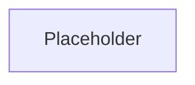
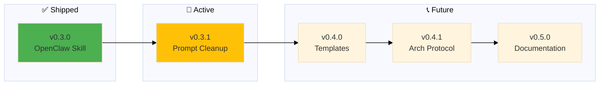

# Backstage - Roadmap

> 🤖
> | Backstage files | Description |
> | ---------------------------------------------------------------------------- | ------------------ |
> | [README](../README.md) | Our project |
> | [CHANGELOG](CHANGELOG.md) | What we did |
> | [ROADMAP](ROADMAP.md) | What we wanna do |
> | POLICY: [project](POLICY.md), [global](global/POLICY.md) | How we go about it |
> | HEALTH: [project](HEALTH.md), [global](global/HEALTH.md) | What we accept |
>
> We use **[backstage protocol](https://github.com/nonlinear/backstage)**, v0.3.4
> 🤖




## v0.3.8

### Type Enforcement & Version Sync

**Description:** Auto-calculate and enforce Type field in epics (Major/Minor/Patch)

**Problem:**
- Epics don't show semantic version type explicitly
- Version numbers can mismatch with intended type
- Manual grooming needed to ensure version consistency

**Solution:**
Implement `add_epic_types()` in backstage-start.sh:

1. **Auto-add Type field** after `### Epic Title`:
   ```markdown
   ## v1.2.3
   ### Epic Title
   **Type:** Minor  ← AUTO-CALCULATED
   ```

2. **Calculate type from version number:**
   - Compare epic version vs last CHANGELOG version
   - `vX.0.0` (MAJOR changed) → Type: Major
   - `v0.Y.0` (MINOR changed) → Type: Minor
   - `v0.0.Z` (PATCH changed) → Type: Patch

3. **Parity check:**
   - If Type exists but doesn't match version → adjust version to comply with Type
   - Example: Type: Major but v0.1.0 → change to v1.0.0

**Tasks:**
- [ ] Implement add_epic_types() function in backstage-start.sh
- [ ] Parse ROADMAP → extract all epics (## vX.Y.Z)
- [ ] Read last CHANGELOG version
- [ ] Calculate type (which number changed: X, Y, or Z)
- [ ] Insert **Type:** field after ### Epic Title
- [ ] Handle existing Type field (parity check)
- [ ] Adjust version if Type/version mismatch
- [ ] Update POLICY.md epic format (add Type field example)
- [ ] Test on multiple epics (major/minor/patch scenarios)
- [ ] Handle edge cases (v0.0.0, first epic, missing CHANGELOG)
- [ ] **Approve to merge**

**Success:**
- Every epic has **Type:** field auto-calculated
- Version numbers match semantic meaning
- No manual type annotation needed
- Grooming enforces version consistency

---

## v0.3.5

### Protocol Stabilization

**Description:** Major protocol evolution day - semantic versioning, manual merge protocol, automation improvements

**Context:**
- 30 commits in one day implementing core backstage features
- Skills v0.1.0 needed merge → discovered manual better than auto
- Diagram generation + navigation blocks automation
- Epic format standardization

**Accomplished (retrospective):**

**Semantic Versioning + Epic Format:**
- [x] Add semantic versioning rules to global POLICY (MAJOR.MINOR.PATCH)
- [x] Standardize epic format (## vX.Y.Z + ### Epic Title, separate)
- [x] Add "Approve to merge" task to epic workflow
- [x] Add post-merge validation step to epic protocol

**Manual Merge Protocol:**
- [x] Document manual merge protocol (ROADMAP→CHANGELOG format)
- [x] Create commit message format (Release vX.Y.Z: Title + bullets)
- [x] Define CHANGELOG entry format (date, past tense tasks, no checkboxes)
- [x] Test protocol with skills v0.1.0 (successful merge)

**Auto-Merge Attempt (implemented → removed):**
- [x] Implement auto-merge workflow detection
- [x] Add auto-add "Approve to merge" logic
- [x] Debug BSD awk compatibility issues (7 commits)
- [x] Decide manual > auto (simpler, more control)
- [x] Remove all auto-merge code (160 lines deleted)

**Mermaid Diagram Auto-Generation:**
- [x] Implement ROADMAP parser → mermaid syntax
- [x] Auto-insert diagrams after 🤖 navigation block
- [x] Fix BSD awk temp file pattern (diagram insertion)
- [x] Update all backstage files with diagrams

**Navigation Blocks:**
- [x] Implement ensure_navigation_blocks() in backstage-start.sh
- [x] Auto-create 🤖 blocks in README/ROADMAP/CHANGELOG/POLICY/HEALTH
- [x] Fix BSD sed compatibility (awk + cat method)

**New Epics Created:**
- [x] v0.3.1 - VISION Core Prompt
- [x] v0.3.2 - Parent Project Support
- [x] v0.3.3 - Auto-generate Mermaid Diagrams
- [x] v0.3.4 - Diagram Redesign
- [x] v0.3.6 - Auto-Update Navigation Version
- [x] v0.6.0 - Branch Lifecycle Management
- [x] v0.7.0 - Back to Main Rituals

**Finalization:**
- [ ] Republish backstage skill on ClawHub (manual, not automated yet)
  - **Command:** `clawhub publish /path/to/backstage/skill --version X.Y.Z --changelog "text"`
  - **Order:** merge → tag → publish (ClawHub points to stable tag, not branch)
  - **Future:** Automate in v0.7.0 or later (add to merge protocol)
- [ ] **Approve to merge**

**Success:**
- Manual merge protocol proven (skills v0.1.0 released)
- Backstage-start.sh robust (navigation blocks, diagrams, BSD awk compatible)
- Epic format standardized across all projects
- Clear decision: manual > auto (when cost > benefit)

---

## v0.7.0

### Back to Main Rituals

**Description:** Promote agenda and exercise to full projects with backstage protocol

**Context:**
- Agenda and exercise have grown beyond simple life/ subfolders
- Both need proper roadmaps, changelogs, and epic management
- Currently live as subfolders in life/ project
- Should be independent projects in ~/Documents/

**Solution:**
1. Move `~/Documents/life/agenda/` → `~/Documents/agenda/`
2. Create `~/Documents/exercise/` (fitness tracking project)
3. Copy gevulot backstage/ (empty template) to both
4. Extract epics from life/ROADMAP → respective project ROADMAPs:
   - v0.5.0 Home Augmented Calendar → agenda/ROADMAP
   - v0.6.0 Fitness Tracker → exercise/ROADMAP
5. Update life/ROADMAP (remove migrated epics, renumber if needed)

**Tasks:**
- [ ] Move agenda/ from life/ to Documents/
- [ ] Create exercise/ project in Documents/
- [ ] Copy gevulot backstage/ template to agenda/
- [ ] Copy gevulot backstage/ template to exercise/
- [ ] Extract v0.5.0 epic from life/ROADMAP → agenda/ROADMAP
- [ ] Extract v0.6.0 epic from life/ROADMAP → exercise/ROADMAP
- [ ] Update life/ROADMAP (remove migrated epics)
- [ ] Update life/backstage diagram (remove agenda/exercise nodes)
- [ ] Test backstage-start in agenda/ project
- [ ] Test backstage-start in exercise/ project
- [ ] **Approve to merge**

**Success:**
- Agenda and exercise are independent projects
- Each has own backstage/ (ROADMAP, CHANGELOG, POLICY, HEALTH)
- life/ project focuses on life-wide concerns (not sub-projects)
- Clear separation: life = meta-project, agenda/exercise = focused projects

---

## v0.3.1

### 📜 VISION Core Prompt

**Problem:** VISION.md exists in workspace, but belongs in backstage protocol

**Context:**
- Each project has its own VISION.md (ethics, principles, decision framework)
- Currently: VISION.md lives in workspace (workspace-specific)
- Should: VISION.md lives in project/backstage/ (project-specific)

**Solution:** Move VISION.md to backstage protocol, make it per-project

**Tasks:**
- [ ] Document VISION.md structure in backstage/POLICY.md
- [ ] Create VISION.md template (ethics, principles, decision tree)
- [ ] Move workspace VISION.md → life/backstage/VISION.md
- [ ] Update backstage-start.sh to read project VISION.md
- [ ] Add VISION.md to navigation block (🤖)
- [ ] Test with multiple projects

**Success:**
- Each project has its own VISION.md
- backstage-start reminds of project ethics/principles
- Workspace VISION.md deprecated (project-specific now)

---

## v0.3.2

### 🌳 Parent Project Support

**Problem:** Policentric structure needs hierarchy: Global < Parent < Project

**Current:** Global < Project (two layers only)

**Future:** Global < Parent Project < Project (three layers)

**Examples:**
- **Global:** `~/Documents/backstage/` (universal rules)
- **Parent:** `~/Documents/life/` (Nicholas's umbrella project)
- **Projects:** `~/Documents/life/fitness/`, `~/Documents/life/habits/`, etc.

**Parent project features:**
- Shared VISION.md (inherited by child projects)
- Shared POLICY.md (parent rules + global rules)
- Shared resources (scripts, templates, configs)
- Cross-project roadmap (parent-level epics)

**Resolution order:**
1. Project POLICY.md (most specific)
2. Parent POLICY.md (if exists)
3. Global POLICY.md (universal)

**Tasks:**
- [ ] Detect parent project (search up tree for backstage/)
- [ ] Cascade VISION.md (parent → project)
- [ ] Cascade POLICY.md (global → parent → project)
- [ ] Update backstage-start to show parent context
- [ ] Document parent project structure in POLICY.md
- [ ] Create example parent project (life/)

**Success:**
- Projects can inherit from parent
- Parent policies override global (when defined)
- Clear resolution order documented

---

## v0.3.3

### 📊 Auto-Generate Mermaid Diagrams

**Problem:** Roadmap diagrams are hardcoded, high maintenance, go stale

**Current state:**
- Each backstage file has mermaid diagram (after 🤖 nav block)
- Manual updates every time epic added/removed/completed
- Easy to forget → diagram diverges from ROADMAP

**Future state:**
- Parse ROADMAP.md (via parse-roadmap.sh)
- Generate mermaid graph (version → status → name)
- Auto-update all backstage files on backstage-start run

**Tasks:**
- [ ] Fix BSD awk multi-line bug (use temp files, not variables)
- [ ] Test diagram generation on multiple projects
- [ ] Document diagram format rules in POLICY.md
- [ ] Support project-specific diagram overrides
- [ ] Handle empty ROADMAPs gracefully

**Success:**
- Diagrams auto-update on every backstage-start
- No manual maintenance needed
- Diagrams always match ROADMAP state

---

## v0.3.4

### 📊 Diagram Redesign - Beyond Linear

**Problem:** Current diagrams = single linear chain (A → B → C)

**Reality:** Epics have richer relationships
- **Parallel work:** Multiple epics active simultaneously
- **Dependencies:** Some epics block others
- **Changelog context:** Completed work informs future planning

**Proposed evolution:**
- **ROADMAP diagram:** Show active + backlog (linear OK for now)
- **CHANGELOG diagram:** Show completed epics (timeline/grouped by version)
- **Combined view:** ROADMAP + CHANGELOG = full project lifecycle

**Questions to explore:**
- Should CHANGELOG have its own diagram?
- Gantt chart for parallel epics?
- Dependency arrows (epic A blocks epic B)?
- Timeline vs priority-based ordering?

**Tasks:**
- [ ] Research mermaid diagram types (gantt, timeline, graph with clusters)
- [ ] Prototype CHANGELOG diagram (completed epics visualization)
- [ ] Test combined ROADMAP + CHANGELOG view
- [ ] Document when to use which diagram type
- [ ] Add examples to POLICY.md

**Success:**
- Diagrams reflect reality (not just linear progression)
- CHANGELOG has visual context (what we accomplished)
- Clear when to use each diagram type

---

## v0.3.5

### 📝 Prompt Grooming

**Problem:** .github/prompts/ has 30+ prompts, many outdated/unused

**Solution:** Review, archive, and document active prompts

**Tasks:**

- [ ] Inventory all prompts in .github/prompts/
- [ ] Identify active vs unused prompts
- [ ] Archive unused prompts (move to _archived/)
- [ ] Document remaining prompts in PROMPTS.md
- [ ] Update README with prompt usage guide
- [ ] **Approve to merge**

**Success:**
- Clean prompt inventory
- Active prompts documented
- Unused prompts archived

---

## v0.3.6

### 🔄 Auto-Update Navigation Version

**Problem:** Navigation blocks say "backstage protocol v0.3.4" but version is hardcoded

**Current behavior:**
- Version number is manual (users must update)
- Drifts from CHANGELOG stable version

**Proposed solution:**
- backstage-start reads CHANGELOG → extracts last stable version
- Updates navigation block automatically: `> We use **[backstage protocol](...)**, vX.Y.Z`

**Tasks:**
- [ ] Parse CHANGELOG.md → extract latest version (## vX.Y.Z)
- [ ] Update navigation block regex (find "We use **[backstage")
- [ ] Replace version automatically during backstage-start
- [ ] Test with multiple projects (backstage, skills, life)
- [ ] Add version detection to pre-commit validation
- [ ] Document in POLICY.md (navigation version = auto-synced)
- [ ] **Approve to merge**

**Success:**
- Navigation version auto-updates from CHANGELOG
- No manual version edits needed
- Version always matches stable release

---

## v0.3.3

### 🏴 Backstage to Win

**Description:** Merge context-switch + roadmap skills into backstage-skill

**Problem:**
- context-switch (project/epic transitions + HEALTH checks) should be part of backstage
- roadmap (epic planning, grooming, emoji shortcuts) should be part of backstage
- Three separate skills = fragmented workflow

**Solution:** Merge both into single backstage-skill (universal project management)

**Tasks:**
- [ ] Merge context-switch logic into backstage-skill
  - [ ] Morning/evening workflows ("bom dia", "boa noite")
  - [ ] Project/epic transitions with HEALTH checks
  - [ ] Context state tracking (.current-context.json)
- [ ] Merge roadmap logic into backstage-skill
  - [ ] Epic creation, grooming, emoji shortcuts
  - [ ] Roadmap management across projects
  - [ ] Task reordering, merging
- [ ] Update backstage-skill SKILL.md (new triggers, features)
- [ ] Test on multiple projects (life, librarian, wiley, skills)
- [ ] Archive context-switch + roadmap skills (mark deprecated in skills/)

**Success:**
- Single skill handles full project workflow
- context-switch + roadmap features accessible via backstage commands
- No workflow fragmentation

---

## v0.4.1

### 🏗️ Arch Protocol | [notes](https://github.com/nonlinear/librarian/blob/epic/v0.15.0-skill-protocol/backstage/epic-notes/v0.15.0-skill-protocol.md)

**arch: = PARIDADE - O COMO familiar e mage comunicam**

**Definition:** Shared language (visual = text = code) for architecture decisions

**Problem:** Todos epics mudam estrutura, precisa de arch (diagrama antes de código)

**Solution:** `arch:` prefix protocol - Nicholas says "arch: X" → I implement + document in diagram

**Paridade = same map, same territory:**
- Nicholas olha diagrama → sabe exatamente o que vai acontecer
- Claw olha diagrama → sabe exatamente o que fazer
- Screenshots → provam mapa = território (always)

**Key insight:**
- **First epic:** Create diagram from scratch (hard - 29 commits, 4 hours)
- **Subsequent epics:** ALTER existing diagram (easy - 1 commit)
- **Diagram = living document** - cada epic refina
- **Sandbox = safe** - epics isolated (branch), diagrams versioned (epic-notes/), nodes explicit (mermaid)

**Workflow:**
1. Planning (arch:) - Familiar opines freely, suggests, debates → diagram agreement
2. Execution (post-diagram) - Familiar executes without errors, everything agreed

**Learning source:** `~/Documents/librarian/backstage/epic-notes/arch-session-2026-02-08.md`

**Tasks:**
- [ ] Extract arch protocol from librarian v0.15.0 learnings
- [ ] Document `arch:` prefix convention in POLICY.md
- [ ] Create arch workflow template (mermaid → commits → screenshots)
- [ ] Add to epic-notes/ standard structure
- [ ] Test with 2+ different project types

**Success Criteria:**
- New epics start with `arch:` diagram creation
- Diagram changes = explicit (screenshots prove evolution)
- Low metabolic cost (alter > recreate)

---

## v0.4.0

### Templates

⏳ Create installable templates for new projects

**Problem:** Users need starter templates

**Solution:** GitHub templates/ folder with ROADMAP, CHANGELOG, POLICY, HEALTH templates

**Tasks:**

- [ ] Create templates/ROADMAP-template.md
- [ ] Create templates/CHANGELOG-template.md
- [ ] Create templates/POLICY-template.md
- [ ] Create templates/HEALTH-template.md
- [ ] **OPTIONAL:** Document when to use design-architecture exercise
  - Complex systems (APIs, integrations, workflows)
  - Architectural changes (not simple fixes)
  - Deliverable = approved diagram BEFORE implementation

---

## v0.5.0

### Documentation

⏳ Write comprehensive usage guide

**Problem:** People don't know how to use backstage

**Solution:** README with examples, philosophy, workflow diagrams

**Tasks:**

- [ ] Write README.md (philosophy + quick start)
- [ ] Add workflow diagrams (mermaid)
- [ ] Document epic dance
- [ ] Add examples from real projects
- [ ] **Approve to merge**

**Success:**
- Clear onboarding guide
- Visual workflow diagrams
- Real-world examples

---

## v0.6.0

### Branch Lifecycle Management

**Problem:** What to do with branches after merge?

**Current state:**
- Branches merged to main stay forever → pollution
- No automation for cleanup
- No guidance for single-user vs multi-user workflows

**Options explored:**

1. **Auto-delete after merge**
   - Pros: Clean, forces discipline
   - Cons: Loses visual history in UI

2. **Archive with tag before delete**
   - Pros: Preserves recovery point, clean branches
   - Cons: Tags don't show in UI like branches

3. **Keep indefinitely**
   - Pros: GitHub/GitLab shows merged branches
   - Cons: 50+ branches = noise

**Pull Request consideration:**

- **Single-user:** No PRs needed (overhead without benefit)
- **Multi-user:** PRs required (code review, CI/CD gates)
- **Automation:** backstage-start can auto-create PR when "Approve to merge" checked

**Proposed solution:**

**Default (single-user):**
- No PRs (merge direto via git)
- Delete branch after merge
- Archive with tag if epic was significant
- Command: `backstage-cleanup` after merge

**Opt-in (multi-user, via project POLICY):**
- Auto-create PR when "Approve to merge" checked
- CI runs HEALTH checks
- Auto-merge when passes
- Delete branch after merge

**Tasks:**

- [ ] Document branch cleanup policy in global POLICY
- [ ] Add `backstage-cleanup` command (delete + tag option)
- [ ] Implement auto-delete after merge (default: ask first)
- [ ] Add multi-user PR workflow (opt-in via project POLICY)
- [ ] Document when to keep vs delete branches
- [ ] Add archive tagging convention (`archive/epic-vX.Y.Z`)
- [ ] **Approve to merge**

**Success:**
- Clear branch lifecycle rules
- Automated cleanup (configurable)
- Multi-user PR support (opt-in)
- No branch pollution after 10+ epics

---

## v0.5.0

### Documentation

⏳ Write comprehensive usage guide

**Problem:** People don't know how to use backstage

**Solution:** README with examples, philosophy, workflow diagrams

**Tasks:**

- [ ] Write README.md (philosophy + quick start)
- [ ] Add workflow diagrams (mermaid)
- [ ] Document epic dance
- [ ] Add examples from real projects
- [ ] **Approve to merge**

**Success:**
- Clear onboarding guide
- Visual workflow diagrams
- Real-world examples

---



