```mermaid
%%{init: {'theme':'base', 'themeVariables': { 'fontSize':'14px'}}}%%
graph LR
    subgraph "🚧 Active"
        V03[v0.3.0<br/>OpenClaw Skill]
    end
    
    subgraph "📞 Future"
        V04[v0.4.0<br/>Templates]
        V05[v0.5.0<br/>Documentation]
    end

    V03 --> V04
    V04 --> V05
    
    style V03 fill:#4CAF50
```

# Backstage - Roadmap

---

## v0.3.0

### [🚧](https://github.com/nonlinear/backstage/tree/epic/v0.3.0-openclaw-skill) OpenClaw Skill

**Problem:** Backstage needs OpenClaw integration (skill + prompt)

**Solution:** Create skill that reads POLICY and executes via AI

**Tasks:**

- [x] Create skill/backstage.sh (thin wrapper)
- [x] Create skill/SKILL.md (documentation)
- [x] Add AI EXECUTION PROTOCOL to global POLICY.md
- [ ] **CRITICAL:** Inventory global vs project POLICY/HEALTH (muita confusão - content in wrong files)
- [ ] Test with real project
- [ ] Merge to main

---

## v0.4.0

### Templates

⏳ Create installable templates for new projects

**Problem:** Users need starter templates

**Solution:** GitHub templates/ folder with ROADMAP, CHANGELOG, POLICY, HEALTH templates

**Tasks:**

- [ ] Create templates/ROADMAP-template.md
- [ ] Create templates/CHANGELOG-template.md
- [ ] Create templates/POLICY-template.md
- [ ] Create templates/HEALTH-template.md

---

## v0.5.0

### Documentation

⏳ Write comprehensive usage guide

**Problem:** People don't know how to use backstage

**Solution:** README with examples, philosophy, workflow diagrams

**Tasks:**

- [ ] Write README.md (philosophy + quick start)
- [ ] Add workflow diagrams (mermaid)
- [ ] Document epic dance
- [ ] Add examples from real projects

---

> 🤖
> | Backstage files | Description |
> | ---------------------------------------------------------------------------- | ------------------ |
> | [README](../README.md) | Our project |
> | [CHANGELOG](CHANGELOG.md) | What we did |
> | [ROADMAP](ROADMAP.md) | What we wanna do |
> | POLICY: [project](POLICY.md), [global](global/POLICY.md) | How we go about it |
> | CHECKS: [project](HEALTH.md), [global](global/HEALTH.md) | What we accept |
> | We use **[backstage rules](https://github.com/nonlinear/backstage)**, v0.3.0 |
> 🤖

