```mermaid
%%{init: {'theme':'base', 'themeVariables': { 'fontSize':'14px'}}}%%
graph LR
    subgraph "📞 Future"
        V03[v0.3.0<br/>Update Script]
        V04[v0.4.0<br/>Templates]
        V05[v0.5.0<br/>Documentation]
    end

    V03 --> V04
    V04 --> V05
```

# Backstage - Roadmap

> 🤖
>
> - [README](../README.md) - Our project
> - [CHANGELOG](CHANGELOG.md) — What we did
> - [ROADMAP](ROADMAP.md) — What we wanna do
> - [POLICY](POLICY.md) [project](POLICY.md) / [global](global/POLICY.md) — How we do it
> - [HEALTH](HEALTH.md) — What we accept
> - 👷 Wanna collaborate? Connect via [signal group](https://signal.group/#CjQKIKD7zJjxP9sryI9vE5ATQZVqYsWGN_3yYURA5giGogh3EhAWfvK2Fw_kaFtt-MQ6Jlp8)
>
> 🤖

---

## v0.3.0

### ⏳ OpenClaw Skill

AI-powered orchestration layer for backstage protocol.

**Problem:** Need executable skill to manifest backstage protocol in OpenClaw sessions
**Solution:** backstage.sh skill with install, update, protocol execution, and next-step display

**Tasks:**

- [ ] Foundation epic in ROADMAP template
- [ ] Update README - "Backstage = PROTOCOL" framing
- [ ] Protocol diagrams (skill flow, epic dance, polycentric governance)
- [ ] Move approved skill diagram to `skill/` or `README.md`
- [ ] Publish placeholder skill on ClawdHub (reserve "backstage" name)
- [ ] Install logic (templates → backstage/, global/ from repo main)
- [ ] Update logic (compare versions, download from main)
- [ ] POLICY protocol execution (read global + project, project wins)
- [ ] HEALTH protocol execution (run checks, auto-fix, report)
- [ ] "What's next?" display (epic list, commands)

---

## v0.4.0 (was v0.3.0)

### Update Script

⏳ Smart update script to fetch backstage framework updates from GitHub

**Problem:** Projects need easy way to update backstage framework files
**Solution:** Interactive script compares versions, shows changes, gets user approval

**Tasks:**

- [ ] Fetch remote CHANGELOG from GitHub
- [ ] Compare local vs remote version
- [ ] Enumerate improvements per version (from CHANGELOG epics)
- [ ] Show user what changed
- [ ] User confirms yes/no to update
- [ ] Download and overwrite global/ files on approval
- [ ] Download and overwrite .github/prompts/backstage-\* files
- [ ] Preserve project-specific files (ROADMAP, CHANGELOG, POLICY, HEALTH at root)

---

## v0.4.0

### Project Templates

⏳ Create template for new projects with starter structure

**Problem:** New projects need boilerplate setup
**Solution:** Template with default structure and optional starter epics

**Tasks:**

- [ ] Create empty ROADMAP template structure
- [ ] Include v0.1.0 Environment Setup as default first epic in template
- [ ] Create empty CHANGELOG template
- [ ] Create empty POLICY template (references global/POLICY.md)
- [ ] Create empty HEALTH template (references global/HEALTH.md)
- [ ] Add template README with navigation block
- [ ] Document how backstage-update.py creates missing files from templates
- [ ] Add option: create with/without starter epics

---

## v0.5.0

### Documentation & Diagrams

⏳ Improve README value proposition and create better diagrams

**Problem:** Backstage needs clearer benefits and more useful visualizations
**Solution:** Enhanced README, dynamic diagrams generated from local files

**Tasks:**

- [ ] Add "why it's good" section to README (benefits, use cases)
- [ ] Research better diagram types (timeline? dependency graph? progress tracker?)
- [ ] Implement chosen diagram format in mermaid
- [ ] Add diagram generation logic to global/POLICY.md
- [ ] Update all status files with new diagram
- [ ] **Fast-pass for typos:** Allow direct commits to main for typo-only fixes (no epic/branch workflow needed)

---

## v0.6.0

### Multi-Project Backstage (Monorepo Support)

⏳ Support multiple mini-products under one parent project, each with independent backstage files

**Problem:** Large projects have multiple products/modules that need separate roadmaps/changelogs but share a repo
**Solution:** Nested backstage structure with parent coordination

**Use cases:**

- Monorepo with multiple apps (e.g., web app + mobile app + API)
- Product suite (e.g., core library + plugins)
- Multi-tenant systems (each tenant has own roadmap)

**Tasks:**

**Structure Design:**

- [ ] Define nested backstage folder convention (e.g., `apps/web/backstage/`, `apps/mobile/backstage/`)
- [ ] Decide: Parent backstage aggregates children, or children are independent?
- [ ] Document parent-child relationship rules in global/POLICY.md
- [ ] Create example monorepo structure in templates/

**Parent Coordination:**

- [ ] Parent ROADMAP shows cross-cutting epics (affect multiple children)
- [ ] Parent CHANGELOG aggregates major milestones from children
- [ ] Children reference parent for shared policies (polycentric at 3 levels: global → parent → child)
- [ ] Navigation blocks point to both parent and sibling backstage files

**Tooling:**

- [ ] Update backstage-start to detect nested structure (look for parent backstage/)
- [ ] backstage-update.py handles multiple backstage folders
- [ ] Health checks validate parent-child consistency
- [ ] Optional: Aggregate view (parent dashboard showing all child statuses)

**Migration:**

- [ ] Document how to split existing backstage into multi-project
- [ ] Provide migration script (copy backstage/ → apps/\*/backstage/)
- [ ] Backward compatibility: single backstage/ still works

---
