```mermaid
graph LR
    A[📋 v0.3.8 Skill Reordering]
    B[📋 v0.3.9 Roadmap Skill]
    A --> B
    C[📋 v0.4.0 Type Enforcement & Version Sync]
    B --> C
    D[📋 v0.7.0 Back to Main rites]
    C --> D
    E[📋 v0.3.1 VISION Core Prompt]
    D --> E
    F[📋 v0.8.0 Backstage from zero]
    E --> F
    G[📋 v0.10.0 Pattern Research]
    F --> G
```

# Backstage - Roadmap

> 🤖
> | Backstage files | Description |
> | ---------------------------------------------------------------------------- | ------------------ |
> | [README](../README.md) | Our project |
> | [CHANGELOG](CHANGELOG.md) | What we did |
> | [ROADMAP](ROADMAP.md) | What we wanna do |
> | POLICY: [project](POLICY.md), [global](global/POLICY.md) | How we go about it |
> | HEALTH: [project](HEALTH.md), [global](global/HEALTH.md) | What we accept |
>
> We use **[backstage protocol](https://github.com/nonlinear/backstage)**, v0.3.4
> 🤖



---

## v0.3.8

### Skill Reordering

**Goal:** Organize skills inside skill folder, improve backstage skill "add to" function, document skills in README

**Tasks:**
- [ ] Move all skills inside skill folder (change symlinks)
- [ ] Backstage skill "add to" function (add skill to project)
- [ ] POLICY as folder
- [ ] HEALTH as folder
- [ ] Project/ global, same level
- [ ] Skills section on README (list available skills)

**Success:**
- All skills in `skill/` folder (no scattered symlinks)
- `backstage-skill add <skill-name>` works
- README documents available skills

---

## v0.3.9

### Roadmap Skill

**Description:** Localhost wrapper (like arch) that loads ROADMAP.md and displays as interactive to-do list organized by epics

**Goal:** Visual epic management with automatic renumbering and task reordering

**Tasks:**
- [ ] Phase 1: Load ROADMAP.md (read-only viewer)
- [ ] Phase 2: Check tasks (mark complete)
- [ ] Phase 3: Add/remove/reorder tasks within epics
- [ ] Phase 4: Reorder epics
- [ ] Phase 5: Automatic renumbering (v0.X.0 → v0.Y.0 on reorder)

**Success:**
- Interactive ROADMAP viewer (localhost)
- Task completion (checkboxes work)
- Drag-and-drop epic reordering
- Auto-renumber on epic move
- Saves back to ROADMAP.md

---

## v0.3.9

### Pattern Research (Backstage vs Open Source Standards)

**Goal:** Evaluate if backstage protocol is reinventing the wheel vs existing open source standards

**Questions:**
- Should we adopt Keep a Changelog, Conventional Commits, or other standards?
- What's unique about backstage? (HEALTH, mermaid, epic-notes)
- Hybrid approach (standards + custom features) or full migration?

**Tasks:**
- [x] Research existing protocols (Keep a Changelog, Semantic Versioning, Conventional Commits, ADR, Shape Up)
- [x] Compare features (table: Visual roadmap, Health checks, Tooling, Adoption)
- [ ] Prototype: Generate CHANGELOG from Conventional Commits
- [ ] Measure: Does HEALTH.md prevent issues?
- [ ] Decide: Keep, hybrid, or abandon backstage?

**Details:** [epic-notes/v0.9.0-pattern-research.md](epic-notes/v0.9.0-pattern-research.md)

**Success Criteria:**
- Clear recommendation (keep, hybrid, or replace)
- If hybrid: Changelog auto-generation working
- If replace: Migration plan documented

---

## v0.11.0

### Skill Security Fixes

**Problem:** ClawHub security scan flagged skill as "Suspicious" (high confidence) - 3 major issues: undeclared $HOME access, arbitrary code execution via eval, file modification without explicit warnings.

**Goal:** Pass ClawHub security scan OR justify current design with explicit documentation/warnings.

**Tasks:**
- [ ] Discuss: Is eval execution core to backstage or removable?
- [ ] Decide: Configurable $HOME paths vs hardcoded (env var?)
- [ ] Document: Add explicit warnings about HEALTH.md code execution
- [ ] Metadata: Declare required paths/permissions in skill manifest
- [ ] Consider: Sandbox eval (restricted bash, whitelist commands?)
- [ ] Alternative: Remove eval entirely, use separate test scripts?
- [ ] Hybrid approach: Keep eval for project HEALTH, remove for global?
- [ ] Re-publish skill after fixes, verify scan result

**Details:** [epic-notes/v0.11.0-skill-security-fixes.md](epic-notes/v0.4.0-skill-security-fixes.md)

---

## v0.4.0

### Type Enforcement & Version Sync

**Description:** Auto-calculate and enforce Type field in epics (Major/Minor/Patch)

**Problem:**
- Epics don't show semantic version type explicitly
- Version numbers can mismatch with intended type
- Manual grooming needed to ensure version consistency

**Solution:**
Implement `add_epic_types()` in backstage-start.sh:

1. **Auto-add Type field** after `### Epic Title`:
   ```markdown
   ## v1.2.3
   ### Epic Title
   **Type:** Minor  ← AUTO-CALCULATED
   ```

2. **Calculate type from version number:**
   - Compare epic version vs last CHANGELOG version
   - `vX.0.0` (MAJOR changed) → Type: Major
   - `v0.Y.0` (MINOR changed) → Type: Minor
   - `v0.0.Z` (PATCH changed) → Type: Patch

3. **Parity check:**
   - If Type exists but doesn't match version → adjust version to comply with Type
   - Example: Type: Major but v0.1.0 → change to v1.0.0

**Tasks:**
- [ ] Implement add_epic_types() function in backstage-start.sh
- [ ] Parse ROADMAP → extract all epics (## vX.Y.Z)
- [ ] Read last CHANGELOG version
- [ ] Calculate type (which number changed: X, Y, or Z)
- [ ] Insert **Type:** field after ### Epic Title
- [ ] POLICY reordena ROADMAP baseado em type e ordem
- [ ] Handle existing Type field (parity check)
- [ ] Adjust version if Type/version mismatch
- [ ] Update POLICY.md epic format (add Type field example)
- [ ] Test on multiple epics (major/minor/patch scenarios)
- [ ] Handle edge cases (v0.0.0, first epic, missing CHANGELOG)

**Success:**
- Every epic has **Type:** field auto-calculated
- Version numbers match semantic meaning
- No manual type annotation needed
- Grooming enforces version consistency

---

## v0.3.9

### Diagram Generation Bootstrap

**Type:** Patch

**Description:** Initial diagram generation implementation (completing v0.3.3)

**Problem:**
- v0.3.3 implemented diagram auto-update logic but parser was broken
- parse-roadmap.sh expected old epic format (### v0.3.5 - Name)
- ROADMAP uses new format (## vX.Y.Z + ### Name separated)
- Diagrams showed "No epics found" error

**Solution:**
- Fixed parse-roadmap.sh to support new epic format
- Sanitized epic names (removed quotes for mermaid compatibility)
- Limited diagram to 4 nodes (readability)
- Generated initial diagrams in all backstage files

**Accomplished:**
- Fixed parse-roadmap.sh regex (## vX.Y.Z pattern)
- Removed quotes from epic names in mermaid output
- Added max_nodes limit (4) to diagram generation
- Regenerated diagrams in README, ROADMAP, CHANGELOG, POLICY, HEALTH

**Success:**
- Diagrams auto-generate on backstage-start
- All backstage files have current roadmap snapshot
- Mermaid syntax valid (no quote errors)
- Compact view (4 nodes max)

---


## v0.7.0

### "Back to Main" rites

**Description:** back to main is a MILESTONE ritual an needs to be fortified

**Tasks:**

- [ ] Fix backstage-start.sh: `check_branch: command not found` (deleted during auto-merge removal)
- [ ] Merge to main auto task on all epics
- [ ] fortify ritual
- [ ] teat, merge, test
- [ ] what we do with branches?
- [ ] auto push? Onboarding
- [ ] HOOKS (promotion, etc)
- [ ] protocol for retroactive epics (major minor patch)
- [ ] define what types mean
- [ ] ensure that main epic only has one comit per epic

---


## v0.3.1

### VISION Core Prompt

**Problem:** VISION.md exists in workspace, but belongs in backstage protocol

**Context:**
- Each project has its own VISION.md (ethics, principles, decision framework)
- Currently: VISION.md lives in workspace (workspace-specific)
- Should: VISION.md lives in project/backstage/ (project-specific)

**Solution:** Move VISION.md to backstage protocol, make it per-project

**Tasks:**
- [ ] Document VISION.md structure in backstage/POLICY.md
- [ ] Create VISION.md template (ethics, principles, decision tree)
- [ ] Move workspace VISION.md → life/backstage/VISION.md
- [ ] Update backstage-start.sh to read project VISION.md
- [ ] Add VISION.md to navigation block (🤖)
- [ ] Test with multiple projects

**Success:**
- Each project has its own VISION.md
- backstage-start reminds of project ethics/principles
- Workspace VISION.md deprecated (project-specific now)

---

## v0.8.0

### Backstage from zero

**Description:** back to main is a MILESTONE ritual an needs to be fortified

**Tasks:**

- [ ] Skill BUILDS backstage it not, from templates
- [ ] Onboarding

---

## v0.3.2

### 🌳 Parent Project Support

**Problem:** Policentric structure needs hierarchy: Global < Parent < Project

**Current:** Global < Project (two layers only)

**Future:** Global < Parent Project < Project (three layers)

**Examples:**
- **Global:** `~/Documents/backstage/` (universal rules)
- **Parent:** `~/Documents/life/` (Nicholas's umbrella project)
- **Projects:** `~/Documents/life/fitness/`, `~/Documents/life/habits/`, etc.

**Parent project features:**
- Shared VISION.md (inherited by child projects)
- Shared POLICY.md (parent rules + global rules)
- Shared resources (scripts, templates, configs)
- Cross-project roadmap (parent-level epics)

**Resolution order:**
1. Project POLICY.md (most specific)
2. Parent POLICY.md (if exists)
3. Global POLICY.md (universal)

**Tasks:**
- [ ] Detect parent project (search up tree for backstage/)
- [ ] Cascade VISION.md (parent → project)
- [ ] Cascade POLICY.md (global → parent → project)
- [ ] Update backstage-start to show parent context
- [ ] Document parent project structure in POLICY.md
- [ ] Create example parent project (life/)

**Success:**
- Projects can inherit from parent
- Parent policies override global (when defined)
- Clear resolution order documented

---

## v0.3.3

### Auto-Generate Mermaid Diagrams

**Problem:** Roadmap diagrams are hardcoded, high maintenance, go stale

**Current state:**
- Each backstage file has mermaid diagram (after 🤖 nav block)
- Manual updates every time epic added/removed/completed
- Easy to forget → diagram diverges from ROADMAP

**Future state:**
- Parse ROADMAP.md (via parse-roadmap.sh)
- Generate mermaid graph (version → status → name)
- Auto-update all backstage files on backstage-start run

**Tasks:**
- [x] Fix BSD awk multi-line bug (use temp files, not variables)
- [x] Parse ROADMAP.md (via parse-roadmap.sh)
- [x] Generate mermaid graph (version → status → name)
- [x] Auto-update all backstage files on backstage-start run
- [ ] Generate initial diagram when ROADMAP created (bootstrap)
- [x] Test diagram generation on multiple projects
- [x] Document diagram format rules in POLICY.md
- [x] Support project-specific diagram overrides
- [x] Handle empty ROADMAPs gracefully

**Success:**
- Diagrams auto-update on every backstage-start
- No manual maintenance needed
- Diagrams always match ROADMAP state

---

## v0.3.4

### Diagram Redesign - Beyond Linear

**Problem:** Current diagrams = single linear chain (A → B → C)

**Reality:** Epics have richer relationships
- **Parallel work:** Multiple epics active simultaneously
- **Dependencies:** Some epics block others
- **Changelog context:** Completed work informs future planning

**Proposed evolution:**
- **ROADMAP diagram:** Show active + backlog (linear OK for now)
- **CHANGELOG diagram:** Show completed epics (timeline/grouped by version)
- **Combined view:** ROADMAP + CHANGELOG = full project lifecycle

**Questions to explore:**
- Should CHANGELOG have its own diagram?
- Gantt chart for parallel epics?
- Dependency arrows (epic A blocks epic B)?
- Timeline vs priority-based ordering?

**Tasks:**
- [ ] Research mermaid diagram types (gantt, timeline, graph with clusters)
- [ ] Prototype CHANGELOG diagram (completed epics visualization)
- [ ] Test combined ROADMAP + CHANGELOG view
- [ ] Document when to use which diagram type
- [ ] Add examples to POLICY.md

**Success:**
- Diagrams reflect reality (not just linear progression)
- CHANGELOG has visual context (what we accomplished)
- Clear when to use each diagram type

---

## v0.3.6

### Navigation Branding

**Problem:** Navigation blocks + GitHub social preview need visual identity

**Current state:**
- Navigation 🤖 blocks are text-only
- GitHub shows generic preview on shares
- No visual branding across backstage projects

**Proposed solution:**
1. **SVG badges for navigation blocks** (version, status, project type)
2. **GitHub social preview image** (og:image meta tag)
3. **Brandable navigation** (project logo/icon support)

**Context from reminders:**
- Discussed SVG generation for GitHub social cards
- Want consistent branding across projects
- Auto-update version badges from CHANGELOG

**Tasks:**
- [ ] Design SVG badge format (version, status, custom text)
- [ ] Generate badges in backstage-start (or separate script)
- [ ] Update navigation blocks with badge links
- [ ] Create GitHub social preview template (og:image)
- [ ] Support project-specific logos/icons
- [ ] Auto-update version badge from CHANGELOG
- [ ] Document badge format in POLICY.md

**Success:**
- Navigation blocks have visual badges
- GitHub shares show branded preview
- Version badges auto-update from CHANGELOG
- Projects can customize branding

---

## v0.4.1

### Arch Protocol

**Note:** This may become a skill companion (arch skill in librarian or standalone). If so, change to skill companion status.

**arch: = PARIDADE - O COMO familiar e mage comunicam**

**Definition:** Shared language (visual = text = code) for architecture decisions

**Problem:** Todos epics mudam estrutura, precisa de arch (diagrama antes de código)

**Solution:** `arch:` prefix protocol - Nicholas says "arch: X" → I implement + document in diagram

**Paridade = same map, same territory:**
- Nicholas olha diagrama → sabe exatamente o que vai acontecer
- Claw olha diagrama → sabe exatamente o que fazer
- Screenshots → provam mapa = território (always)

**Key insight:**
- **First epic:** Create diagram from scratch (hard - 29 commits, 4 hours)
- **Subsequent epics:** ALTER existing diagram (easy - 1 commit)
- **Diagram = living document** - cada epic refina
- **Sandbox = safe** - epics isolated (branch), diagrams versioned (epic-notes/), nodes explicit (mermaid)

**Workflow:**
1. Planning (arch:) - Familiar opines freely, suggests, debates → diagram agreement
2. Execution (post-diagram) - Familiar executes without errors, everything agreed

**Learning source:** `~/Documents/librarian/backstage/epic-notes/arch-session-2026-02-08.md`

**Tasks:**
- [ ] Extract arch protocol from librarian v0.15.0 learnings
- [ ] Document `arch:` prefix convention in POLICY.md
- [ ] Create arch workflow template (mermaid → commits → screenshots)
- [ ] Add to epic-notes/ standard structure
- [ ] Test with 2+ different project types

**Success Criteria:**
- New epics start with `arch:` diagram creation
- Diagram changes = explicit (screenshots prove evolution)
- Low metabolic cost (alter > recreate)

---

## v0.4.0

### Templates

⏳ Create installable templates for new projects

**Problem:** Users need starter templates

**Solution:** GitHub templates/ folder with ROADMAP, CHANGELOG, POLICY, HEALTH templates

**Tasks:**

- [ ] Create templates/ROADMAP-template.md
- [ ] Create templates/CHANGELOG-template.md
- [ ] Create templates/POLICY-template.md
- [ ] Create templates/HEALTH-template.md
- [ ] **OPTIONAL:** Document when to use design-architecture exercise
  - Complex systems (APIs, integrations, workflows)
  - Architectural changes (not simple fixes)
  - Deliverable = approved diagram BEFORE implementation

---

## v0.5.0

### Documentation

⏳ Write comprehensive usage guide

**Problem:** People don't know how to use backstage

**Solution:** README with examples, philosophy, workflow diagrams

**Tasks:**

- [ ] Write README.md (philosophy + quick start)
- [ ] Add workflow diagrams (mermaid)
- [ ] Document epic dance
- [ ] Add examples from real projects

**Success:**
- Clear onboarding guide
- Visual workflow diagrams
- Real-world examples

---

## v0.6.0

### Branch Lifecycle Management

**Problem:** What to do with branches after merge?

**Current state:**
- Branches merged to main stay forever → pollution
- No automation for cleanup
- No guidance for single-user vs multi-user workflows

**Options explored:**

1. **Auto-delete after merge**
   - Pros: Clean, forces discipline
   - Cons: Loses visual history in UI

2. **Archive with tag before delete**
   - Pros: Preserves recovery point, clean branches
   - Cons: Tags don't show in UI like branches

3. **Keep indefinitely**
   - Pros: GitHub/GitLab shows merged branches
   - Cons: 50+ branches = noise

**Pull Request consideration:**

- **Single-user:** No PRs needed (overhead without benefit)
- **Multi-user:** PRs required (code review, CI/CD gates)
- **Automation:** backstage-start can auto-create PR when "Approve to merge" checked

**Proposed solution:**

**Default (single-user):**
- No PRs (merge direto via git)
- Delete branch after merge
- Archive with tag if epic was significant
- Command: `backstage-cleanup` after merge

**Opt-in (multi-user, via project POLICY):**
- Auto-create PR when "Approve to merge" checked
- CI runs HEALTH checks
- Auto-merge when passes
- Delete branch after merge

**Tasks:**

- [ ] Document branch cleanup policy in global POLICY
- [ ] Add `backstage-cleanup` command (delete + tag option)
- [ ] Implement auto-delete after merge (default: ask first)
- [ ] Add multi-user PR workflow (opt-in via project POLICY)
- [ ] Document when to keep vs delete branches
- [ ] Add archive tagging convention (`archive/epic-vX.Y.Z`)

**Success:**
- Clear branch lifecycle rules
- Automated cleanup (configurable)
- Multi-user PR support (opt-in)
- No branch pollution after 10+ epics

