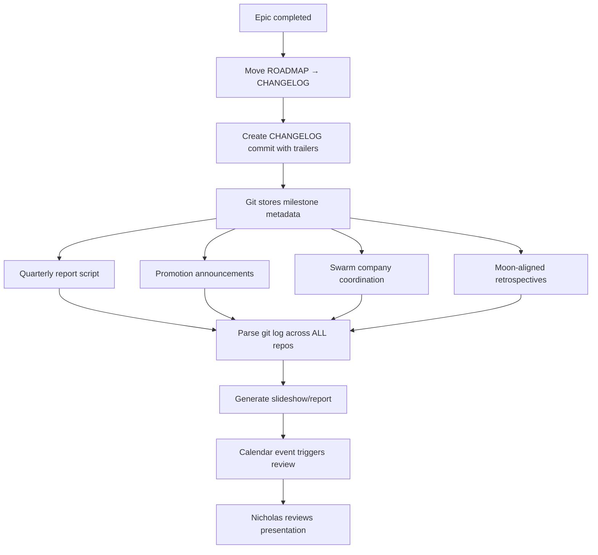

# Epic: Changelog as Milestone System

**Status:** 💡 CONCEPT  
**Created:** 2026-02-13  
**Project:** backstage (cross-project infrastructure)

---

## Problem

**When epic moves from ROADMAP → CHANGELOG, we lose the milestone moment.**

Current state:
- Epics completed, removed from ROADMAP
- No structured way to track "what we shipped when"
- Git commits scattered across repos
- No unified quarterly/monthly reports
- No promotion/announcement mechanism
- Future swarm company needs milestone tracking

**We need:** Special commit flag for changelog entries → enables cross-repo aggregation.

---

## Solution: Changelog Commits as Milestones

**Core idea:** When epic completes, commit with special tag → becomes queryable milestone.

**Commit format:**
```bash
git commit -m "CHANGELOG: Epic name (brief description)" \
  --trailer "milestone:YYYY-QQ" \
  --trailer "epic:v0.X.0" \
  --trailer "project:PROJECT_NAME"
```

**Example:**
```bash
git commit -m "CHANGELOG: Home Augmented Calendar (HA+Claw shared calendar, cronjob visualization)" \
  --trailer "milestone:2026-Q1" \
  --trailer "epic:v0.5.0" \
  --trailer "project:life"
```

**Query across ALL repos:**
```bash
# All Q1 2026 milestones
git log --all --grep="milestone:2026-Q1"

# All life project milestones
git log --all --grep="project:life"

# Specific epic
git log --all --grep="epic:v0.5.0"
```

---

## Architecture



---

## What This Enables

### 1. **Quarterly Reports**
- Full Moon → Victory lap slideshow
- Parse `git log --grep="milestone:2026-Q1"` across ALL repos
- Generate Marp slideshow:
  - What we shipped
  - Which epics completed
  - Diagrams, screenshots
  - Moon phase context

### 2. **Promotions & Announcements**
- ClawHub skill published → CHANGELOG commit
- Twitter/Mastodon/Discord announcement
- Portfolio page update
- "What's new" section auto-generated

### 3. **Swarm Company Coordination**
- Groups informed when milestones hit
- Distributed teams know what shipped
- Cross-project dependencies visible
- "What did team X ship this quarter?"

### 4. **Moon-Aligned Retrospectives**
- Calendar event (Full Moon) triggers report
- Script aggregates CHANGELOG commits since last Full Moon
- Generates slideshow
- Notifies Nicholas to review
- Automates victory lap ritual

---

## Implementation

### Phase 1: Commit Convention

**Backstage policies (global/local) addition:**

```markdown
## Changelog Commits

When moving epic from ROADMAP → CHANGELOG:

1. **Remove from ROADMAP.md**
2. **Add to CHANGELOG.md** (if exists) or commit message documents completion
3. **Commit with trailers:**
   ```bash
   git commit -m "CHANGELOG: Epic name (brief)" \
     --trailer "milestone:YYYY-QQ" \
     --trailer "epic:vX.Y.Z" \
     --trailer "project:PROJECT_NAME"
   ```

**Required trailers:**
- `milestone:YYYY-QQ` - Which quarter (2026-Q1, 2026-Q2, etc.)
- `epic:vX.Y.Z` - Epic version number
- `project:PROJECT_NAME` - Which project (life, librarian, wiley, skills, etc.)

**Optional trailers:**
- `announcement:yes` - Should be announced publicly
- `skills:SLUG1,SLUG2` - Published skills (for ClawHub)
- `moon:full|new` - Moon phase when completed

**Why trailers?**
- Git native (no external tools needed)
- Queryable via `git log --grep`
- Machine-readable
- Human-readable in commit
- Works across ALL repos
```

### Phase 2: Report Generator Script

**`~/Documents/backstage/scripts/quarterly-report.sh`**

```bash
#!/bin/bash
# Generate quarterly report from CHANGELOG commits

QUARTER=${1:-$(date +%Y-Q$(($(date +%-m)/3+1)))}
OUTPUT_DIR="$HOME/Documents/backstage/reports"
mkdir -p "$OUTPUT_DIR"

echo "# Quarterly Report: $QUARTER" > "$OUTPUT_DIR/$QUARTER.md"
echo "" >> "$OUTPUT_DIR/$QUARTER.md"

# Find all repos with backstage/
REPOS=$(find ~/Documents -name "backstage" -type d | xargs -I {} dirname {})

for repo in $REPOS; do
    cd "$repo"
    PROJECT=$(basename "$repo")
    
    echo "## $PROJECT" >> "$OUTPUT_DIR/$QUARTER.md"
    
    # Find CHANGELOG commits for this quarter
    git log --all --grep="milestone:$QUARTER" --pretty=format:"- **%s** (%ad)%n  %b" --date=short >> "$OUTPUT_DIR/$QUARTER.md"
    
    echo "" >> "$OUTPUT_DIR/$QUARTER.md"
done

# Convert to slideshow (Marp)
npx @marp-team/marp-cli "$OUTPUT_DIR/$QUARTER.md" -o "$OUTPUT_DIR/$QUARTER.html"

echo "Report generated: $OUTPUT_DIR/$QUARTER.html"
open "$OUTPUT_DIR/$QUARTER.html"
```

### Phase 3: Calendar Integration

**Home calendar event (HA + Claw both read):**

```yaml
# Full Moon event (recurring)
summary: "🌕 Victory Lap - Quarterly Review"
start: FULL_MOON_DATE
description: "Review what we shipped this quarter. Claw will generate slideshow."
```

**Claw detects event → runs quarterly-report.sh → notifies Telegram:**

```
🌕 Full Moon Victory Lap

Quarterly report ready: ~/Documents/backstage/reports/2026-Q1.html

What we shipped:
- v0.5.0 Home Augmented Calendar (life)
- v0.6.0 Fitness Tracker (life)
- token-management v1.0.1 (skills)
- 3 epics completed, 12 commits

Open slideshow? [Yes] [Later]
```

### Phase 4: Swarm Company Integration (Future)

**When Nicholas's company becomes swarm:**

```bash
# Announce to team channels
git log --grep="announcement:yes" --grep="milestone:2026-Q1" \
  | parse-and-announce.sh --channel "#shipped"

# Update portfolio
git log --grep="skills:" --grep="milestone:2026-Q1" \
  | update-portfolio.sh

# Notify dependent teams
git log --grep="project:librarian" --grep="milestone:2026-Q1" \
  | notify-teams.sh --team "research"
```

---

## Tasks

- [ ] **Define commit trailer convention** (policies (global/local))
  - milestone:YYYY-QQ (required)
  - epic:vX.Y.Z (required)
  - project:PROJECT_NAME (required)
  - Optional: announcement, skills, moon
  
- [ ] **Update backstage policies (global/local)** with convention

- [ ] **Create quarterly-report.sh script**
  - Parse git log across all repos
  - Filter by milestone trailer
  - Generate markdown report
  - Convert to Marp slideshow
  
- [ ] **Test on existing completed epics**
  - Retroactively tag 2026-Q1 completions
  - Generate first quarterly report
  - Validate output format
  
- [ ] **Calendar integration**
  - Add Full Moon event to home calendar
  - Script detects event → triggers report
  - Notification to Telegram
  
- [ ] **Moon-aligned triggers**
  - Full Moon = Victory lap (achievements)
  - New Moon = Planning (upcoming quarter)
  - Automate timing
  
- [ ] **Swarm company prep (future)**
  - Announcement parser
  - Portfolio updater
  - Team notification router

---

## Success Criteria

**Minimum Viable:**
- ✅ CHANGELOG commits have trailers
- ✅ Can query all milestones for a quarter
- ✅ Script generates report from git log
- ✅ Report opens in browser

**Full System:**
- ✅ Calendar event triggers report automatically
- ✅ Slideshow format (Marp) with diagrams
- ✅ Telegram notification with preview
- ✅ Works across ALL projects (life, librarian, skills, wiley, etc.)
- ✅ Victory lap ritual happens every Full Moon
- ✅ Planning ritual happens every New Moon

**Swarm Ready:**
- ✅ Announcements auto-posted to channels
- ✅ Portfolio auto-updated
- ✅ Teams notified of relevant milestones
- ✅ Cross-project dependencies visible

---

## Why This Matters

**Git commits = durable audit trail**
- Survives tool changes
- No external dependencies
- Works offline
- Human + machine readable

**Milestones = organizational memory**
- "What did we ship last quarter?"
- "When did X get completed?"
- "Which epics are in 2026-Q1?"
- No more forgetting achievements

**Moon alignment = natural rhythm**
- Full Moon = celebrate (victory lap)
- New Moon = plan (set intentions)
- Quarterly = sustainable pace
- Ritual automation reduces cognitive load

**Swarm company = distributed coordination**
- Every team knows what shipped
- Announcements happen automatically
- Portfolio stays current
- Cross-functional visibility

---

## Open Questions

1. **Retroactive tagging?** Should we go back and tag completed 2026-Q1 epics?
2. **CHANGELOG.md vs commit message?** Keep both, or just commit trailers?
3. **Marp vs reveal.js?** Which slideshow tool?
4. **Image context?** How to include epic screenshots/diagrams automatically?
5. **Announcement routing?** Which milestones get announced where (Twitter/Discord/ClawHub)?

---

## References

- Git trailers: https://git-scm.com/docs/git-interpret-trailers
- Marp: https://marp.app/ (Markdown to slideshow)
- reveal.js: https://revealjs.com/ (alternative slideshow)
- Moon phases API: https://www.icalendar.org/moon-phases.html

---

**This epic is meta:** It's about HOW we track epics. Backstage managing backstage. 🏴✨
