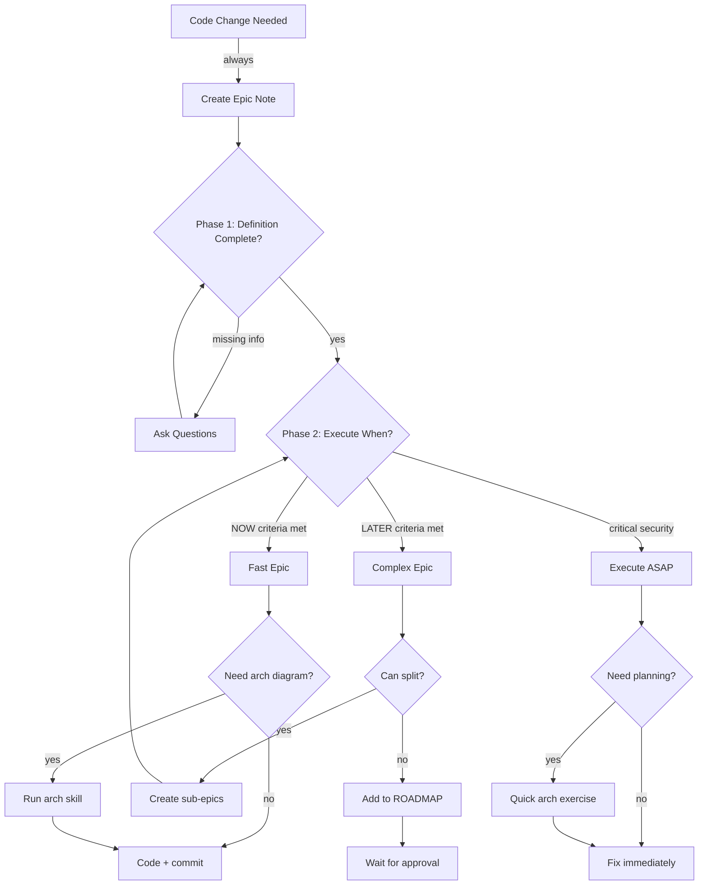

# Epic: Epic Planning Protocol

**Status:** 🏗️ ACTIVE  
**Created:** 2026-02-13  
**Project:** backstage

---

## Problem

We need a clear protocol for:
1. How to know planning has been done properly
2. When to execute now vs later
3. When to use architecture diagrams
4. When to split epics into smaller parts

**Current state:** Ad-hoc decision making, no consistent criteria.

---

## Solution

Define **Epic Planning Protocol** in global policies (global/local):

### Phase 1: Epic Definition (always required)

**Checklist:**
- [ ] **Problem:** One sentence, clear and specific
- [ ] **Solution:** Concrete steps (not "figure it out")
- [ ] **Risk assessment:** What could break? Dependencies? Side effects?
- [ ] **Information completeness:** Do we have everything needed?
- [ ] **Success criteria:** How do we know it's done? (pass/fail test)

**If ANY checkbox fails → pause, ask questions, refine.**

### Phase 2: Execution Decision

**Execute NOW (fast epic) if ALL true:**
- ✅ Solution is simple/clear
- ✅ Low risk (won't break existing functionality)
- ✅ Can do unattended (no surprises expected)
- ✅ Scope < 30min
- ✅ Self-contained (no dependencies on other work)

**Execute LATER (complex epic) if ANY true:**
- ❌ Solution complex/unclear
- ❌ High risk (could break things)
- ❌ Needs supervision/testing
- ❌ Large scope (>30min)
- ❌ Depends on other unfinished work

**Critical exception:** Security/data loss risks → execute ASAP regardless of complexity.

### Phase 3: Architecture Exercise (optional)

**Use arch diagrams when:**
- Multiple components interact
- Flow is non-obvious
- Team collaboration needed
- Future reference valuable (onboarding, debugging)

**Trigger phrases:**
- "Let's design architecture for X"
- "Before coding, let's map this"
- "Vamos desenhar fluxo de Z"

**Tool:** arch skill (Mermaid diagrams, iterative refinement)

### Phase 4: Epic Splitting (when needed)

**Split epic if:**
- Multiple self-contained parts (can be done independently)
- Some parts fast, some complex (execute fast ones now, defer complex)
- Different risk levels (low-risk changes first, high-risk after validation)

**How to split:**
1. Identify independent sub-tasks
2. Create separate epic notes (with cross-references)
3. Prioritize by: critical → fast → complex

---

## Tasks

- [ ] **Add Epic Planning Protocol to global/policies (global/local)**
  - Phase 1: Definition checklist
  - Phase 2: Execution decision criteria
  - Phase 3: Architecture exercise triggers
  - Phase 4: Epic splitting guidelines

- [ ] **Update AGENTS.md to defer to backstage**
  - "If repo uses backstage → code needs epic (see backstage/policies (global/local))"
  - Remove epic protocol details (now in global POLICY)

- [ ] **Test protocol on next 3 code changes**
  - Track: Was planning sufficient? Did criteria work?
  - Refine if needed

- [ ] **Document in connections/backstage.md**
  - Epic planning workflow
  - Examples of fast vs complex epics
  - When to use arch skill

---

## Success Criteria

**Planning completeness:**
- ✅ Every epic has Phase 1 checklist completed
- ✅ Clear NOW/LATER decision with reasoning
- ✅ No "let's just try it" coding without epic

**Execution clarity:**
- ✅ Fast epics resolve in <30min (90% success rate)
- ✅ Complex epics don't get rushed (no broken implementations)
- ✅ Arch diagrams used when helpful (not mandatory boilerplate)

**Epic splitting:**
- ✅ Large epics broken into actionable parts
- ✅ Independent parts executed separately
- ✅ Dependencies documented clearly

---

## Architecture

---

## Examples

### Fast Epic: Agenda Refresh Button
- **Problem:** Button doesn't reload page after refresh
- **Solution:** Add `location.reload()` after success
- **Risk:** Low (reload is standard browser API)
- **Info:** Complete (know where to add code)
- **Scope:** <5min
- **Decision:** Execute NOW ✅

### Complex Epic: Backstage Global Sync
- **Problem:** Global files diverge across projects
- **Solution:** Automated sync script + conflict resolution
- **Risk:** High (could overwrite project-specific changes)
- **Info:** Incomplete (need sync strategy, conflict rules)
- **Scope:** >2h (research + testing)
- **Decision:** Execute LATER, add to ROADMAP ❌

### Critical Epic: Private Skill Leak
- **Problem:** Private skill accidentally committed to git
- **Solution:** Remove from history, add to .gitignore
- **Risk:** High (contains credentials)
- **Info:** Complete (know which file, git commands)
- **Scope:** 15min
- **Decision:** Execute ASAP (security) 🚨

---

## References

- Elinor Ostrom: Polycentric governance (global/project rules)
- Agile: User stories = epic definition templates
- Chaos magick: Intent → Sigil → Servitor (planning = intent clarification)

---

**Epic note:** This is meta (epic about epic planning). Uses own protocol to validate itself.
