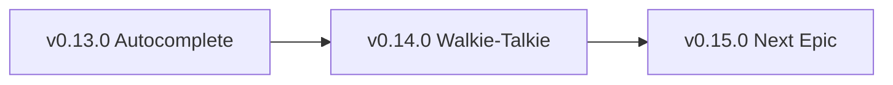
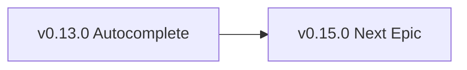
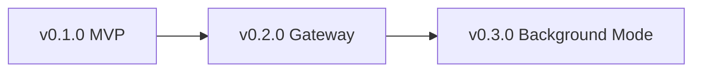

# Epic Promotion Protocol - From Epic to Project

**Created:** 2026-02-15  
**Status:** Draft protocol (needs validation)  
**Type:** Meta-protocol (governs epic lifecycle)

---

## Context Snapshot

**Why this exists:**  
Epics can outgrow their parent project and deserve their own dedicated space. This protocol defines WHEN and HOW to promote an epic to a standalone project.

**Problem solved:**  
Currently no clear rules for:
- When does an epic become "too big" for its parent project?
- How do you migrate epic-notes → new project?
- What happens to ROADMAP/CHANGELOG in parent project?
- How do you preserve git history?

**Date:** 2026-02-15  
**Assumptions:**  
- Promotion is RARE (most epics stay epics)
- Project structure: `~/Documents/PROJECT_NAME/`
- Git repos per project (not monorepo)
- Backstage protocol applied to new project

---

## Goal

Define clear criteria and step-by-step process to promote an epic to a standalone project when it outgrows its parent.

---

## When to Promote an Epic

**Criteria (ANY ONE triggers consideration):**

1. **Size threshold:** Epic-notes > 50KB OR > 500 lines
2. **Scope creep:** Epic spawns 5+ sub-epics (nested roadmap)
3. **Team threshold:** Epic requires dedicated person/team (not just you)
4. **Revenue potential:** Epic becomes paid product/service (needs separate P&L)
5. **Timeline:** Epic will take 6+ months (own roadmap needed)
6. **Dependencies:** Epic has 10+ external dependencies (deserves own dependency tree)
7. **Domain shift:** Epic is fundamentally different domain from parent project

**Examples:**

| Epic | Parent Project | Promote? | Why |
|------|----------------|----------|-----|
| v0.6.0 Fitness Tracker | personal/ | ✅ YES → apps/exercises/ | Became standalone app |
| v0.14.0 Walkie-Talkie | nonlinear/ | ✅ LIKELY → apps/walkie/ | iOS app = separate codebase |
| v0.3.0 Design Strategy | nonlinear/ | ❌ NO | Research epic, stays in nonlinear |
| v0.11.0 Memory Architecture | nonlinear/ | ❌ NO | Infrastructure, not standalone product |

---

## Promotion Process (Step-by-Step)

### Phase 1: Decision & Planning

**1. Validate promotion criteria**
- [ ] Review criteria above
- [ ] Discuss with Nicholas (if unsure)
- [ ] Document WHY promoting (add to epic-notes)

**2. Choose project location**
- [ ] `~/Documents/apps/` - Standalone applications (agenda, exercises, walkie)
- [ ] `~/Documents/PRODUCT_NAME/` - Products/services (librarian, wiley)
- [ ] `~/Documents/personal/` - Personal life projects (fitness, health, home)
- [ ] `~/Documents/nonlinear/` - Company/server/infrastructure

**3. Choose project name**
- [ ] Use epic name (e.g., "walkie-talkie" → `walkie/`)
- [ ] OR rebrand (e.g., "Fitness Tracker" → `exercises/`)
- [ ] Verify name doesn't conflict with existing projects

---

### Phase 2: Project Bootstrap

**4. Create project directory**
```bash
mkdir -p ~/Documents/PROJECT_NAME
cd ~/Documents/PROJECT_NAME
git init
```

**5. Bootstrap backstage protocol**
```bash
# Create backstage folder
mkdir -p backstage/global backstage/epic-notes

# Download templates
for file in ROADMAP CHANGELOG POLICY HEALTH README; do
  curl -fsSL "https://raw.githubusercontent.com/nonlinear/backstage/main/templates/${file}-template.md" \
    -o "backstage/${file}.md"
done

# Download global files
curl -fsSL "https://raw.githubusercontent.com/nonlinear/backstage/main/backstage/global/policies (global/local)" \
  -o "backstage/global/policies (global/local)"
curl -fsSL "https://raw.githubusercontent.com/nonlinear/backstage/main/backstage/global/checks (global/local)" \
  -o "backstage/global/checks (global/local)"
```

**6. Customize backstage files**
- [ ] Edit `backstage/README.md` (project name, purpose, context)
- [ ] Edit `backstage/policies (global/local)` (project-specific rules, if needed)
- [ ] Edit `backstage/checks (global/local)` (quality gates, if needed)

**7. Initial commit**
```bash
git add -A
git commit -m "Bootstrap PROJECT_NAME with backstage protocol"
```

---

### Phase 3: Epic Migration

**8. Copy epic-notes to new project**
```bash
# From parent project
cp -r backstage/epic-notes/vX.Y.Z/ ~/Documents/PROJECT_NAME/backstage/epic-notes/

# OR if multiple epics
cp -r backstage/epic-notes/vX.Y.Z* ~/Documents/PROJECT_NAME/backstage/epic-notes/
```

**9. Convert epic to project ROADMAP**

**In new project `backstage/ROADMAP.md`:**
- Copy epic tasks → new ROADMAP epics
- Renumber versions (start at v0.1.0 or v1.0.0)
- Add mermaid diagram placeholder

**Example transformation:**

**Parent project (nonlinear/ROADMAP.md):**
```markdown
## v0.14.0
### OpenClaw Walkie-Talkie
- [ ] Answer disambiguation questions
- [ ] Create UX wireframes
- [ ] Research iOS voice app best practices
```

**New project (walkie/ROADMAP.md):**
```markdown
## v0.1.0
### MVP - Voice Recording & Playback
- [ ] Set up iOS project (Xcode + repo)
- [ ] Implement voice recording (AVFoundation)
- [ ] Implement STT integration (Whisper API)
- [ ] Implement TTS playback (Kokoro API)

## v0.2.0
### Gateway Connection
- [ ] Implement gateway API client
- [ ] Implement conversation history (local storage)
- [ ] Implement offline queue
```

**10. Update parent project**

**In parent `backstage/ROADMAP.md`:**
- Remove promoted epic OR convert to "See PROJECT_NAME"
- Update mermaid diagram (remove promoted epic)

**Example:**
```markdown
## v0.14.0
### OpenClaw Walkie-Talkie
**Status:** ✅ Promoted to standalone project  
**Location:** `~/Documents/apps/walkie/`  
**See:** [walkie/backstage/ROADMAP.md](../../apps/walkie/backstage/ROADMAP.md)
```

**In parent `backstage/CHANGELOG.md`:**
- Add entry documenting promotion

**Example:**
```markdown
## v0.14.0 - OpenClaw Walkie-Talkie (Promoted)
**Released:** 2026-02-15  
**Status:** ✅ Promoted to standalone project

**What happened:** Epic outgrew nonlinear/ (iOS app = separate codebase).

**New location:** `~/Documents/apps/walkie/`

**Migration:**
- Epic-notes moved → `walkie/backstage/epic-notes/v0.14.0-openclaw-walkie-talkie.md`
- Tasks migrated → `walkie/backstage/ROADMAP.md` (renumbered v0.1.0+)
- Parent epic archived (see above link)

**Details:** [walkie/backstage/README.md](../../apps/walkie/backstage/README.md)
```

---

### Phase 4: Git History (Optional)

**11. Preserve epic-notes git history**

If you want to preserve git history of epic-notes in new project:

```bash
# In parent project
git log --follow -- backstage/epic-notes/vX.Y.Z/ > ~/epic-vX.Y.Z-history.txt

# In new project
# Add as HISTORY.md in epic-notes folder
mv ~/epic-vX.Y.Z-history.txt backstage/epic-notes/vX.Y.Z/HISTORY.md
git add backstage/epic-notes/vX.Y.Z/HISTORY.md
git commit -m "Add git history from parent project (vX.Y.Z epic)"
```

**12. Tag parent project**

```bash
# In parent project
git tag -a vX.Y.Z-promoted -m "Epic vX.Y.Z promoted to PROJECT_NAME"
git push origin vX.Y.Z-promoted
```

---

### Phase 5: Integration

**13. Update workspace index**

**In `~/.openclaw/workspace/AGENTS.md`:**
- Add new project to "📁 Workspace Structure" section

**Example:**
```markdown
- **`apps/walkie/`** - OpenClaw Walkie-Talkie iOS app (promoted from nonlinear v0.14.0)
```

**14. Update agenda app (if used)**

**In `~/Documents/apps/agenda/generate-projects-json.py`:**
- Verify new project is auto-detected (script scans `~/Documents/*/backstage/ROADMAP.md`)
- Run `refresh-agenda.sh` to update

**15. Commit parent project changes**

```bash
# In parent project
git add backstage/ROADMAP.md backstage/CHANGELOG.md
git commit -m "Epic vX.Y.Z promoted to PROJECT_NAME

- Removed tasks from ROADMAP (moved to PROJECT_NAME)
- Added promotion entry to CHANGELOG
- Updated navigation blocks"

git push origin main
```

---

## Backlog Concept (Alternative to Promotion)

**Problem:** Some epics don't deserve promotion BUT are too big/uncertain for numbered versions.

**Solution:** Backlog epic type (no version number, just "## Backlog - EPIC_NAME")

**When to use Backlog:**
- Epic is **aspirational** (might never happen)
- Epic is **research-heavy** (needs more investigation before commitment)
- Epic is **low priority** (won't work on for 6+ months)
- Epic is **waiting on external factor** (dependency, funding, tech maturity)

**Format:**

```markdown
## Backlog

### Epic Name 1
**Status:** 🔮 Research  
**Why backlog:** Needs X technology to mature first  
**Revisit:** 2026-Q3

- [ ] Task 1
- [ ] Task 2

### Epic Name 2
**Status:** 💭 Aspirational  
**Why backlog:** Cool idea, but no time/resources  
**Revisit:** When Y happens

- [ ] Task 1
```

**Rules:**
- Backlog epics are ALWAYS at bottom of ROADMAP (after all versioned epics)
- Backlog epics can be promoted to versioned epics when ready
- Backlog epics can be deleted without ceremony (they were never committed)
- Mermaid diagram does NOT include backlog epics (they're not in flow)

---

## Mermaid Diagram Updates

**After promotion:**

**Parent project (before):**


**Parent project (after):**


**New project:**


---

## Success Criteria

**Promotion is successful when:**
- [ ] New project has own git repo
- [ ] Backstage protocol bootstrapped (ROADMAP, CHANGELOG, POLICY, HEALTH)
- [ ] Epic-notes migrated to new project
- [ ] Parent ROADMAP updated (epic removed or marked "promoted")
- [ ] Parent CHANGELOG documents promotion
- [ ] Workspace index updated (AGENTS.md)
- [ ] Agenda app updated (if used)
- [ ] Both projects can operate independently

---

## Anti-Patterns (Don't Do This)

❌ **Promote too early** - Epic is <10KB, <100 lines, <3 months timeline → Keep it an epic  
❌ **Promote without plan** - No clear reason, just "feels big" → Document WHY first  
❌ **Lose history** - Delete epic-notes from parent → Always preserve (copy, link, or git history)  
❌ **Break parent ROADMAP** - Remove epic without updating CHANGELOG → Always document promotion  
❌ **Create zombie projects** - Promote then abandon → Only promote if committed to maintaining

---

## Examples

**Successful promotions:**
- `personal/agenda/` → `apps/agenda/` (standalone app, outgrew personal project)
- `personal/fitness/` → `apps/exercises/` (dedicated application, separate codebase)

**Should have promoted (but didn't):**
- `librarian/` - Started as epic in `personal/`, became massive project, never formally promoted (grew organically)

**Correctly kept as epic:**
- `nonlinear/v0.11.0 Memory Architecture` - Infrastructure, not standalone product
- `personal/v0.17.0 Location Screenshots` - Single feature, not app

---

## Related Protocols

- **Retrospective Epic Protocol** (global/policies (global/local)) - For recovering commits without branch
- **Manual Merge Protocol** (global/policies (global/local)) - For merging promoted epic into new project
- **Backlog Epic Concept** (this document) - Alternative to promotion for uncertain epics

---

## Notes

**Nicholas's request:** "from epic to project - a protocol to PROMOTE an epic to a project. and maybe a 'backlog' epic concept with no numbers, or a backlog version."

**My interpretation:**  
- Promotion protocol = step-by-step migration (epic → project)
- Backlog concept = alternative for uncertain/aspirational epics (no version number, stays in ROADMAP)

**Disambiguation needed:**
- [ ] Should Backlog be separate file (`backstage/BACKLOG.md`) or just section in ROADMAP?
- [ ] Should promoted epics be deleted or marked "promoted" in parent ROADMAP?
- [ ] Should epic-notes be MOVED (delete from parent) or COPIED (keep in both places)?

**Next steps:**
1. Review this protocol with Nicholas
2. Test on real epic (e.g., v0.14.0 Walkie-Talkie → apps/walkie/)
3. Refine based on what breaks
4. Add to global/policies (global/local) when stable

---

**Status:** 📝 DRAFT (needs validation before official adoption)
