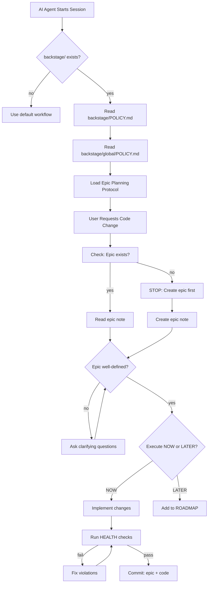

# Epic: OpenClaw Defers to Backstage

**Status:** 🏗️ ACTIVE  
**Created:** 2026-02-13  
**Project:** backstage

---

## Problem

**How do we ensure OpenClaw (and any AI agent) follows backstage protocol when working in repos that use it?**

Current state:
- AGENTS.md has backstage rules hardcoded
- Rules duplicate what's in backstage/POLICY.md
- No clear "defer to backstage" pattern
- Other users won't have same AGENTS.md

**We need:** A way to wire backstage protocol into any AI agent's workflow.

---

## Solution

### 1. AGENTS.md Delegation Pattern

**AGENTS.md should defer to backstage, not duplicate it:**

```markdown
## Code Changes (Backstage Protocol)

**If repo uses backstage protocol → defer to project's backstage/POLICY.md**

**Detection:**
- Repo has `backstage/` folder
- Contains: POLICY.md, HEALTH.md, ROADMAP.md, CHANGELOG.md

**When detected:**
1. Read `backstage/POLICY.md` (project-specific rules)
2. Read `backstage/global/POLICY.md` (universal rules, if exists)
3. Follow epic planning protocol defined there
4. Run HEALTH checks before/after code changes

**Why this works:**
- Backstage rules live in repo (versioned, shareable)
- AI reads rules from source of truth (no duplication)
- Works for ANY agent (OpenClaw, Cursor, Claude, etc.)
- Users can fork/modify backstage protocol per project
```

### 2. Backstage Protocol Wire-Through

**How to instruct other users/agents to use backstage:**

#### A. Repository README.md

```markdown
## Development Workflow

This project uses [backstage protocol](https://github.com/nonlinear/backstage).

**AI agents:** Read `backstage/POLICY.md` before making code changes.

**Humans:** 
- Every code change needs an epic (see `backstage/epic-notes/`)
- Run HEALTH checks: `bash backstage/HEALTH.md`
- Update ROADMAP when planning features
```

#### B. `.github/CONTRIBUTING.md` (for open source)

```markdown
# Contributing

This project requires epic planning before code changes.

1. **Create epic note:** `backstage/epic-notes/YOUR-EPIC.md`
2. **Define problem + solution** (see `backstage/POLICY.md`)
3. **Run HEALTH checks:** `bash backstage/HEALTH.md`
4. **Submit PR** with epic note + implementation

All contributions must follow [backstage protocol](https://github.com/nonlinear/backstage).
```

#### C. AI Agent System Prompts

**For Cursor/Windsurf/Claude Projects:**

```markdown
# Project Context

This codebase uses backstage protocol for development workflow.

**Before any code change:**
1. Check if `backstage/` folder exists
2. Read `backstage/POLICY.md` for epic requirements
3. Create epic note in `backstage/epic-notes/`
4. Follow planning protocol (definition → decision → execution)

**After code changes:**
1. Run `bash backstage/HEALTH.md` to verify compliance
2. Commit epic note + code together
3. Update ROADMAP if adding new features
```

#### D. OpenClaw Skills Integration

**Create `backstage-skill` (already in roadmap):**
- Auto-detects backstage repos
- Reads POLICY.md on session start
- Enforces epic protocol
- Runs HEALTH checks
- Syncs global/ files

---

## Why This Matters

### For Nicholas (me)
- **life/** project: No feature branches, fast epics common
- **skills/** project: Same workflow as life
- **wiley/** project: May need different rules (work policies)
- **Consistency:** Same protocol across projects, rules live in each repo

### For Other Users
- **Forkable:** Copy backstage/ to your repo, customize POLICY.md
- **Agent-agnostic:** Works with OpenClaw, Cursor, Claude, any AI
- **Teachable:** New contributors read POLICY.md, learn workflow
- **Versionable:** Rules evolve with project, tracked in git

### For Open Source
- **Transparency:** Rules visible in repo (not hidden in AI configs)
- **Governance:** Polycentric (global + project rules, Ostrom-style)
- **Scalability:** Each project can have different epic criteria

---

## Tasks

- [ ] **Update AGENTS.md: Add backstage delegation**
  - Remove hardcoded epic rules
  - Add "detect backstage/ → defer to POLICY.md"
  - Keep general principles (Git Safety, Memory Recall, etc.)

- [ ] **Add to global/POLICY.md: Epic Planning Protocol**
  - Phase 1: Definition checklist
  - Phase 2: Execution decision (NOW/LATER criteria)
  - Phase 3: Architecture exercise triggers
  - Phase 4: Epic splitting guidelines

- [ ] **Document in backstage README.md**
  - How to use backstage protocol
  - How to integrate with AI agents
  - Examples of AGENTS.md delegation

- [ ] **Create `.github/CONTRIBUTING.md` template**
  - Epic planning requirements
  - HEALTH check instructions
  - PR submission workflow

- [ ] **Test with real code change**
  - Create epic
  - Follow protocol
  - Verify HEALTH passes
  - Confirm workflow smooth

- [ ] **Add to skills ROADMAP: backstage-skill**
  - Auto-detect backstage repos
  - Enforce epic protocol
  - Sync global/ files

---

## Success Criteria

**Agent compliance:**
- ✅ OpenClaw reads POLICY.md before code changes
- ✅ Epic required for all code (no exceptions)
- ✅ HEALTH checks run automatically

**User adoption:**
- ✅ README.md explains backstage protocol
- ✅ CONTRIBUTING.md guides new contributors
- ✅ Other AI agents can use same workflow

**Flexibility:**
- ✅ Projects can customize POLICY.md
- ✅ Global rules provide baseline
- ✅ Project rules override when needed

---

## Architecture



---

## Examples

### AGENTS.md Before (hardcoded rules)
```markdown
## Epic Protocol

Every code change needs:
1. Epic note with problem/solution
2. Fast epic if <30min
3. Complex epic if >30min
...
```

### AGENTS.md After (delegation)
```markdown
## Code Changes

**If repo uses backstage → defer to backstage/POLICY.md**

Detection: Check for `backstage/` folder.
Follow: Epic planning protocol in POLICY.md.
```

---

## Latest Edits (from earlier conversation)

**What we decided:**
1. **NO CODE WITHOUT EPICS** (mandatory)
2. **Epic Discussion Phase** (always happens first):
   - Problem: What's broken/missing?
   - Solution: How to fix?
   - Risk: What could break?
   - Info: Do we have everything?

3. **Execute NOW criteria:**
   - Simple/clear solution
   - Low risk
   - Can do unattended
   - <30min scope

4. **Execute LATER criteria:**
   - Complex/unclear
   - High risk
   - Needs supervision
   - Large scope

5. **AGENTS.md defers to backstage POLICY** (not hardcoded)

6. **Global POLICY defines epic planning rules**

7. **Project POLICY can override** (life/skills: no branches, wiley: may need branches)

---

## References

- Elinor Ostrom: Polycentric governance
- backstage protocol: https://github.com/nonlinear/backstage
- Epic Planning Protocol epic: `epic-notes/epic-planning-protocol.md`

---

**Meta note:** This epic documents HOW to wire backstage into AI workflows. It's self-referential (uses epic protocol to define epic protocol integration).
