# Backstage Architecture - POLICY Design Flow

**How backstage works: User → Skill → POLICY → AI → Execution**

**Created:** 2026-02-07  
**Version:** v0.4.0 (design exercise)

---

## Legend

**Colors:**
- 🟦 **Blue** = User input / triggers
- 🟨 **Yellow** = Skill wrapper (thin, dumb)
- 🟩 **Green** = POLICY/HEALTH (intelligence lives here)
- 🟧 **Orange** = AI execution (reads POLICY, follows protocol)
- 🟪 **Purple** = Git operations (commits, tags, merges)

**Arrows:**
- `→` Solid line = data flow
- `⤷` Dashed line = conditional (depends on context)
- `↺` Curved line = loop/iteration

**Shapes:**
- `[ ]` Rectangle = process/action
- `{ }` Diamond = decision point
- `(( ))` Cylinder = data store (files)

---

## Architecture Flow

```mermaid
%%{init: {'theme':'base', 'themeVariables': { 'fontSize':'14px', 'primaryColor':'#e3f2fd', 'primaryBorderColor':'#1976d2', 'lineColor':'#424242'}}}%%

flowchart TD
    %% User Input
    USER_TRIGGER["🟦 User: 'backstage start'<br/>or 'epic is completed, merge'"]
    
    %% Skill Wrapper (THIN)
    SKILL_CHECK{"🟨 Skill: backstage/ exists?"}
    SKILL_DUMP["🟨 Skill: Dump POLICY + HEALTH<br/>(cat files to stdout)"]
    
    %% POLICY/HEALTH (INTELLIGENCE)
    POLICY_READ(("🟩 POLICY.md<br/>HEALTH.md<br/>(protocol rules)"))
    
    %% AI Reads Context
    AI_READ["🟧 AI: Read dumped context<br/>+ user message intent"]
    AI_DECIDE{"🟧 AI: What workflow?<br/>(pre-commit vs merge)"}
    
    %% Pre-Commit Workflow
    AI_HEALTH["🟧 Run HEALTH checks"]
    AI_HEALTH_PASS{"🟧 All checks pass?"}
    AI_UPDATE["🟧 Update docs<br/>(navigation blocks, mermaid)"]
    AI_COMMIT["🟪 Git commit + push"]
    AI_VICTORY["🟧 Victory lap<br/>(what's next?)"]
    
    %% Merge Workflow
    AI_MERGE_CHECK["🟧 Pre-merge checks<br/>(version sync, tasks done)"]
    AI_MERGE_CHANGELOG["🟧 Move epic to CHANGELOG"]
    AI_MERGE_GIT["🟪 Git merge + tag + delete branch"]
    AI_MERGE_POST["🟧 Post-merge updates<br/>(skill symlink if needed)"]
    
    %% Connections
    USER_TRIGGER --> SKILL_CHECK
    
    SKILL_CHECK -->|No backstage/| ERROR_INSTALL["❌ Error: Install backstage first"]
    SKILL_CHECK -->|Yes| SKILL_DUMP
    
    SKILL_DUMP --> POLICY_READ
    POLICY_READ --> AI_READ
    
    AI_READ --> AI_DECIDE
    
    %% Pre-commit path
    AI_DECIDE -->|"Regular commit"| AI_HEALTH
    AI_HEALTH --> AI_HEALTH_PASS
    AI_HEALTH_PASS -->|No| FIX_REPORT["🟧 Report failures<br/>(add fix tasks to ROADMAP)"]
    AI_HEALTH_PASS -->|Yes| AI_UPDATE
    AI_UPDATE --> AI_COMMIT
    AI_COMMIT --> AI_VICTORY
    
    %% Merge path
    AI_DECIDE -->|"'epic is completed, merge'"| AI_MERGE_CHECK
    AI_MERGE_CHECK --> AI_MERGE_CHANGELOG
    AI_MERGE_CHANGELOG --> AI_MERGE_GIT
    AI_MERGE_GIT --> AI_MERGE_POST
    AI_MERGE_POST --> AI_VICTORY
    
    %% Style
    style USER_TRIGGER fill:#2196F3,stroke:#1565C0,color:#fff
    style SKILL_CHECK fill:#FFC107,stroke:#F57C00,color:#000
    style SKILL_DUMP fill:#FFC107,stroke:#F57C00,color:#000
    style POLICY_READ fill:#4CAF50,stroke:#2E7D32,color:#fff
    style AI_READ fill:#FF9800,stroke:#E65100,color:#fff
    style AI_DECIDE fill:#FF9800,stroke:#E65100,color:#fff
    style AI_HEALTH fill:#FF9800,stroke:#E65100,color:#fff
    style AI_UPDATE fill:#FF9800,stroke:#E65100,color:#fff
    style AI_COMMIT fill:#9C27B0,stroke:#6A1B9A,color:#fff
    style AI_VICTORY fill:#FF9800,stroke:#E65100,color:#fff
    style AI_MERGE_CHECK fill:#FF9800,stroke:#E65100,color:#fff
    style AI_MERGE_CHANGELOG fill:#FF9800,stroke:#E65100,color:#fff
    style AI_MERGE_GIT fill:#9C27B0,stroke:#6A1B9A,color:#fff
    style AI_MERGE_POST fill:#FF9800,stroke:#E65100,color:#fff
```



---

## Key Principles

### 1. **Skill = Thin Wrapper (80 lines)**

**Skill does NOT:**
- ❌ Run checks
- ❌ Update files
- ❌ Make decisions
- ❌ Execute git commands

**Skill ONLY:**
- ✅ Check if backstage/ exists
- ✅ Dump POLICY + HEALTH to stdout
- ✅ Exit

**Why:** Logic belongs in POLICY (human-readable), not code (hard to change).

---

### 2. **POLICY = Intelligence**

**POLICY.md contains:**
- Workflow rules (when to commit, when to merge)
- Step-by-step protocols (health checks, merge workflow)
- Decision criteria (version sync, task completion)

**HEALTH.md contains:**
- Test commands (bash one-liners)
- Pass/fail criteria
- Auto-fix logic (if possible)

**AI reads POLICY/HEALTH and follows protocol.**

---

### 3. **AI = Executor**

**AI's job:**
1. Read user message ("backstage start" vs "epic is completed, merge")
2. Read dumped POLICY + HEALTH
3. Decide workflow (pre-commit vs merge)
4. Execute steps from POLICY
5. Report results

**AI does NOT invent steps.** All logic defined in POLICY.

---

### 4. **User Intent = Context**

**Same command (`backstage start`), different outcomes:**

| User message | AI interprets | Workflow |
|--------------|---------------|----------|
| "backstage start" | Regular work session | Pre-commit (checks + docs + commit) |
| "epic is completed, merge" + "backstage start" | Epic complete | Merge (checks + CHANGELOG + git merge) |

**AI reads context from BOTH:**
- User's words (intent)
- POLICY rules (protocol)

---

## Data Flow Example

### Regular Commit

```
User: "backstage start"
  ↓
Skill: cat backstage/global/POLICY.md backstage/POLICY.md
  ↓
AI: Reads POLICY → sees "pre-commit workflow"
  ↓
AI: Runs HEALTH checks (from HEALTH.md)
  ↓
AI: Updates navigation blocks (per POLICY rules)
  ↓
AI: git commit -m "wip: updated docs"
  ↓
AI: "✅ All checks pass. Next: [suggest from ROADMAP]"
```

### Merge to Main

```
User: "epic is completed, merge"
User: "backstage start"
  ↓
Skill: cat backstage/global/POLICY.md backstage/HEALTH.md
  ↓
AI: Reads user message → detects "merge" intent
AI: Reads POLICY → sees "merge workflow (Step 10)"
  ↓
AI: Runs pre-merge checks (version sync, tasks done)
  ↓
AI: Moves epic from ROADMAP to CHANGELOG
  ↓
AI: git merge epic/vX.Y.Z --no-ff
AI: git tag vX.Y.Z
AI: git push origin main
  ↓
AI: "✅ Epic vX.Y.Z merged to main. Next epic: [suggest]"
```

---

## Why This Architecture?

### **Problem (old way):**
- 500+ lines of bash in skill
- Logic hardcoded (if POLICY changes, skill breaks)
- Can't reuse across LLM tools (skill is OpenClaw-specific)

### **Solution (new way):**
- 80 lines of bash (just wrapper)
- Logic in POLICY.md (human-readable, AI executes)
- Portable (POLICY works with ANY LLM tool)

### **Benefits:**
- ✅ **Low metabolic cost** - small skill, easy to maintain
- ✅ **Human-readable protocol** - POLICY is documentation AND code
- ✅ **Portable** - works with Cursor, Aider, Claude, etc (via prompt)
- ✅ **Evolvable** - change POLICY, not skill code

---

## File Locations

**Where intelligence lives:**

```
backstage/
├── global/
│   ├── POLICY.md           ← Universal workflow rules
│   └── HEALTH.md           ← Universal health checks
├── POLICY.md               ← Project-specific overrides (optional)
├── HEALTH.md               ← Project-specific checks (optional)
├── ROADMAP.md              ← What we wanna do (AI reads for context)
└── CHANGELOG.md            ← What we did (AI updates on merge)
```

**Where wrapper lives:**

```
skill/
├── backstage.sh            ← Thin wrapper (80 lines)
└── SKILL.md                ← Documentation
```

**Where prompt lives:**

```
backstage.prompt.md         ← Root (same name as skill, universal)
```

---

## Decision Points (AI Logic)

**How AI decides workflow:**

```python
# Pseudo-code (what AI does mentally)

user_message = read_user_message()
policy = read_file("backstage/global/POLICY.md")
health = read_file("backstage/global/HEALTH.md")

if "merge" in user_message.lower():
    workflow = "merge"
    steps = policy.find_section("Step 10: Merge to Main")
else:
    workflow = "pre-commit"
    steps = policy.find_section("Pre-Commit Workflow")

for step in steps:
    execute(step)
    
report_results()
```

**No hardcoded branching in skill.** AI infers from context + POLICY.

---

## Polycentric Governance

**Two centers of power:**

1. **global/POLICY.md** - Universal rules (all projects)
2. **POLICY.md** - Project-specific overrides (this project only)

**AI reads BOTH, project wins on conflicts.**

**Example:**

```markdown
# global/POLICY.md
Commit message format: "type: description"

# project/POLICY.md (backstage)
Commit message format: "type: description [vX.Y.Z]" (include version)
```

**AI sees both, uses project rule (version tag).**

**Inspired by:** Elinor Ostrom's polycentric governance framework.

---

## Comparison: Old vs New

| Aspect | v0.2.0 (old) | v0.3.0+ (new) |
|--------|--------------|---------------|
| Skill size | 500+ lines bash | 80 lines bash |
| Logic location | Hardcoded in skill | POLICY.md (human-readable) |
| Prompts | 3 separate (start, close, update) | 1 prompt (backstage.prompt.md) |
| Portability | OpenClaw only | Works with any LLM tool |
| Maintenance | Change code = retest everything | Change POLICY = AI adapts |
| Duplication | High (logic in skill + prompts) | Zero (single source of truth) |

---

## Next Steps (v0.4.0)

- [ ] Use this diagram in documentation
- [ ] Create templates based on this architecture
- [ ] Publish to ClawdHub
- [ ] Write tutorial (how to adopt backstage)

---

**This is not just a diagram. This is the design philosophy.** 🏛️l 
