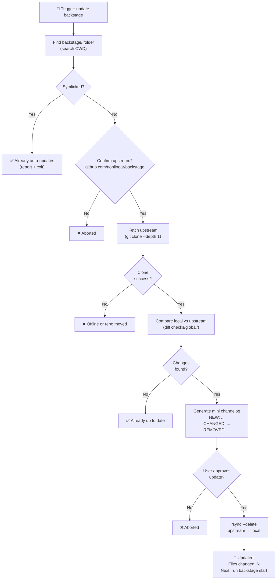

# Update Backstage Flow Diagram

**Purpose:** Visual spec for "update backstage" trigger (sync checks/global with upstream)

---

---

## Key Decision Points

1. **Symlink check** - Admin mode users already auto-update (skip)
2. **Upstream confirmation** - Safety check (could be wrong repo)
3. **Offline handling** - Graceful failure if git clone fails
4. **User approval** - Show what changes before applying
5. **Report** - What changed + next steps

## Edge Cases Handled

- ✅ Symlinked (admin mode) → skip
- ✅ No changes → "Already up to date"
- ✅ Offline → "Can't reach upstream"
- ✅ User declines → "Aborted" at multiple points
- ✅ Conflicts (user modified global) → TODO (future enhancement)

---

**Created:** 2026-02-25  
**Implementation:** `update-backstage.sh`  
**Status:** Implemented + documented
