# Navigation Block & Backstage Files Index

**Every backstage file must have a navigation block** (`> 🤖 ... 🤖`) with links to all backstage files.

**Purpose:** Provides consistent navigation and makes backstage-start workflow aware of file locations.

**Precedence:** When global and project rules conflict:

- **Project POLICY.md** > global/POLICY.md
- **Project HEALTH.md** > global/HEALTH.md
- Local knowledge always wins (polycentric governance)

## README Protection

**README is special** — it's the "spine" of your project:

- **Public-facing:** Outsiders read this to understand your project
- **Vision statement:** Who you are AND who you aim to be
- **People are watching:** Changes are visible to community

**Global rule:** backstage-start can append navigation block but **NOT rewrite README content** without explicit confirmation.

**What needs confirmation:**

- What will change (specific sections/lines)
- How it will change (show before/after)
- Where it will change (exact line numbers)

Only **surgical, pointed changes** allowed—no wholesale rewrites.

**Project can override:** Add to your project POLICY.md if you want to allow automatic README edits (e.g., "allow auto-update of version badges").

## Placement Rules

**AI: The backstage skill/prompt enforces these rules by appending/updating the navigation block automatically:**

**All files (README.md, ROADMAP.md, CHANGELOG.md, HEALTH.md, POLICY.md):**

- **Navigation block at END** (after all content, before final line)
- **No special cases:** All files follow same pattern
- **If `> 🤖` markers exist:** Update content between them
- **If no markers exist:** Append new navigation block at end
- Includes mermaid roadmap diagram (source of truth from ROADMAP.md)

**Logic:**
1. Check if file has `> 🤖` markers
2. If yes: Replace content between markers
3. If no: Append navigation block at end
4. No exceptions, no "top vs end" logic

## Why 🤖 Markers Exist: Future-Proof Format Changes

**The markers are format-agnostic boundaries.**

In the future, navigation block format may change:

- Table → list
- New diagram types
- Different syntax entirely

**How backstage-start handles this:**

1. Find `> 🤖` (start marker)
2. Find `> 🤖` (end marker)
3. Delete everything between
4. Insert current format from POLICY.md

**Works regardless of old format** - the script doesn't need to know what the old syntax was. Markers are the stable contract, content between them evolves freely.

## Format

**Navigation block template (current version):**

```markdown
> 🤖
> This project follows [backstage protocol](https://github.com/nonlinear/backstage) v0.3.4
> [readme](path/to/README.md) 👏 [roadmap](path/to/ROADMAP.md) 👏 [changelog](path/to/CHANGELOG.md) 👏 [global](path/to/policy/global), [local](path/to/policy/local) policies 👏 [global](path/to/policy/global), [local](path/to/policy/local) checks
> 🤖
```

## Path Adjustment

**All paths in the navigation block are relative to each file's location.**

The navigation block appears in multiple files across the project. The backstage-start workflow automatically calculates correct paths when updating navigation blocks based on:

- **File's directory level** (root vs subdirectory)
- **Distance to target files** (same dir, parent dir, child dir)
- **Global file references** (POLICY/CHECKS point to both project and global versions)

No manual path calculation needed—the workflow handles this automatically.

## Mermaid Roadmap Diagram

**Source of truth:** ROADMAP.md contains the canonical mermaid roadmap diagram showing epic status.

**Location:** Mermaid diagram appears ONLY ONCE per file, immediately AFTER the navigation block closing marker (`> 🤖`).

**Structure:**
```
[file content]

> 🤖
[navigation table]
> 🤖

```mermaid
[diagram here]
```
```

**Diagram Generation Rules (Global Defaults):**

**Type:** Linear graph (`graph LR`)

**Include:**
- All epics from ROADMAP.md (version + status emoji + name)
- Sequential order (sorted by epic version)
- Status emoji before version number

**Format:**

```mermaid
graph LR
    A[🏗️ v0.1.0 Epic Name] --> B[📋 v0.2.0 Next Epic]
    B --> C[📋 v0.3.0 Future Epic]
```


**Status emoji mapping:**
- 🏗️ ACTIVE (currently working)
- 📋 BACKLOG (planned, not started)
- ✅ DONE (completed, moved to CHANGELOG)

**Completed epics:**
- Remove from ROADMAP diagram
- Show in CHANGELOG "Latest" section
- Keep audit trail via git history

**Project overrides:**
- Project POLICY.md can specify different diagram type (gantt, flowchart, etc.)
- Can disable diagram entirely: `diagram: none`
- Can customize include/exclude logic

**backstage-skill workflow:**

1. **Parse ROADMAP.md** (via `parse-roadmap.sh` - extracts version|status|name)
2. **Read POLICY diagram rules** (global + project, project wins)
3. **Generate mermaid** (AI applies rules to parsed data)
4. **Propagate to all files** (README, ROADMAP, CHANGELOG, POLICY, HEALTH)

**When to update:** Any time epics are added, moved, or completed—backstage-skill handles distribution automatically.

**AI Note:** backstage-skill maintains navigation blocks and diagrams. Don't manually copy—let the workflow enforce consistency.
