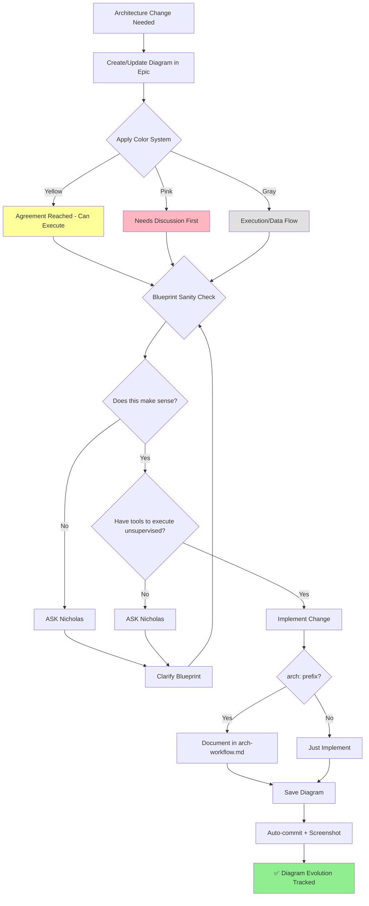

## Auto-commit on Save

**Concept:** Save .md → auto-commit with diagram screenshot
- **Purpose:** Stop motion of diagram evolution
- **Status:** Not implemented (manual git workflow for now)
- **Future:** fswatch + screencapture automation

## Color System

- **Yellow (#FFFF99):** Agreement reached, can execute
- **Pink (#FFB6C1):** Needs discussion before execution
- **Gray (#E0E0E0):** Execution/data flow (neutral)

## Blueprint Sanity Check (MANDATORY)

Before executing ANY architecture diagram, AI must ask:
1. **"Does this make sense?"** - Logic coherent?
2. **"Do I have the tools to execute unsupervised?"** - Can I run this alone?

**If ambiguous → ASK, ASK, ASK.**

Diagrams = agreements (contracts of execution). Ambiguity in blueprint = wasted effort.

## arch: Prefix Rule

**When Nicholas says "arch:" in conversation:**
1. **Implement** the change/rule immediately
2. **Document** in this file

**Special syntax:**
- **arch: italic means exact copy user sees** - Text in italics = verbatim (error messages, UI copy)

**Example:**
- "arch: screenshot tela toda, simples" → Implement + document here
- Regular conversation → Just implement, don't document

## Diagram Update Workflow

1. **Agreement reached** → Update diagram immediately (node by node is fine)
2. **Each save** → Auto-commit
3. **Screenshot** → Auto-move to `backstage/epic-notes/screenshots/`
4. **Result:** Incremental visual evolution, stop motion on every change
