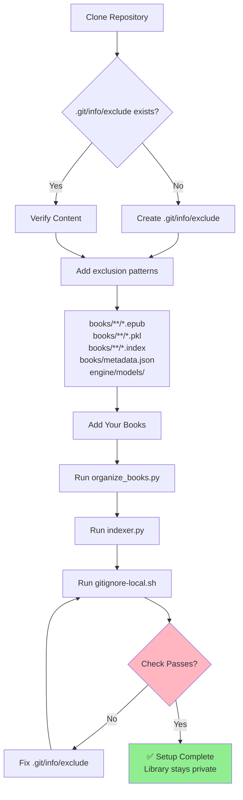

**This is a personal library management system - NOT a collaborative repository.**

Each person runs their own instance with their own books. Nothing syncs to GitHub except code/scripts.

## For Contributors

**Want to contribute code?** Contact Nicholas first to discuss environment setup - don't submit PRs directly.

**Just want to use it?** Fork it, clone it, use it. Your books/data stay 100% local.

## Setup After Clone

**1. Verify `.git/info/exclude` exists:**

```bash
cat .git/info/exclude
```

Expected content:

```
books/**/*.epub
books/**/*.pkl
books/**/*.index
books/metadata.json
engine/models/
```

**Why:** Keeps your library private + enables autocomplete for book links.

**2. Add your books:**

```bash
python3.11 .github/engine/scripts/organize_books.py

python3.11 engine/scripts/indexer.py
```

**AI enforcement:**
- Check `gitignore-local.sh` passes (verifies .git/info/exclude)
- Remind user to run indexer after adding new books
