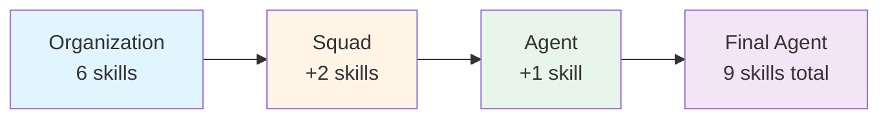
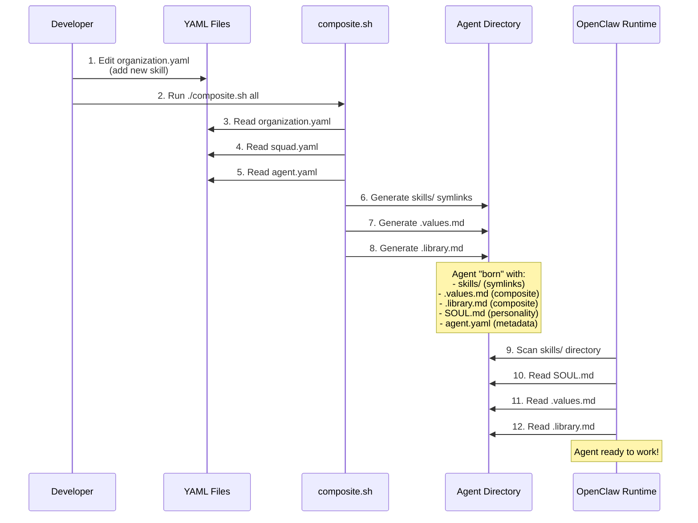
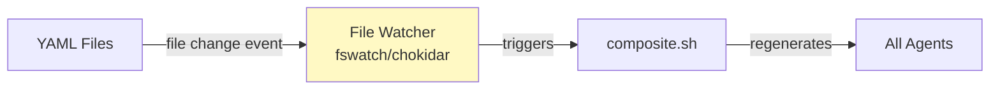
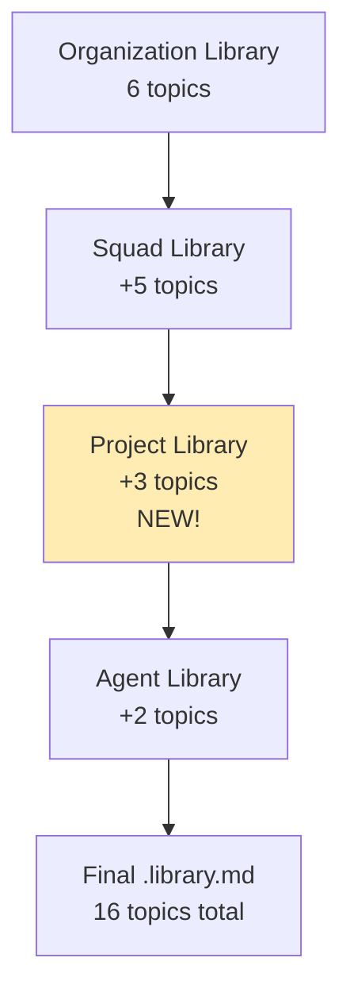

# Agent Composite System

**Philosophy:** YAML = source of truth, composite scripts manifest reality.

Simple changes (update skill, new book, new topic, new value) percolate across all agents automatically.

---

## Architecture

```mermaid
graph TB
    subgraph "Source of Truth (YAML)"
        ORG[organization.yaml<br/>skills, values, library]
        SQUAD[squads/{squad}/squad.yaml<br/>skills, values, library]
        AGENT[agents/{squad}/{agent}/agent.yaml<br/>skills, values, library]
    end
    
    subgraph "Composite Scripts"
        SYNC[composite.sh]
        SKILLS[sync-agent-skills.sh]
        VALUES[generate-agent-values.sh]
        LIBRARY[generate-agent-library.sh]
    end
    
    subgraph "Manifested Reality"
        AGENT_DIR["{agent}/"]
        AGENT_SKILLS[skills/<br/>symlinks]
        AGENT_VALUES[.values.md<br/>full content]
        AGENT_LIBRARY[.library.md<br/>topic list]
        SOUL[SOUL.md<br/>personality]
        YAML_FILE[agent.yaml<br/>metadata]
    end
    
    ORG --> SYNC
    SQUAD --> SYNC
    AGENT --> SYNC
    
    SYNC --> SKILLS
    SYNC --> VALUES
    SYNC --> LIBRARY
    
    SKILLS --> AGENT_SKILLS
    VALUES --> AGENT_VALUES
    LIBRARY --> AGENT_LIBRARY
    
    AGENT_SKILLS --> AGENT_DIR
    AGENT_VALUES --> AGENT_DIR
    AGENT_LIBRARY --> AGENT_DIR
    SOUL --> AGENT_DIR
    YAML_FILE --> AGENT_DIR
```

---

## Composite Inheritance

**Priority:** Organization → Squad → Agent (later wins)



**Example (design-engineer):**
- Organization: `backstage, librarian, github, summarize, tmux, remove-ambiguity` (6)
- Squad (design): `design-discrepancy, contract-diagram` (2, future)
- Agent: `video-frames` (1, future)
- **Result:** 9 skills total

---

## How an Agent is Created



---

## Composite Types

### 1. Skills (Symlinks)

**Source:** `skills: []` in YAML  
**Output:** `{agent}/skills/{skill}` → `~/Backstage/skills/{skill}/`  
**Discovery:** OpenClaw scans filesystem, auto-discovers available skills

**Why symlinks?**
- Zero duplication (single source of truth)
- Instant updates (skill changes propagate immediately)
- Filesystem = canonical truth (no config sync needed)

**Script:** `sync-agent-skills.sh`

---

### 2. Values (Full Content)

**Source:** `values: []` in YAML  
**Output:** `{agent}/.values.md` (appends full content of each value file)  
**Usage:** Agent reads `.values.md`, knows EXACTLY what each value means

**Why full content?**
- Value NAME = meaningless without definition
- Agent needs context to apply values correctly
- Single file = easy to read on startup

**Sources:**
- `~/Backstage/values/{value}.md` (organization)
- `~/Backstage/squads/{squad}/values/{value}.md` (squad)
- `{agent}/.agent-values/{value}.md` (agent-specific)

**Script:** `generate-agent-values.sh`

---

### 3. Library (Topic List)

**Source:** `library: []` in YAML  
**Output:** `{agent}/.library.md` (pungent mandate + topic list)  
**Usage:** Agent MUST ground decisions in research from listed topics

**Why topic list (not full books)?**
- Books = large (EPUBs, PDFs, thousands of pages)
- Topics = filter for librarian skill
- Agent consults on-demand via skill, not upfront load

**IDs must match:** `.library-index.json` format (e.g., `management_activism`, not `management/activism`)

**Script:** `generate-agent-library.sh`

---

## Future: Watcher (Auto-Sync)

**Problem:** Developers must remember to run `./composite.sh all` after YAML edits

**Solution:** File watcher monitors YAML changes, auto-runs composite



**Watch paths:**
- `organization.yaml`
- `squads/*/squad.yaml`
- `squads/*/values/*.md`
- `agents/*/*/agent.yaml`
- `agents/*/*/.agent-values/*.md`
- `values/*.md`

**Epic:** v0.33.0 (Hot Reload) - Future

---

## Adding New Content

### Add Skill to All Agents

```bash
# 1. Edit source
vim ~/Backstage/organization.yaml
# Add: - new-skill-name

# 2. Manifest
~/Backstage/scripts/composite.sh all

# Result: All 22 agents now have new-skill-name symlink
```

### Add Value to Squad

```bash
# 1. Create value file
echo "# sprezzatura\n\nEffortless mastery..." > ~/Backstage/squads/design/values/sprezzatura.md

# 2. Edit squad.yaml
vim ~/Backstage/squads/design/squad.yaml
# Add to values: - sprezzatura

# 3. Manifest
~/Backstage/scripts/composite.sh all

# Result: All design squad agents have sprezzatura in .values.md
```

### Add Library Topic to Agent

```bash
# 1. Edit agent YAML
vim ~/Backstage/agents/meta/business-analyst/agent.yaml
# Add to library: - cognition_swarm

# 2. Manifest
~/Backstage/scripts/composite.sh ~/Backstage/agents/meta/business-analyst/

# Result: business-analyst .library.md updated
```

---

## Project-Level Library (Future)

**Epic:** v0.28.0 (backlog)

**Goal:** Agents inherit library topics from projects they work on



**Example:** Wiley project → RPM-specific topics (`management_product`, `technology_excel`)

**When agent assigned to Wiley project:**
- Composite reads `projects/wiley/project.yaml`
- Adds `library: []` topics to agent's `.library.md`
- Agent context-aware (knows project domain)

---

## Summary

**YAML = Source of Truth** → **Composite Script = Manifestation** → **Agent = Runtime**

**Key insight:** Simple changes (1 line in YAML) → percolate across all agents (zero manual duplication)

**Future:** Watcher auto-runs composite on YAML change (zero manual intervention)

**Philosophy:** DRY at infrastructure level. Update once, apply everywhere.

---

**Created:** 2026-03-15  
**Epic:** librarian-v0.27.0  
**Scripts:** `composite.sh`, `sync-agent-skills.sh`, `generate-agent-values.sh`, `generate-agent-library.sh`
