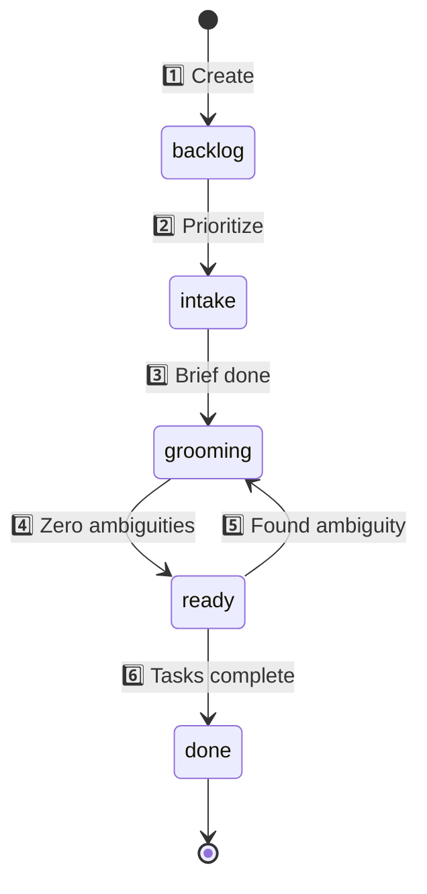

# Epic Writing Guide

**Purpose:** Standard format for Backstage epics (ideas → execution)

**Location:** `~/Backstage/projects/{PROJECT}/epics/v{X.Y.Z}/`

---

## File Structure

```
epics/v2.7.0/
├── epic.yaml          # Metadata + tasks (source of truth)
├── index.md           # Human narrative (optional)
├── notes.md           # Technical details (optional)
└── {other-docs}.md    # Supporting materials (optional)
```

**Rule:** `epic.yaml` = metadata ONLY. Long-form content = separate `.md` files.

---

## epic.yaml Format

**Critical:** Version is in folder name (`epics/v2.7.0/`), NOT in YAML frontmatter.

**DRY principle:** Don't repeat what the folder structure already says.

---

### Minimal (Backlog)

```yaml
---
name: "Epic Name"
goal: "One-line description of what we want"
status: backlog
type: minor
tasks: []
---
```

**Required fields:**
- `name` - Display name
- `goal` - One-line summary (what success looks like)
- `status` - `backlog`, `intake`, `grooming`, `ready`, `done`
- `type` - `minor`, `major`, `patch`
- `tasks` - Array (can be empty `[]`)

**Location:** `~/Backstage/projects/{PROJECT}/epics/v{X.Y.Z}/epic.yaml`

**What's tracked by Git (NOT in YAML):**
- `created` - First commit timestamp
- `started` - Branch creation date
- `completed` - Merge to main date
- `updated` - Every commit

**DRY principle:** Don't duplicate what Git already tracks.

---

### Full (Grooming/Active)

```yaml
---
name: "Mattermost Agent Integration"
goal: "Enable agents to participate in Mattermost channels for grooming sessions"
status: grooming
type: major

tasks:
  - text: "Diagnose WebSocket event filtering (design-engineer)"
    checked: false
  - text: "Test bot permissions in Mattermost (security-ops)"
    checked: false
  - text: "Document setup for new agents (technical-writer)"
    checked: true
    notes: "Added to agents.md"
---
```

**Optional additions:**
- `notes` - Brief inline notes (long notes → separate `notes.md`)
- Task `notes` - Context for specific task

> 🔜 **Future fields:**
> ```yaml
> tasks:
>   - text: "..."
>     checked: false
>     responsible: design-engineer  # Agent assignment
>     description: "Detailed context"
>     tests: "Command to verify completion"
> ```

**What NOT to include:**
- ❌ `version` - Already in folder name
- ❌ `summary` - Use separate `index.md` for long-form content
- ❌ `context` - Use `index.md`
- ❌ `architecture_decisions` - Use `decisions.md`
- ❌ Markdown headers/sections - YAML is metadata only

---

## Field Reference

### Core Metadata

| Field | Type | Required | Description |
|-------|------|----------|-------------|
| `name` | string | ✅ | Display name |
| `goal` | string | ✅ | One-line summary (what success looks like) |
| `status` | enum | ✅ | `backlog`, `intake`, `grooming`, `ready`, `done` |
| `type` | enum | ✅ | `minor`, `major`, `patch` |
| `tasks` | array | ✅ | Can be empty `[]` |

### Optional Fields

| Field | Type | Description |
|-------|------|-------------|
| `notes` | string | Brief inline notes (long notes → `notes.md`) |
| Task `notes` | string | Context for specific task |

> 🔜 **Future task fields:**
> - `responsible` - Agent assignment
> - `description` - Detailed context
> - `tests` - Command to verify completion

### Tracked by Git (NOT in YAML)

| What | How |
|------|-----|
| Version | Folder name (`epics/v4.3.0/`) |
| Created | First commit timestamp |
| Started | Branch creation date |
| Completed | Merge to main date |
| Updated | Every commit |

**Rationale:** DRY - don't duplicate what Git already tracks perfectly.

---

## Task Format

**ONLY valid format (Backstage UI parser requirement):**

```yaml
tasks:
  - text: "Task description"
    checked: false
  - text: "Another task"
    checked: true
    notes: "Optional context for this specific task"
```

**WRONG (breaks UI):**
```yaml
# ❌ Simple strings
tasks: ["Task description"]

# ❌ Emoji prefixes
tasks: ["✅ Task"]

# ❌ Markdown inside YAML
tasks:
  - "### Section\n- [ ] Task"
```

---

## Version Numbering

**Format:** `v{major}.{minor}.{patch}`

**Semantic meaning:**
- `major` - Breaking changes, large scope (e.g., v2.0.0 → v3.0.0)
- `minor` - Features, improvements (e.g., v2.1.0 → v2.2.0)
- `patch` - Bugfixes, small tweaks (e.g., v2.1.0 → v2.1.1)

**Auto-increment rule:**
- Next version = `max(existing versions) + 0.1.0`
- Example: If `v2.5.0` and `v2.6.0` exist → next is `v2.7.0`

**Project-specific counters:**
- `backstage` v2.7.0 ≠ `studio` v2.7.0
- Each project has independent versioning

---

## Epic Lifecycle



**Stages:**

1️⃣ **backlog** - Created, not picked up yet  
2️⃣ **intake** - Nicholas + business-analyst write basics  
3️⃣ **grooming** - Agents bid, discuss until zero ambiguities (branch: `epic/v{version}`)  
4️⃣ **ready** - Night shift execution (strict: zero tolerance for ambiguity)  
5️⃣ **Failure path** - Ambiguity found during execution → back to grooming  
6️⃣ **done** - Passes checks, merge to main

---

### 1. backlog

**State:** Created, not picked up yet

**Minimal YAML:**
```yaml
---
name: "Epic Name"
goal: "One sentence describing outcome"
status: backlog
type: minor
tasks: []
---
```

**Who:** Nobody (idea parking lot)

**Artifacts:** Epic YAML only (no branch, no channel, no assignments)

**Exit criteria:** Nicholas prioritizes it for intake

---

### 2. intake

**State:** Nicholas + business-analyst write down the basics

**Who:** Nicholas (author) + business-analyst (co-author)

**Activities:**
- Write problem statement
- Define objective
- Identify constraints
- Draft success criteria

**Additions to YAML:**
- `summary` - Multi-line explanation (optional)
- `context` - Why this epic exists (optional)
- `dependencies` - Blockers identified (optional)

**Artifacts:**
- Epic YAML with expanded goal/context
- Problem statement clarified
- No tasks yet, no Mattermost room yet

**Exit criteria:** Brief complete, ready for stakeholder discussion

---

### 3. grooming

**State:** Discussion until exhaustion (zero ambiguities)

**Who:** Nicholas (facilitator) + agents who bid + business-analyst (always)

**Git:** Branch created: `epic/v{version}` (e.g., `epic/v2.7.0`)

**Agent bidding:**
- Agents analyze epic
- Bid if relevant: "I should join because {reason}"
- Agents act as **quality control** for their disciplines
- Approved agents invited to Mattermost room

**Mattermost:** Private channel `#grooming-{PROJECT}-{EPIC_ID}` created

**Activities:**
- Technical debate
- Feasibility validation
- Architecture decisions
- Risk identification
- Task breakdown (per agent)
- Diagrams, specs finalized

**Additions to YAML:**
```yaml
tasks:
  - text: "Task description (assigned to agent or Nicholas)"
    checked: false
```

> 🔜 **Future:** Tasks will have `responsible` (agent select), `description`, `tests` (to prove completion)

**Artifacts:**
- Mattermost room with full discussion
- Diagrams (Mermaid, architecture)
- Specs documented
- Tasks assigned per agent (or Nicholas for supervision)
- All ambiguities resolved

**Exit criteria:** 
- Zero ambiguous tasks
- Agents have all tools and permissions they need
- Epic can be executed **unsupervised** (night shift ready)

---

### 4. ready (for night shift)

**State:** Agents work on tasks in order until completion

**Entry criteria (STRICT):**
- ✅ Zero ambiguous tasks
- ✅ All tools and permissions verified
- ✅ Each task has clear deliverable
- ✅ Success criteria measurable
- ✅ No open questions from grooming

**Who:** Agents (execute) + Nicholas (supervise OR fully autonomous)

**Git:** Work happens on branch `epic/v{version}`

**Mattermost:** Channel archived (discussion done, now execution)

**Activities:**
- Agents work on assigned tasks sequentially
- Commit code, run tests, report progress
- Nicholas may have "review work" tasks

> 🔜 **Future:** "Create presentation to defend your ideas" tasks before review

**Review cycle:**
- Nicholas reviews work
- Either: pass (merge) OR request changes (better checks, etc.)

**Artifacts:**
- Code commits
- Test results
- Progress updates
- Implementation artifacts

**Exit criteria:** All tasks `checked: true`, passes quality checks

---

#### When Ready Fails (Back to Grooming)

**Triggers:**
- Agent encounters ambiguity during execution
- Tool/permission missing (wasn't verified in grooming)
- Task deliverable unclear ("what does 'working' mean?")
- Success criteria not measurable
- Dependency discovered that wasn't discussed

**Process:**
1. Agent stops work immediately (don't guess)
2. Update `status: grooming` in epic.yaml
3. Re-open Mattermost channel (or create new thread)
4. Document what was ambiguous: "Task X unclear because..."
5. Discuss until resolved
6. Update tasks with clarifications
7. Verify ALL other tasks still clear
8. Return to `status: ready` only when zero ambiguities again

**Example failure:**
```yaml
# Task during grooming:
- text: "Implement WebSocket filtering"
  checked: false

# Agent during ready phase:
# "Wait, filter WHICH events? All channels? Only mentions?"
# → STOP, back to grooming

# After grooming clarification:
- text: "Filter WebSocket events: keep DMs + channel mentions, discard other channel traffic"
  checked: false
  notes: "Mention detection: rawText.includes('@' + botUsername)"
```

**Goal:** Zero tolerance for ambiguity. Better to return to grooming than execute wrong solution.

---

### 5. done

**State:** Task passes checks, merged to main

**Who:** Nicholas (final approval) + QA (automated checks)

**Git:** Branch `epic/v{version}` merged to `main`

**YAML updates:**
```yaml
status: done
tasks:
  - text: "..."
    checked: true  # All tasks completed
```

> 🔜 **Future:** Automated checks enforce task completion before merge

**Artifacts:**
- Merged code
- Closed Mattermost room (archived for audit)
- Lessons learned (optional)
- Documentation updated

**Exit criteria:** Epic complete, artifacts archived

**Timeline:** Git commit history shows when branch created → merged

---

## Writing Guidelines

### Summary
- **Length:** 2-5 paragraphs (500 words max)
- **Content:** Context, motivation, high-level approach
- **Avoid:** Implementation details (→ notes.md)

### Goal
- **Length:** 1-3 sentences
- **Format:** "Enable {capability} so that {outcome}"
- **Example:** "Enable agents to participate in Mattermost channels so that grooming sessions can happen collaboratively"

### Tasks
- **Format:** Action verb + deliverable
  - ✅ "Implement WebSocket event filtering"
  - ✅ "Document bot permission requirements"
  - ❌ "Work on Mattermost stuff"
  - ❌ "Fix the thing"
- **Granularity:** 1-4 hours of work each
- **Ownership:** Assign to specific agent (if known)

### Scope
- **Structure:**
  ```
  In scope:
  - Feature X
  - Use case Y
  
  Out of scope:
  - Feature Z (reason)
  ```
- **Purpose:** Prevent scope creep

### Success Criteria
- **Format:** Bullet list of measurable outcomes
- **Example:**
  ```yaml
  success_criteria:
    - "Bot responds to @mention in <2 seconds"
    - "3+ agents participate in grooming session"
    - "Zero manual config per new agent"
  ```

---

## Common Patterns

### Process Epic (v4.1.0 style)

**Use when:** Defining workflows, not code

**Structure:**
```yaml
phases:
  - phase: intake
    description: "..."
    entry: "..."
    exit: "..."
    artifacts: [...]
    participants: [...]

workflows:
  agent_bidding:
    trigger: "..."
    process: |
      Step-by-step flow

architecture_decisions:
  - date: YYYY-MM-DD
    decision: "..."
    rationale: |
      Why this choice
```

---

### Implementation Epic (v0.26.0 style)

**Use when:** Building features, fixing bugs

**Structure:**
```yaml
tasks:
  - text: "Implement X"
    checked: false
  - text: "Test Y"
    checked: false
  - text: "Document Z"
    checked: false

dependencies:
  - Epic v1.0.0 (foundation)

references:
  - PR: https://github.com/...
```

---

### Research Epic

**Use when:** Exploring options, not building yet

**Structure:**
```yaml
goal: "Evaluate {options} for {problem}"

tasks:
  - text: "Research option A (pros/cons)"
  - text: "Benchmark option B (performance)"
  - text: "Document recommendation"

success_criteria:
  - "Decision documented with rationale"
  - "Benchmark results reproducible"
```

---

## Anti-Patterns

### ❌ Markdown inside epic.yaml

**Problem:** UI parser breaks

```yaml
# WRONG
summary: |
  # Epic v2.7.0
  
  ## Context
  - Point 1
  - Point 2
```

**Fix:** Use plain text, or move to `index.md`

---

### ❌ Vague tasks

**Problem:** Agents don't know what to do

```yaml
# WRONG
tasks:
  - text: "Fix Mattermost"
  - text: "Make it work"
```

**Fix:** Be specific

```yaml
# RIGHT
tasks:
  - text: "Diagnose WebSocket event filtering in monitor.ts"
  - text: "Test bot mention detection with test messages"
```

---

### ❌ Nested structure in tasks

**Problem:** Parser expects flat array

```yaml
# WRONG
tasks:
  group1:
    - text: "Task A"
  group2:
    - text: "Task B"
```

**Fix:** Use flat list + notes for grouping

```yaml
# RIGHT
tasks:
  - text: "[Phase 1] Task A"
    checked: false
  - text: "[Phase 1] Task B"
    checked: false
  - text: "[Phase 2] Task C"
    checked: false
```

---

### ❌ Epic as knowledge dump

**Problem:** 20KB YAML = slow UI, hard to read

**Fix:** Split content

```
epics/v2.7.0/
├── epic.yaml      # <1KB (metadata + tasks)
├── index.md       # Human narrative
├── notes.md       # Technical deep dive
└── decisions.md   # Architecture decisions
```

---

## Mattermost Integration

**When grooming:**

### Create channel
- **Name:** `#grooming-{PROJECT}-{EPIC_ID}`
  - ✅ `#grooming-backstage-034`
  - ❌ `#grooming-v2.7.0-mattermost` (version changes)
- **Type:** Private
- **Participants:** Nicholas + approved agents + business-analyst

### Record in epic.yaml
```yaml
mattermost_channel_id: "xyz123"
mattermost_url: "http://localhost:8065/..."
```

### Archive when done
- When epic moves to `ready` or `active`
- Channel stays archived (auditability)
- Link in epic.yaml remains permanent

### Commands
- `/decision {text}` - Record architectural decision
- `/task {agent} {task}` - Add task to epic
- `/risk {description}` - Document risk

---

## Creating a New Epic

### Step 1: Find Next Version

```bash
# List existing epics, get latest version
ls ~/Backstage/projects/{PROJECT}/epics/ | grep -E "^v[0-9]" | sort -V | tail -1
# Example output: v4.2.0

# Next version:
# - Minor feature: v4.3.0 (most common)
# - Major breaking: v5.0.0 (rare)
# - Patch/fix: v4.2.1 (small tweaks)
```

### Step 2: Create Epic Folder & Branch

```bash
cd ~/Backstage
mkdir -p projects/{PROJECT}/epics/v4.3.0
git checkout -b epic/v4.3.0
```

### Step 3: Write epic.yaml (Minimal)

```yaml
---
name: "Epic Name"
goal: "One-line outcome description"
status: intake
type: major

tasks:
  - text: "First task description"
    checked: false
  - text: "Second task description"
    checked: false
---
```

**Save as:** `projects/{PROJECT}/epics/v4.3.0/epic.yaml`

**Rules:**
- NO `version` field (folder name = source of truth)
- NO `created`, `started`, `completed` (Git tracks this)
- `status: intake` if actively refining (else `backlog`)
- `type: major` for foundational, `minor` for features, `patch` for fixes

### Step 4: Write index.md (Context)

```markdown
# Epic Name

**Status:** Description of current state

---

## Problem

What problem are we solving? Why does this epic exist?

---

## Current State

What works, what doesn't, what's been diagnosed.

---

## Success Criteria

- [ ] Measurable outcome 1
- [ ] Measurable outcome 2

---

## Stakeholders

Who's involved, who will work on this.

---

## Next Steps

Immediate actions to move forward.
```

**Save as:** `projects/{PROJECT}/epics/v4.3.0/index.md`

### Step 5: Commit

```bash
cd ~/Backstage
git add projects/{PROJECT}/epics/v4.3.0/
git commit -m "epic: v4.3.0 Epic Name (intake)

Brief description of problem and approach.

Status: intake
Type: major/minor/patch

Tasks:
- Task 1
- Task 2"
```

### Step 6: Transition to Grooming (When Ready)

1. Update `epic.yaml`:
   ```yaml
   status: grooming
   ```

2. Create Mattermost channel: `#grooming-{PROJECT}-{EPIC_ID}`

3. Agents bid to join (quality control for their disciplines)

4. Discussion until zero ambiguities

5. Finalize tasks (assign to agents)

6. Exit criteria: Can be executed unsupervised (night shift ready)

---

## Tools (Future)

> 🔜 **These commands don't exist yet, but will simplify the process:**

### Create epic
```bash
backstage epic create "Epic Name"
# Auto-generates next version, opens editor
```

### Add task
```bash
backstage epic task "Implement X"
# Appends to current epic's tasks
```

### Update status
```bash
backstage epic status grooming
backstage epic complete
```

### View
```bash
backstage read epics/v4.3.0/epic.yaml
# Renders in terminal (Mermaid diagrams, tables, etc.)
```

---

## Examples

### Simple (Backlog)
See: `epics/v0.28.0/epic.yaml` (Project-Level Library Topics)

### Complex (Active)
See: `epics/v4.1.0/epic.yaml` (Epic Phases)

### Done
See: `epics/v0.26.0/epic.yaml` (Context Switch Merge)

---

## Lessons Learned

### From v2.7.0 creation attempt

**Mistake:** Tried to create epic with Markdown sections inside YAML

**Result:** Epic invisible in UI (parser choked)

**Fix:** Minimal YAML + separate `.md` files

**Rule:** Trust the spec. UI expects structure, not novel.

---

### From v4.1.0 (Epic Phases)

**Insight:** Process epics need different structure than implementation epics

**Solution:** Extended schema (`phases`, `workflows`, `philosophy`)

**Rule:** Adapt format to epic type, but keep `epic.yaml` minimal

---

## Quick Reference

**Backlog epic (5 minutes):**
```yaml
version: v2.7.0
name: "Epic Name"
status: backlog
created: 2026-03-16
type: minor
goal: "One sentence"
tasks: []
```

**Active epic (30 minutes):**
```yaml
version: v2.7.0
name: "Epic Name"
status: active
created: 2026-03-16
started: 2026-03-16
type: minor
priority: P1
category: integration

summary: |
  Multi-line explanation (2-3 paragraphs)

goal: |
  Measurable outcome

tasks:
  - text: "Task 1"
    checked: false
  - text: "Task 2"
    checked: false

success_criteria:
  - "Criterion 1"
  - "Criterion 2"
```

---

**Created:** 2026-03-16  
**Last updated:** 2026-03-16 15:56 EDT  
**Location:** `~/Backstage/documentation/epics.md`
