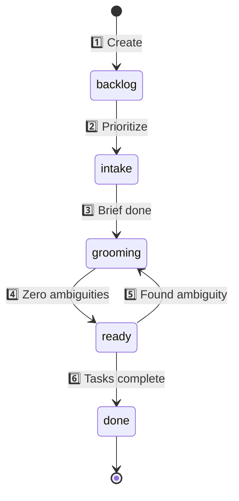

# Epic Writing Guide

**Purpose:** Standard format for Backstage epics

**Location:** `~/Backstage/projects/{PROJECT}/epics/v{X.Y.Z}/`

---

## File Structure

```
epics/v4.3.0/
├── epic.yaml          # Metadata + tasks (source of truth)
├── index.md           # Human narrative (optional)
└── notes.md           # Technical details (optional)
```

**Rule:** `epic.yaml` = metadata ONLY. Long content = separate `.md` files.

---

## epic.yaml Format

```yaml
---
name: "Epic Name"
goal: "One-line outcome description"
status: backlog
type: minor

tasks:
  - text: "Task description"
    checked: false
---
```

**Required fields:**
- `name` - Display name
- `goal` - One-line summary
- `status` - `backlog`, `intake`, `grooming`, `ready`, `done`
- `type` - `minor` (feature), `major` (breaking), `patch` (fix)
- `tasks` - Array (can be empty `[]`)

**What Git tracks (NOT in YAML):**
- Version (folder name: `epics/v4.3.0/`)
- Created (first commit)
- Started (branch creation)
- Completed (merge to main)

---

## Task Format (CRITICAL)

**ONLY valid syntax:**

```yaml
tasks:
  - text: "Task description"
    checked: false
  - text: "Another task"
    checked: true
    notes: "Optional context"
```

**WRONG (breaks UI):**
```yaml
# ❌ Simple strings
tasks: ["Task"]

# ❌ Emoji prefixes
tasks: ["✅ Task"]

# ❌ Markdown in YAML
tasks:
  - "### Section\n- [ ] Task"
```

---

## Lifecycle



1️⃣ **backlog** - Created, not picked up  
2️⃣ **intake** - Nicholas + business-analyst write basics  
3️⃣ **grooming** - Agents bid (declare stakeholder interest), discuss in Mattermost until zero ambiguities (branch: `epic/v{version}`)  
4️⃣ **ready** - Zero ambiguities = agents consulted libraries + all tasks assignable + tool permissions confirmed  
5️⃣ **Failure** - Ambiguity found during night shift → document in `notes.md`, back to grooming  
6️⃣ **done** - Passes checks, merge to main

---

## Creating an Epic

### 1. Find next version

```bash
ls ~/Backstage/projects/{PROJECT}/epics/ | grep -E "^v[0-9]" | sort -V | tail -1
# Output: v4.2.0
# Next: v4.3.0 (minor), v5.0.0 (major), v4.2.1 (patch)
```

### 2. Create folder & branch

```bash
cd ~/Backstage
mkdir -p projects/{PROJECT}/epics/v4.3.0
git checkout -b epic/v4.3.0
```

### 3. Write epic.yaml

```yaml
---
name: "Epic Name"
goal: "One-line outcome"
status: intake
type: major

tasks:
  - text: "First task"
    checked: false
---
```

Save as: `projects/{PROJECT}/epics/v4.3.0/epic.yaml`

### 4. Write index.md (optional)

```markdown
# Epic Name

## Problem
What we're solving and why.

## Success Criteria
- [ ] Measurable outcome 1
- [ ] Measurable outcome 2
```

Save as: `projects/{PROJECT}/epics/v4.3.0/index.md`

### 5. Commit

```bash
git add projects/{PROJECT}/epics/v4.3.0/
git commit -m "epic: v4.3.0 Epic Name (intake)

Brief description.

Tasks:
- Task 1
- Task 2"
```

---

## Grooming Process

**Who:** Agents declare stakeholder interest ("I need to be stakeholder here")

**Where:** Mattermost grooming rooms (project-specific channels)

**What:** 
- Agents ask clarifying questions
- Shape epic direction
- Consult respective library topics
- Identify ambiguities

**When done:**
- All agent questions answered
- Tasks are assignable (atomic, clear)
- Tool permissions confirmed
- Documented in epic/task files

**Output:** `status: ready` (zero ambiguities)

---

## Subtasks

Tasks cascade (task 2 starts when task 1 done).

Break large tasks during grooming:

```yaml
# BEFORE (too large)
- text: "Implement auth system"
  checked: false

# AFTER (atomic)
- text: "Configure OAuth provider"
  checked: false
- text: "Implement JWT tokens"
  checked: false
- text: "Add refresh token logic"
  checked: false
```

Stakeholders decide granularity during grooming.

---

## When Ready Fails

**If agent encounters ambiguity during night shift:**

1. STOP immediately (don't guess)
2. Update `status: grooming` in epic.yaml
3. Document in `notes.md`: "Task X unclear because..."
4. Re-open Mattermost discussion
5. Resolve ambiguity (consult libraries, ask questions)
6. Return to `status: ready`

**Discovery loop:** Night shift may find NEW ambiguities. Iterate.

**Lock in gains:** Meta agent reviews failures → suggests check improvements.

---

> 🔜 **TDD for Tasks (Future)**
>
> Tasks should follow test-driven development pattern:
>
> 1. **Red phase:** Write task describing success criteria
> 2. **Confirm fail:** Verify task NOT complete (check fails)
> 3. **Green phase:** Work on task until check passes
> 4. **Mark checked:** Only when evidence confirms completion
>
> Example:
> ```yaml
> # BEFORE work
> - text: "Add test coverage >80%"
>   checked: false
>
> # Run check → FAIL (65% coverage)
> # Work on tests
> # Run check → PASS (82% coverage)
>
> # AFTER work
> - text: "Add test coverage >80%"
>   checked: true
> ```

---

## Version Numbering

**Format:** `v{major}.{minor}.{patch}`

- `major` - Breaking changes (v2.0.0 → v3.0.0)
- `minor` - Features (v2.1.0 → v2.2.0) ← most common
- `patch` - Fixes (v2.1.0 → v2.1.1)

**Auto-increment:** Next = max(existing) + 0.1.0

**Project-specific:** Each project has independent versioning.

---

## Anti-Patterns

### ❌ Markdown inside YAML
Breaks UI parser. Use plain text in YAML, move formatting to `index.md`.

### ❌ Vague tasks
```yaml
# WRONG
- text: "Fix Mattermost"

# RIGHT
- text: "Diagnose WebSocket event filtering in monitor.ts"
```

### ❌ Epic as knowledge dump
Keep `epic.yaml` < 1KB. Split long content into `.md` files.

---

## Auditability

**Discussion:** Mattermost (ephemeral, searchable)  
**Documentation:** Epic files (permanent, versioned)

High auditability enables:
- Commit history (what changed, when)
- Mattermost room history (why decisions made)
- Epic notes (context, constraints)

Meta agent uses this to suggest process improvements:
- More/fewer checks
- Install apps for validation
- Reorder workflow steps
- Add library topics for best practices

---

## Examples

**Simple:** `epics/v0.28.0/epic.yaml` (Project-Level Library Topics)  
**Complex:** `epics/v4.1.0/epic.yaml` (Epic Phases)

---

> 🔜 **Future enhancements:**
> - `backstage epic create` CLI command
> - Task fields: `responsible` (agent), `description`, `tests`
> - Automated checks before merge (enforce task completion)
