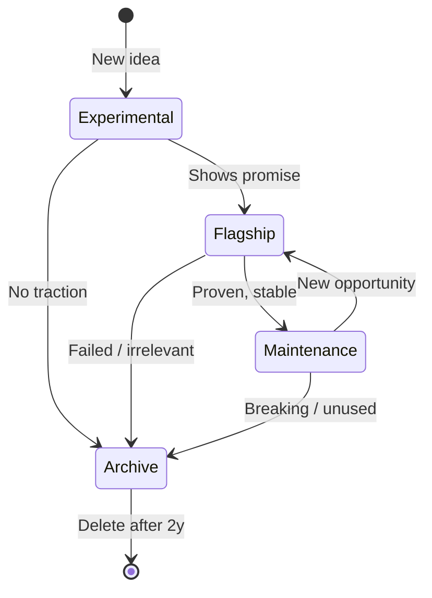

# Project Tiers

**Purpose:** Resource allocation framework for design studio operating as commons

**Philosophy:** Balance exploration (new ideas) with exploitation (proven projects). Small overhead (Nicholas) = need funnel to elevate deserving experiments without maintaining heavy overhead on curiosities.

**Critical: Tiers are business analysis, not value judgment.**
- Tier 3 (Archive) ≠ failure (just frozen, like many open source projects)
- Tier 0 (Flagship) ≠ permanent (can move down if priorities shift)
- Movement in ANY direction is natural (resource allocation changes)

---

## Core Insight

📕 **The Open Organization** (Red Hat model):
> "People often ask how we decide which open source projects to commercialize. A small group—sometimes one person—begins contributing. If community thrives and customers get involved, we increase effort. If not, engineers move to new project. By the time we commercialize, the decision is obvious."

**Applied to Nonlinear Studio:**
- Start experiments lightweight (low overhead)
- Signal-based escalation (if shows promise → elevate)
- Natural funnel (not forced commitment)

---

## Tier Definitions

### Tier 0: Flagship

**What:** Primary business focus, revenue-generating or brand-defining projects.

**Characteristics:**
- Daily attention (Nicholas dedicates majority time)
- Full squad access (all agents available)
- Highest check rigor (all checks enforced)
- Public-facing (portfolio, case studies)
- Active roadmap (epics in grooming/ready/done)

**Resource allocation:**
- 60-80% time
- Full agent squad (Meta, Design, Engineering, etc)
- Budget for tools/infrastructure

**Examples:**
- Backstage (internal, but core infrastructure)
- Studio (R&D, but flagship-level attention)

**Exit criteria:**
- Revenue stopped / brand no longer relevant
- OR: Proven successful → maintenance mode (Tier 2)

---

### Tier 1: Experimental

**What:** Promising ideas, proofs-of-concept, curiosities worth exploring.

**Characteristics:**
- Weekly/biweekly check-ins (not daily)
- Limited squad (Meta + 1-2 domain agents)
- Reduced checks (critical only: syntax, determinism)
- Internal-only (not portfolio-ready)
- Lightweight roadmap (backlog epics, exploratory)

**Resource allocation:**
- 10-20% time
- Small agent team (Meta squad + relevant domain)
- Minimal budget (free-tier tools, self-hosted)

**Examples:**
- Grant Agent (automation experiment)
- Memory Architecture (research spike)
- Self-Promotion (exploration, not commitment)

**Escalation criteria (Tier 1 → Tier 0):**
- User demand (real people asking for it)
- Revenue opportunity (clear monetization path)
- Strategic fit (aligns with studio values: commons, night shift, library)
- Technical feasibility (proven in prototype)

**Exit criteria:**
- No progress for 3 months → Tier 3 (archive)
- Proven unsuccessful → document learnings, archive
- Proven successful → Tier 0 (flagship)

---

### Tier 2: Maintenance

**What:** Stable, proven projects with minimal active development.

**Characteristics:**
- Monthly check-ins (reactive, not proactive)
- No dedicated squad (on-call agents only)
- Minimal checks (no new features, only bug fixes)
- Public or internal (still accessible, not marketed)
- No roadmap (backlog frozen, emergency-only epics)

**Resource allocation:**
- <5% time (reactive fixes)
- On-call agents (whoever fixes the bug)
- No budget (use existing infra)

**Examples:**
- Librarian (stable, works, no major features planned)
- Mastodon Migration (done, only maintain if breaks)

**Re-escalation criteria (Tier 2 → Tier 0):**
- New opportunity (e.g., Librarian becomes product)
- Major tech shift (e.g., rebuild needed)

**Exit criteria:**
- Breaking beyond repair → Tier 3 (archive)
- No use for 6+ months → Tier 3
- **OK to freeze:** Like many open source projects (not failure, just paused)

---

### Tier 3: Archive

**What:** Historical projects, read-only, no maintenance.

**Characteristics:**
- No attention (reference-only)
- No squad
- No checks
- Documentation preserved (lessons learned)
- Code frozen (Git tag, no commits)

**Resource allocation:**
- 0% time
- 0 agents
- No budget

**Examples:**
- Clawhub Automation (deprecated, replaced)
- Server Migration (done, no longer relevant)

**Exit criteria:**
- Delete after 2 years (if no value)
- OR: Keep as case study (portfolio, learning)

---

## Tier Transitions



**Decision authority:**
- Nicholas (final call)
- Business Analyst (recommendations based on signals)
- Meta squad (escalation proposals)

**Decision cadence:**
- Quarterly review (all projects)
- On-demand (if signals trigger escalation)

---

## Resource Funnel (Commons Model)

📕 **Understanding Knowledge as a Commons**:
> "Equity refers to just or equal appropriation from, and contribution to, the maintenance of a resource. Efficiency deals with optimal production, management, and use."

**Applied:**
- **Equity:** All experiments get fair shot (Tier 1 entry is low-barrier)
- **Efficiency:** Proven projects get more resources (Tier 0 escalation)
- **Sustainability:** Archive dead projects (avoid maintenance debt)

**Anti-pattern:**
- Keeping 10 Tier 1 projects with no progress (overhead kills studio)
- Promoting to Tier 0 without signals (premature commitment)
- Staying Tier 0 after failure (sunk cost fallacy)

---

## Signals for Escalation (Tier 1 → Tier 0)

**User demand:**
- People asking for it (not just "nice idea")
- Repeat requests (>3 different sources)

**Revenue opportunity:**
- Clear monetization path (grants, clients, products)
- Willingness to pay (pre-orders, contracts)

**Strategic fit:**
- Aligns with studio values (commons, night shift, library)
- Differentiates studio (not commodity)

**Technical feasibility:**
- Prototype works (proven PoC)
- Scalable (not just one-off hack)

**Nicholas enthusiasm:**
- Excited to work on it (not forcing)
- Sees long-term potential

**Conservative heuristic:**
When in doubt, **stay Tier 1** (better to experiment longer than commit prematurely).

---

## Current Projects (Tier Mapping)

| Project | Tier | Rationale |
|---------|------|-----------|
| Backstage | 0 (Flagship) | Core infrastructure, daily use, full squad |
| Studio | 0 (Flagship) | Primary R&D focus, brand-defining |
| Research Exchange | 1 (Experimental) | Prototype, unclear revenue, exploring |
| Librarian | 2 (Maintenance) | Stable, works, minimal changes |
| Personal | 2 (Maintenance) | Internal tools, low priority |
| Grant Agent | 1 (Experimental) | Idea phase, no prototype yet |
| Memory Architecture | 1 (Experimental) | Research spike, not productized |
| Clawhub Automation | 3 (Archive) | Deprecated, no longer relevant |

> 🔜 **Future:** Tier field in `project.yaml` (automated tier checks)

---

## Tier Resources (Evolving Globally)

**Critical insight:** Tiers don't just allocate projects → resources → tiers. **Resources available per tier also evolve.**

📕 **Understanding Institutional Diversity** (Elinor Ostrom):
> "Institutions are artifacts of deliberate human choice, but also facilitate learning. Individuals tinker and adapt to institutions that are artifacts of their creation. Reflection and choice occurs on the margin with regard to institutional change."

**Applied to tiers:**
- Tier definitions ≠ fixed (evolve as we learn)
- Resource pools ≠ static (new capabilities → global rollout)
- Tier policies ≠ permanent (adapt based on outcomes)

**Commons advantage (no paywall constraints):**
- **Startup model:** New resource = paid feature (Tier 0 only, monetize upgrade)
- **Commons model:** New resource = enrich all tiers (no market pressure, same hardware)

**Example:**
- Automation available (Discord bot) → **All tiers gain** (Tier 1 gets community monitoring)
- LLM local (Qwen 32B) → **Tier 1 gains AI checks** (before: only Tier 0 had reviews)
- Same hardware (Mac Studio) → **More capabilities** (via software, not buying servers)

**Result:** Tiers get richer over time without increasing cost (efficiency compounds).

---

### Current Resources per Tier

**Tier 0 (Flagship):**
- Nicholas time: 60-80%
- Agent squad: Full (Meta, Design, Engineering, Marketing, Resources, Personal)
- Checks: All (deterministic + probabilistic)
- Infrastructure: Dedicated (custom domains, paid tools)
- Community: Active (Discord, social media, outreach)
- Marketing: Yes (portfolio, case studies, content)
- Budget: $$$ (pay for tools if needed)

**Tier 1 (Experimental):**
- Nicholas time: 10-20%
- Agent squad: Limited (Meta + 1-2 domain agents)
- Checks: Critical only (syntax, determinism)
- Infrastructure: Shared (localhost, self-hosted)
- Community: Passive (monitoring only)
- Marketing: No
- Budget: $ (free-tier or self-hosted only)

**Tier 2 (Maintenance):**
- Nicholas time: <5% (reactive)
- Agent squad: On-call (whoever fixes)
- Checks: Emergency only (security, breaking)
- Infrastructure: Frozen (existing only)
- Community: None
- Marketing: None
- Budget: $0 (no new costs)

**Tier 3 (Archive):**
- Nicholas time: 0%
- Agent squad: None
- Checks: None
- Infrastructure: Static (Git tag)
- Community: None
- Marketing: Historical only (portfolio reference)
- Budget: $0

---

### Resource Evolution (Adaptive Governance)

**Philosophy:** As capabilities change (new tools, automation, AI efficiency), **resources available per tier change globally**.

**Example scenarios:**

#### Scenario 1: Community automation available
**Change:** Discord bot for community management (low overhead)

**Impact:**
- Tier 1 (Experimental) **gains** community monitoring (was passive → now automated)
- Tier 0 (Flagship) community effort **reduced** (human → bot)

**Rollout:**
1. Evaluate automation (does it work?)
2. Update tier policies globally (Tier 1 now includes community bot)
3. Apply to all Tier 1 projects (automatic)

---

#### Scenario 2: Marketing becomes expensive
**Change:** Social media requires daily content (high overhead)

**Impact:**
- Tier 0 (Flagship) marketing **reduced** (all platforms → selective)
- Tier 1 (Experimental) marketing **stays none** (too expensive)

**Rollout:**
1. Assess cost/benefit (is daily posting worth it?)
2. Update tier policies (Tier 0 marketing = strategic only)
3. Apply to all Tier 0 projects (reduce frequency)

---

#### Scenario 3: AI agents reduce check overhead
**Change:** Probabilistic checks now automatable (LLM reviews)

**Impact:**
- Tier 1 (Experimental) **gains** probabilistic checks (was critical-only → now includes AI-powered)
- Tier 0 (Flagship) check rigor **increases** (can add more checks without overhead)

**Rollout:**
1. Prove AI checks work (accuracy, false positives)
2. Update tier policies (Tier 1 includes AI checks)
3. Deploy to all projects (global capability)

---

### Policy Evolution Framework

**Triggers for tier resource changes:**

1. **New capability available** (automation, tool, agent skill)
   - Evaluate: Does it reduce overhead?
   - Decision: Add to which tiers?
   - Rollout: Update policies, apply globally

2. **Resource becomes expensive** (tool pricing change, maintenance burden)
   - Evaluate: Still worth it?
   - Decision: Remove from which tiers?
   - Rollout: Sunset globally (with migration plan)

3. **Learning from experiments** (tried X in Tier 1, worked/failed)
   - Evaluate: Should all Tier 1 projects get X?
   - Decision: Promote to tier policy OR keep project-specific
   - Rollout: If promoted → document + apply

4. **Strategic shift** (studio focus changes)
   - Evaluate: Do tier priorities change?
   - Decision: Reallocate resources (e.g., more design, less marketing)
   - Rollout: Update all tiers

---

### Adaptive Process

📕 **Understanding Institutional Diversity** (Ostrom):
> "Instead of searching for the single optimal set of rules, study real-world experiments that proved robust over time. Design principles are not blueprints—they describe structural similarities among self-organized systems able to adapt and learn."

**Applied:**
- **Not blueprint:** Tier resources listed above = current state, not permanent
- **Continuous learning:** Track what works (which tier resources deliver value?)
- **Marginal changes:** Tinker with tier policies (small experiments → global rollout if proven)
- **Robust patterns:** Preserve what works (don't change for change's sake)

**Commons compounding:**
- New automation → **All tiers richer** (not Tier 0 exclusive)
- Same hardware → **More output** (via software efficiency)
- No market pressure → **Enrich freely** (not "upsell" or "paywall")

**Example compounding:**
- 2025: Tier 1 = no checks (manual review only)
- 2026 Q1: Local LLM available → Tier 1 gains AI checks (same hardware)
- 2026 Q2: Check automation → Tier 1 gains more checks (same LLM)
- 2026 Q3: Agent improvements → Tier 1 checks faster (same hardware)

**Result:** Tier 1 in Q3 2026 >> Tier 0 in Q4 2025 (efficiency compounds, no cost increase).

**Process:**

```
1. Experiment (try new resource in one Tier 0 project)
   ↓
2. Evaluate (did it work? Cost vs benefit?)
   ↓
3. Decide (promote to tier policy? Keep project-specific? Sunset?)
   ↓
4. Rollout (if promoted → update tiers.md, apply to all projects in tier)
   ↓
5. Monitor (is it still working? Adjust if needed)
   ↓
6. Repeat (continuous adaptation)
```

---

### Examples of Resource Changes

**Historical (hypothetical):**

**Q4 2025:** Tier 1 projects had no community monitoring
- **Change:** Added passive Discord monitoring (low overhead)
- **Reason:** Discord bot available, minimal cost
- **Rollout:** All Tier 1 projects now monitor community

**Q1 2026:** Tier 0 projects had dedicated domains
- **Change:** Removed (Tailscale HTTPS sufficient)
- **Reason:** Cost savings ($15/mo per domain), Tailscale works
- **Rollout:** All Tier 0 projects moved to Tailscale URLs

**Q2 2026:** Tier 1 projects gained AI-powered checks
- **Change:** Added probabilistic checks (LLM reviews briefs)
- **Reason:** Qwen 32B local = low cost, high quality
- **Rollout:** All Tier 1 projects now get brief validation

---

### Lookout Responsibility

**Who tracks resource evolution:**
- **Business Analyst** (me): Monitor tier resource effectiveness, propose changes
- **Meta squad:** Evaluate technical feasibility (can we automate X?)
- **Nicholas:** Final decision (is this worth doing?)

**When to review:**
- **Quarterly:** Formal tier policy review (what changed? What should change?)
- **On-demand:** New capability available (automation, tool, breakthrough)
- **Post-mortem:** Project failed/succeeded (what tier resources helped/hurt?)

**Documentation:**
- **This file (tiers.md):** Update resource lists when global changes happen
- **Commit messages:** WHY resource changed (reasoning, evidence)
- **Memory:** Track evolution (what we tried, learned, kept/discarded)

---

## Check Enforcement per Tier

**Tier 0 (Flagship):**
- All checks (deterministic + probabilistic)
- Pre-merge checkpoints (enforce quality)
- Library research required (grounded decisions)

**Tier 1 (Experimental):**
- Critical checks only (syntax, determinism)
- No probabilistic checks (too heavy)
- Optional library research (if needed)

**Tier 2 (Maintenance):**
- Emergency checks only (security, breaking changes)
- No new feature checks

**Tier 3 (Archive):**
- No checks (read-only)

---

## Philosophy: Funnel, Not Prison

**Design studio for commons** = not VC-funded startup (no forced growth).

**Tier movement = resource reallocation, not success metric:**
- Flagship → Archive ≠ "failed" (priorities shifted, resources needed elsewhere)
- Experimental → Archive ≠ "bad idea" (learned something, moved on)
- Archive ≠ "shame" (freeze is OK, like many open source projects)
- Maintenance → Flagship ≠ "resurrection" (new opportunity emerged)

**Exploration OK:**
- Curiosities allowed (Tier 1 entry is cheap)
- Failure OK (archive without shame)
- Opportunistic (elevate when signals appear)

**Not obligated:**
- No "must ship" pressure (Tier 1 can stay Tier 1)
- No "must maintain" burden (archive when breaks)
- No "must scale" mandate (small is fine)

**Funnel both ways:**
- **Up:** Experimental → Flagship (proven, deserves attention)
- **Down:** Flagship → Maintenance → Archive (natural resource shift)
- **Sideways:** Archive → Experimental (rediscovery, new context)

**No stigma:**
- Archive = "paused" (not "failed")
- Experimental = "exploring" (not "risky")
- Maintenance = "stable" (not "abandoned")

**Resource honesty:**
- Tier reflects current reality (attention, budget, squad availability)
- Not aspiration (what we wish we could do)
- Not judgment (what project "deserves")

**Commons compounding (no paywall):**
- Tiers get richer over time (automation → all tiers gain)
- Same hardware → more capability (software efficiency)
- No "paid tier" exclusivity (new features → global rollout)
- Example: Tier 1 today > Tier 0 last year (efficiency compounds)

---

## References

📕 **The Open Organization** (Red Hat model) - Resource allocation via community signals  
📕 **Understanding Knowledge as a Commons** (Elinor Ostrom) - Equity, efficiency, sustainability framework  
📕 **Protecting the Commons** - Scale expansion, self-governance, sustainability
