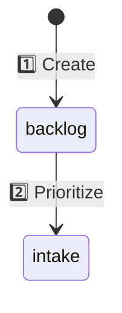

# Writing Guide

**Purpose:** Documentation standards for Backstage

---

## Principles

**Focus over verbosity**
- More words = less focus
- Say ONLY what's necessary
- Remove redundancy

**Present tense**
- Describe what IS, not what was
- No "lessons learned" or historical narrative
- Future features: `> 🔜 Future enhancement`

**Timeless**
- No creation dates in body text
- No "we decided" or "after discussion"
- Git tracks history, docs describe state

**DRY (Don't Repeat Yourself)**
- If Git tracks it, don't duplicate in YAML
- If folder name says it, don't repeat in frontmatter
- If section explains it, don't re-explain elsewhere

---

## Structure

### Diagrams

**Mermaid preferred**
- No yellow note boxes (clutters diagram)
- Use emoji numbers (1️⃣ 2️⃣ 3️⃣)
- Explain numbered items AFTER diagram in prose

**Example:**


1️⃣ **backlog** - Created, not picked up  
2️⃣ **intake** - Nicholas + BA write basics

### Code Blocks

**Annotate intent, not mechanics:**

```yaml
# WRONG
- text: "Fix bug"

# RIGHT  
- text: "Diagnose WebSocket event filtering in monitor.ts"
```

No need to say "This is better because..." — show it.

### Examples

**Real over hypothetical**

Point to actual files:
- ✅ `epics/v0.28.0/epic.yaml` (Project-Level Library Topics)
- ❌ "For example, imagine an epic about..."

### Sections

**Headers as signposts**

User should scan headers and know exactly where to look.

Bad:
- "Configuration"
- "How it works"

Good:
- "epic.yaml Format"
- "When Ready Fails"

---

## Anti-Patterns

### ❌ Explain the obvious
```markdown
# WRONG
The next step is to commit your changes to Git.
This saves your work so you don't lose it.

# RIGHT
### 5. Commit
```

### ❌ Duplicate information
```markdown
# WRONG (epic.yaml)
version: v4.3.0  # Also in folder name epics/v4.3.0/

# RIGHT
Version in folder name ONLY
```

### ❌ Nested redundancy
```markdown
# WRONG
## Creating an Epic
To create an epic, follow these steps to create it.

# RIGHT
## Creating an Epic
```

### ❌ Future promises without marker
```markdown
# WRONG
Soon we will add deny lists.

# RIGHT
> 🔜 Deny lists (agent > squad > organization precedence)
```

---

## Checklist

Before committing documentation:

- [ ] Can I remove 30% without losing meaning?
- [ ] Does every sentence add new information?
- [ ] Are examples real (point to actual files)?
- [ ] Is the diagram clean (no note boxes)?
- [ ] Did I avoid explaining Git basics?
- [ ] Are future features marked `> 🔜`?
- [ ] Is it timeless (no "we decided", "lessons learned")?

---

## Examples

**Good documentation:**
- `documentation/epics.md` (v2 after condensing)
- `documentation/agents.md` (v2 after restructure)

**Before/after:**

**Before (verbose):**
> After careful consideration and discussion with the team, we learned that it's important to keep epic.yaml files small because large files can be harder to maintain and understand. This lesson was valuable.

**After (focused):**
> Keep `epic.yaml` < 1KB. Split long content into `.md` files.

**Reduction:** 27 words → 10 words (63% shorter, same information)
