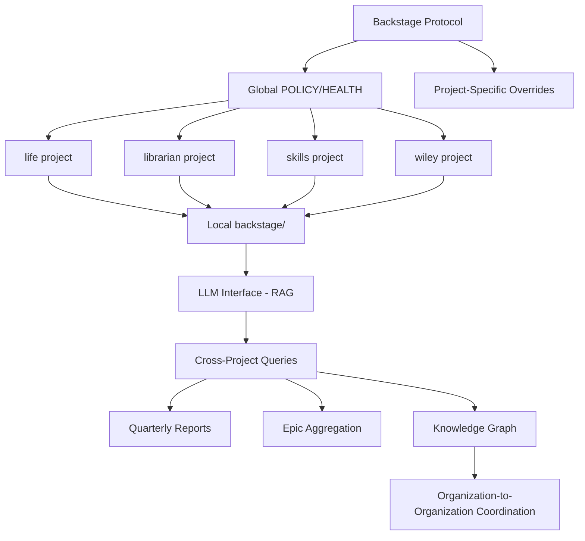

# Epic: Nimble-Ready Prep

**Status:** 💡 CONCEPT  
**Created:** 2026-02-13  
**Project:** backstage

---

## Problem

**Backstage protocol has nimble-ready DNA, but lacks automation to scale.**

Current state:
- Projects adopt backstage protocol manually
- Nicholas coordinates cross-project patterns
- No LLM interface for organizational knowledge
- Manual POLICY/HEALTH propagation
- Cross-project queries require human aggregation

**We need:** Infrastructure automation to enable knowledge networks (multi-agent coordination).

---

## Research Summary

**Sources:**
1. praxis.nyc/nimble-ready (page moved, couldn't fetch)
2. Soulbinding Like a State (Gordon Brander) - Legibility critique
3. Language for Knowledge Networks (BlockScience) - Multi-agent coordination

**What is Nimble-Ready?**
- Small specialized orgs > large monoliths
- Low coordination cost between orgs
- Knowledge networks (multi-agent systems)
- Avoid "seeing like a state" (Scott)

**Backstage as Nimble Framework:**

✅ **YES - Strong alignment:**
1. **Polycentric governance** - Global + project-specific POLICY
2. **Reference IDs (RIDs)** - Backstage uses epic version numbers, project names as references
3. **Interoperability** - Projects subscribe, adapt protocol to fit
4. **Learning agents** - Projects maintain internal models (VISION, ROADMAP), share via backstage
5. **Avoids legibility traps** - No forced standardization, fork-friendly

❌ **GAPS - What's missing:**
1. **No LLM interface** (yet) - Knowledge networks need natural language translation
2. **No cross-project queries** (yet) - Can't easily ask "what did all projects ship Q1?"
3. **Manual knowledge sync** - POLICY/HEALTH changes require human propagation
4. **No automation for org-to-org coordination** - Still human-mediated

---

## Solution: Tooling Phases (Discrete)

### Phase 1: Existing (We Are Here)
- Backstage protocol exists
- Projects adopt, customize
- Human coordination (Nicholas teaches protocol)

### Phase 2: Automation (Tooling Needed)
- ✅ Changelog commits with trailers (DONE - see changelog-as-milestone epic)
- 🏗️ Cross-repo quarterly reports (PLANNED)
- ⏸️ POLICY/HEALTH auto-sync (TODO)

### Phase 3: LLM Interface (Future)
- BSciGPT-style RAG over all backstage/ folders
- Natural language queries: "Show me all fitness-related epics across projects"
- Organizational "theory of mind" - Projects understand each other's contexts

### Phase 4: Knowledge Network (Ultimate)
- Projects = learning agents
- Shared backstage protocol = common language
- Cross-project collaboration without centralization
- "Conversations between open-minded peers"

---

## Architecture

---

## Tasks

### Phase 2: Automation
- [ ] **Quarterly report script** (cross-repo git log aggregation)
  - Parse all `~/Documents/*/backstage/ROADMAP.md`
  - Aggregate CHANGELOG commits by quarter
  - Generate Marp slideshow
  - Test on 2026-Q1
  
- [ ] **POLICY auto-sync detection**
  - Detect when global POLICY.md changes
  - Compare against project-specific POLICY.md files
  - Flag drift, propose updates
  - Do NOT auto-apply (human review required)
  
- [ ] **HEALTH enforcement**
  - Run HEALTH checks across all projects
  - Report violations (do not auto-fix)
  - Log results to backstage/reports/

### Phase 3: LLM Interface
- [ ] **RAG over backstage/ folders**
  - Vector store: all epic-notes/, ROADMAP.md, CHANGELOG.md
  - BSciGPT-style interface
  - Natural language queries
  - Cross-project context
  
- [ ] **Knowledge graph visualization**
  - Epic dependencies
  - Cross-project patterns
  - Timeline view

### Phase 4: Knowledge Network
- [ ] **Project-to-project coordination primitives**
  - Shared epic references
  - Cross-project task dependencies
  - Notification routing
  
- [ ] **Theory of mind** (organizational)
  - Projects understand each other's VISION
  - Detect ethical alignment/drift
  - Propose collaboration opportunities

---

## Open Questions

**From Nicholas (2026-02-13):**

1. **Private skills visibility:**
   - New POLICY: Do not mention private skills (especially not in README)
   - How to ensure private skill epic-notes NOT pushed?
   - Can we push without commit?
   - Best of both worlds pattern?

2. **Skills ROADMAP location:**
   - Where does skills ROADMAP live?
   - ~/Documents/skills/backstage/ROADMAP.md?
   - Or separate project?

3. **Epic parking automation:**
   - "I had an idea" skill → parks idea to corresponding project/epic
   - How to detect which project/epic?
   - Natural language parsing?
   - Explicit tags?

---

## Success Criteria

**Phase 2 Complete:**
- ✅ Can generate quarterly report across ALL projects (one command)
- ✅ POLICY drift detection works
- ✅ HEALTH checks run automatically

**Phase 3 Complete:**
- ✅ LLM can answer: "Show me all fitness-related epics"
- ✅ LLM can answer: "What did we ship in 2026-Q1?"
- ✅ Knowledge graph visualization exists

**Phase 4 Complete:**
- ✅ Projects coordinate via backstage protocol (minimal human intervention)
- ✅ Cross-project dependencies visible
- ✅ Nicholas operates swarm company infrastructure

---

## Why This Matters

**Backstage IS nimble-ready architecture** - It's designed for exactly this:
- Small projects with distinct purposes
- Shared protocol (not shared implementation)
- Forkable, adaptable, context-specific
- Avoids "seeing like a state" (no forced legibility)

**But we lack automation** - Currently requires Nicholas as coordinator. To scale:
1. Automate knowledge sync (POLICY/HEALTH propagation)
2. Add LLM interface (RAG over all projects)
3. Enable cross-project queries (git log aggregation)
4. Build org-to-org primitives (project A → project B coordination)

**When automation exists:**
- Nicholas's swarm company can operate at scale
- Projects collaborate without central planning
- Knowledge networks emerge organically
- "Conversations between open-minded peers" 🏴

---

## References

- Soulbinding Like a State: https://newsletter.squishy.computer/p/soulbinding-like-a-state
- Language for Knowledge Networks: https://blog.block.science/a-language-for-knowledge-networks/
- Changelog as Milestone epic: `~/Documents/backstage/epic-notes/changelog-as-milestone.md`
- BlockScience multi-agent systems research
- James C. Scott "Seeing Like a State"

---

**Next:** Implement Phase 2 (quarterly reports), resolve private skills questions, test cross-project patterns.
