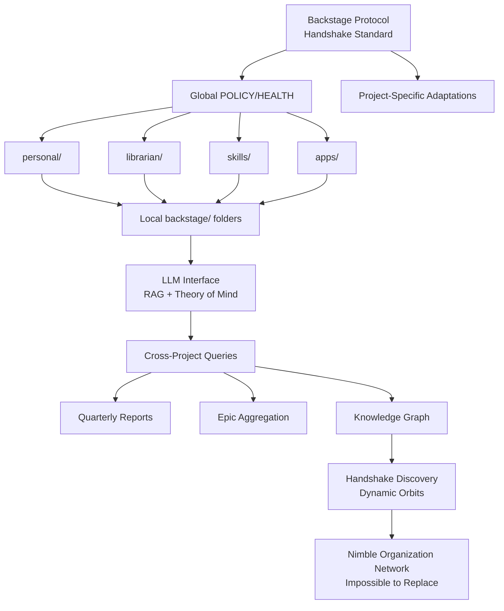

# Epic: Nimble-Ready Prep

**Status:** 💡 CONCEPT  
**Created:** 2026-02-13  
**Updated:** 2026-02-15  
**Project:** backstage

---

## Problem

**Backstage has nimble-ready DNA, but lacks automation infrastructure to enable dynamic organizational constellations.**

### Current State
- Projects adopt backstage protocol manually (human coordination bottleneck)
- No handshake discovery (projects can't find each other)
- No LLM interface (knowledge networks need natural language translation)
- Manual POLICY/HEALTH sync (Nicholas propagates changes)
- Cross-project queries require human aggregation

### Vision
**Enable nimble institutions that sense each other like constellations—autonomous, specialized, impossible to replace.**

---

## Core Philosophy (Nimble-Ready Framework)

> **A framework for collaboration that reduces transaction costs via a handshake protocol that determines what agents can do together and ways to work.**

### Unbundling of Companies // Degrowth // Worker-centric model

Organizations grow monolithic to cut transaction costs. **LLMs slash these costs**, allowing institutions to stay lean, specialized, and agile—while still collaborating dynamically.

This creates a new ecosystem where institutions don't just interact—they **sense each other** through:
- **Handshake protocols** (operational compatibility detection)
- **Smart contracts** (automated collaboration proposals)
- **Dynamic orbits** (shifting roles based on scope and function)

**Result:** Network of autonomous yet hyper-connected entities, breaking free from bureaucratic scaling.

---

## The 7 Nimble-Ready Principles

Nimble institutions reject growth trap by prioritizing **sustainability, adaptability, interdependence** over scale:

1. **Protocol-Driven Collaboration** – Standardized handshake protocols enable seamless partnerships without mergers
2. **Sovereignty Through Specialization** – Master one domain, connect with others instead of expanding aimlessly
3. **Dynamic Orbits** – Stay fluid, shifting roles based on opportunity, not rigid hierarchies
4. **Automated Middle Management** – LLMs replace bureaucratic overhead, ensuring efficiency
5. **Resilience by Design** – Modular, decentralized, and adaptable, not dependent on sheer size
6. **Value Over Scale** – Impact, efficiency, and autonomy define success—not expansion
7. **Networked Anti-Fragility** – Essential to the ecosystem, reducing risk of obsolescence or acquisition

### **Nimble institutions don't need to grow—they need to be impossible to replace.**

---

## Backstage as Nimble-Ready Infrastructure

### How Backstage Implements Each Principle

| Principle | Backstage Implementation | Status |
|-----------|-------------------------|--------|
| **Protocol-Driven Collaboration** | Shared POLICY.md, HEALTH.md, ROADMAP.md across projects | ✅ DONE |
| **Sovereignty Through Specialization** | Each project adapts protocol to domain (librarian, personal, apps) | ✅ DONE |
| **Dynamic Orbits** | Dual-track development (librarian ↔️ skills), cross-pollination | ✅ DONE |
| **Automated Middle Management** | Git trailers + LLM coordination (planned) | 🏗️ IN PROGRESS |
| **Resilience by Design** | Forkable, polycentric (global + project-specific policies) | ✅ DONE |
| **Value Over Scale** | Small projects with clear purpose > monoliths | ✅ DONE |
| **Networked Anti-Fragility** | Cross-project epic references, shared learnings | 🏗️ IN PROGRESS |

### What Makes Backstage Nimble-Ready

**✅ Already nimble-ready:**
- Polycentric governance (global + project overrides)
- Reference IDs (epic versions enable cross-project coordination)
- Learning agents (each project maintains VISION, ROADMAP, CHANGELOG)
- Forkable protocol (projects customize without breaking compatibility)
- Human-readable handshakes (Markdown = accessible to humans + LLMs)

**⚠️ Missing automation (what this epic builds):**
- No handshake discovery (projects can't find each other)
- No cross-project queries ("what did we ship Q1?")
- No LLM interface (RAG over backstage/ folders)
- Manual POLICY sync (Nicholas propagates changes)

---

## Solution: 4-Phase Infrastructure Build

### Phase 1: Foundation ✅ COMPLETE

**Goal:** Establish protocol, demonstrate viability across projects

- [x] Backstage protocol defined (POLICY, ROADMAP, HEALTH, CHANGELOG)
- [x] Multiple projects adopt (librarian, personal, apps, skills)
- [x] Epic-notes document cross-project learnings
- [x] Git trailers for milestone commits (queryable history)

### Phase 2: Automation 🏗️ IN PROGRESS

**Goal:** Reduce coordination overhead, enable basic cross-project queries

**Tasks:**
- [x] Changelog commits with trailers (DONE)
- [ ] **Cross-repo quarterly reports** (aggregate all projects)
  - Parse all `~/Documents/*/backstage/CHANGELOG.md`
  - Generate Marp slideshow by quarter
  - Test on 2026-Q1
  
- [ ] **POLICY auto-sync detection**
  - Detect global POLICY.md changes
  - Flag drift across projects
  - Propose updates (human review required)
  
- [ ] **HEALTH enforcement automation**
  - Run checks across all projects
  - Gate merges on failures
  - Log results to backstage/reports/

### Phase 3: LLM Interface 💡 PLANNED

**Goal:** Natural language queries, organizational "theory of mind"

**Tasks:**
- [ ] **RAG over backstage/ folders**
  - Vector store: epic-notes/, ROADMAP.md, CHANGELOG.md
  - BSciGPT-style interface
  - Queries: "Show me all fitness-related epics across projects"
  
- [ ] **Knowledge graph visualization**
  - Epic dependencies
  - Cross-project patterns
  - Timeline view
  
- [ ] **Smart contract proposals**
  - LLM suggests collaborations based on ROADMAP alignment
  - "Project A + Project B could collaborate on X"

### Phase 4: Knowledge Network 🔮 ULTIMATE

**Goal:** Projects coordinate as autonomous learning agents

**Tasks:**
- [ ] **Handshake discovery**
  - Projects find each other via protocol compatibility
  - Automated operational compatibility checks
  
- [ ] **Dynamic orbits**
  - Projects shift roles based on opportunity
  - No rigid hierarchies, fluid collaboration
  
- [ ] **Networked anti-fragility**
  - Projects become essential to ecosystem
  - Impossible to replace (specialized, interconnected)
  
- [ ] **Organization-to-organization coordination**
  - Project A → Project B coordination primitives
  - Shared epic references, cross-project dependencies
  - Notification routing

---

## Architecture

---

## Success Criteria

### Phase 2 Complete
- ✅ Can generate quarterly report across ALL projects (one command)
- ✅ POLICY drift detection works
- ✅ HEALTH checks run automatically (gate merges)

### Phase 3 Complete
- ✅ LLM can answer: "Show me all fitness-related epics"
- ✅ LLM can answer: "What did we ship in 2026-Q1?"
- ✅ Knowledge graph visualization exists
- ✅ Smart contract proposals work

### Phase 4 Complete
- ✅ Projects coordinate via protocol (minimal human intervention)
- ✅ Handshake discovery operational (projects find each other)
- ✅ Cross-project dependencies visible
- ✅ Nicholas operates swarm company infrastructure
- ✅ **Nimble institutions sense each other like constellations** ✨

---

## Open Questions

**From Nicholas (2026-02-13):**

1. **Private skills visibility:**
   - New POLICY: Do not mention private skills (especially not in README)
   - How to ensure private skill epic-notes NOT pushed?
   - Best of both worlds pattern?

2. **Skills ROADMAP location:**
   - Where does skills ROADMAP live?
   - ~/Documents/skills/backstage/ROADMAP.md?

3. **Epic parking automation:**
   - "I had an idea" skill → parks idea to corresponding project/epic
   - How to detect which project/epic?
   - Natural language parsing vs explicit tags?

---

## Why This Matters

**Backstage enables the nimble-ready alternative to growth:**

### Traditional Organizations
- Grow monolithic to reduce transaction costs
- Merge to coordinate
- Bureaucratic overhead scales with size
- Vulnerable to acquisition/obsolescence

### Nimble Organizations (Backstage-enabled)
- Stay small, specialized, agile
- Collaborate via protocol (no mergers needed)
- LLMs slash coordination costs
- Impossible to replace (networked anti-fragility)

**When Phase 4 complete:**
- Nicholas's swarm company operates at scale
- Projects sense each other (handshake discovery)
- Dynamic orbits (fluid collaboration)
- Knowledge networks emerge organically
- **"Conversations between open-minded peers"** 🏴

---

## References

- **Nimble-Ready Framework:** [praxis.nyc/initiative/nimble-ready](https://praxis.nyc/initiative/nimble-ready/)
- **Soulbinding Like a State:** [Gordon Brander on legibility critique](https://newsletter.squishy.computer/p/soulbinding-like-a-state)
- **Language for Knowledge Networks:** [BlockScience multi-agent coordination](https://blog.block.science/a-language-for-knowledge-networks/)
- **Backstage Protocol:** [github.com/nonlinear/backstage](https://github.com/nonlinear/backstage)
- **James C. Scott:** "Seeing Like a State" (legibility trap critique)

---

**Next Steps:**
1. Implement quarterly reports script (Phase 2)
2. Build LLM interface (Phase 3)
3. Test handshake discovery (Phase 4)
4. **Become impossible to replace** ✨
