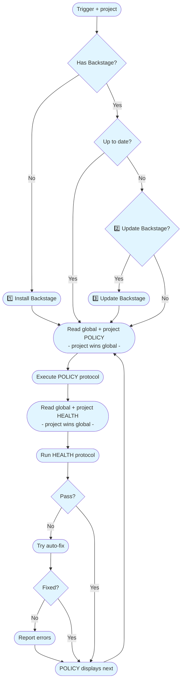

# Backstage Skill Flow

**Flow visual do backstage skill — combinado e implementado**

**How it works:** [See epic-notes/v0.3.0-openclaw-skill.md](https://github.com/nonlinear/backstage/blob/main/epic-notes/v0.3.0-openclaw-skill.md)

---

---

**1️⃣ Install Backstage**
- **Source:** `https://github.com/nonlinear/backstage` branch `main`
- **Files:** Copy `templates/*-template.md` → `backstage/*.md` (remove -template)
- Copy `global/POLICY.md` + `global/HEALTH.md` → `backstage/global/`
- **Result:** Project has backstage protocol foundation

**2️⃣ Update Backstage?**
- Ask once/day (check `backstage/.last-update-check` timestamp)
- Bypass if asked today + user said no
- **Format:** y/n prompt with tease message

**3️⃣ Update Backstage**
- **Version detection:** Branch name (epic) or CHANGELOG (main)
- **Check:** Compare INDEX nav block version vs repo main
- **Tease message:** Storytelling with inline GitHub links
- **If yes:** Replace `backstage/global/` from main (always overwrite)
- **Network fail:** Warn "couldn't check for updates" + continue
- **After:** global/POLICY updates INDEX with new version (branch dance)
