## backstage-gui wireframe 

**Goal:** Read-only GUI for backstage (projects → epics → tasks).

**Framework:** shadcn/ui (Next.js)

---

## Big Picture Layout

**Page structure:** Horizontal scroll (not vertical)

```mermaid
%%{init: {'theme':'base','themeVariables':{"primaryColor":"#4A90E2","primaryTextColor":"#fff","primaryBorderColor":"#2E5C8A","lineColor":"#666","secondaryColor":"#50E3C2","tertiaryColor":"#FFD700","edgeLabelBackground":"#666"},'flowchart':{"nodeSpacing":50,"rankSpacing":50,"padding":15,"curve":"basis"}}}%%
flowchart LR
    Sidebar["Sidebar<br/>(fixed)"]
    Card1["Project Card 1"]
    Card2["Project Card 2"]
    Card3["Project Card 3"]
    Card4["Project Card 4"]
    Card5["Project Card 5"]
    More["... (scroll)"]
    
    Sidebar -.- Card1 -.- Card2 -.- Card3 -.- Card4 -.- Card5 -.- More
    
    style Sidebar fill:#334155,stroke:#475569,color:#e2e8f0
    style Card1 fill:#e5e7eb,stroke:#9ca3af,color:#1f2937
    style Card2 fill:#e5e7eb,stroke:#9ca3af,color:#1f2937
    style Card3 fill:#e5e7eb,stroke:#9ca3af,color:#1f2937
    style Card4 fill:#e5e7eb,stroke:#9ca3af,color:#1f2937
    style Card5 fill:#e5e7eb,stroke:#9ca3af,color:#1f2937
    style More fill:#f3f4f6,stroke:#d1d5db,color:#6b7280
```

---

## Components

| Component | Layout | Content |
|-----------|--------|---------|
| [Sidebar](https://ui.shadcn.com/docs/components/radix/sidebar) | Fixed left, always visible | (TBD) |
| [Project Card](https://ui.shadcn.com/docs/components/radix/card) | Horizontal rectangle, light gray Max width: `$CARD_WIDTH` (400px) CSS scroll-snap (snaps to card start) Horizontal scroll (as many cards as projects exist) | Loops through all projects (see glossary) Order: Most recent first Data source: `~/Documents/backstage/projects/*/` |

---

## Variables

| Variable | Value | Notes |
|----------|-------|-------|
| `$CARD_WIDTH` | 400px | Project card max width (adjustable) |

---

## Next: Define Card Structure

**Pergunta:** O que tem **dentro** de cada Project Card? (project name? epic count? outros dados?)

---

**Status:** 🔄 In progress - card scroll behavior defined

