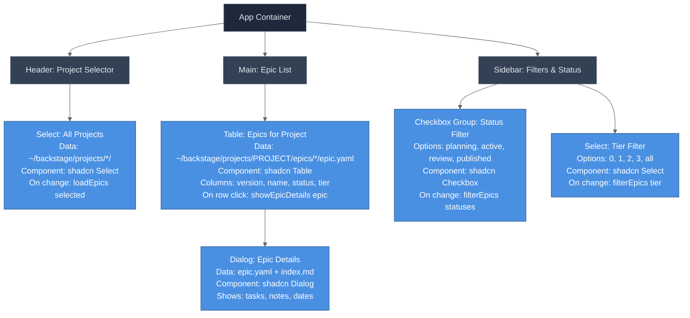

# v2.1.0 - Backstage GUI

**Status:** `planning` → Contract wireframe in progress

---

## Contract Wireframe

**Goal:** Read-only GUI for backstage (projects → epics → tasks).

**Components:** shadcn/ui (Next.js)

**Terminology:** See Glossary below.

---

### Main Layout



---

## Glossary

### Data Sources (Single Source of Truth)

**Projects:**
- **Path:** `~/Documents/backstage/projects/*/`
- **Format:** Directory listing (folder names)
- **Example:** `backstage`, `librarian`, `personal`

**Epics:**
- **Path:** `~/Documents/backstage/projects/{PROJECT}/epics/*/epic.yaml`
- **Format:** YAML frontmatter
- **Schema:**
  ```yaml
  name: epic-slug
  status: planning|blocked|paused|ready|active|review|published|backlog
  tier: 0|1|2|3
  created: YYYY-MM-DD
  started: YYYY-MM-DD|null
  completed: YYYY-MM-DD|null
  tasks: [string array]
  ```

**Epic Notes:**
- **Path:** `~/Documents/backstage/projects/{PROJECT}/epics/{VERSION}/index.md`
- **Format:** Markdown
- **Content:** Philosophy, context (NOT metadata)

### Components (shadcn/ui)

**Select:**
- Dropdown component
- Docs: https://ui.shadcn.com/docs/components/select
- Use for: Project selector, tier filter

**Table:**
- Data table component
- Docs: https://ui.shadcn.com/docs/components/table
- Use for: Epic list (sortable, filterable)

**Checkbox:**
- Checkbox component
- Docs: https://ui.shadcn.com/docs/components/checkbox
- Use for: Multi-select filters (status)

**Dialog:**
- Modal dialog component
- Docs: https://ui.shadcn.com/docs/components/dialog
- Use for: Epic details view

### Interactions (Event Handlers)

**`loadEpics(projectName: string)`**
- **Trigger:** Project dropdown selection changes
- **Action:** 
  1. Read `~/backstage/projects/{projectName}/epics/*/epic.yaml`
  2. Parse YAML → array of epic objects
  3. Update `EpicTable` state
- **Return:** `Epic[]`

**`filterEpics(filters: {status?: string[], tier?: number})`**
- **Trigger:** Status checkboxes OR tier dropdown change
- **Action:**
  1. Filter current epic list by status/tier
  2. Update `EpicTable` visible rows
- **Return:** `Epic[]` (filtered)

**`showEpicDetails(epic: Epic)`**
- **Trigger:** Click epic table row
- **Action:**
  1. Read `epic.yaml` (already loaded)
  2. Read `index.md` from same folder
  3. Open Dialog with combined data
- **Return:** `void`

### State Management

**Global state:**
- `selectedProject: string | null`
- `epics: Epic[]` (loaded from filesystem)
- `filters: {status: string[], tier: number | null}`

**Derived state:**
- `filteredEpics: Epic[]` (epics + filters applied)

---

## Ambiguities to Remove

**Questions for Nicholas:**

1. **Initial load:** Which project selected by default? (last used? first alphabetical? none?)
2. **Epic sorting:** Default sort column? (version? status? created date?)
3. **Tier "all":** Show all tiers OR no tier filter? (semantics)
4. **Dialog actions:** Read-only = true, but show "Edit in AI" button? (opens conversational flow?)
5. **Empty states:** What to show when no project selected? No epics found?

---

## Night Shift Ready?

**Current state:** **NO** (ambiguities exist).

**After removing ambiguities:** **YES** (diagram + glossary + interactions = complete spec).

**Next:** Answer questions above, iterate until zero ambiguity.

---

**Contract status:** 🟡 Draft (needs clarification)

