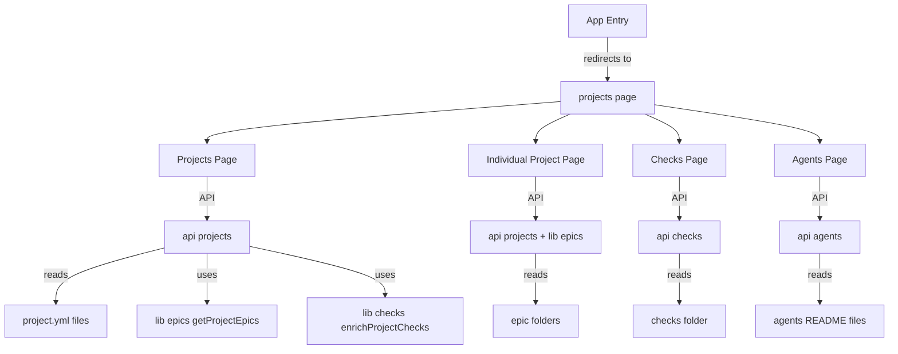
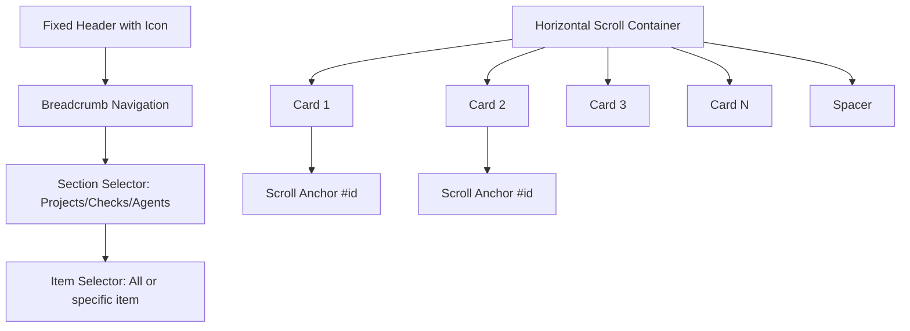
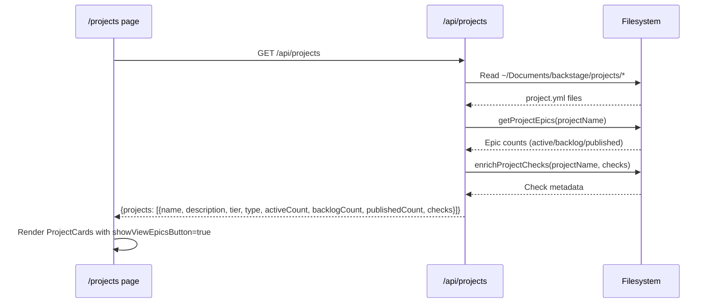
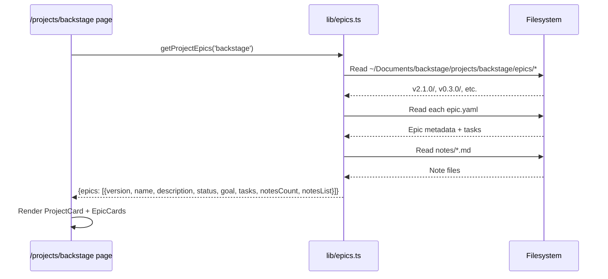
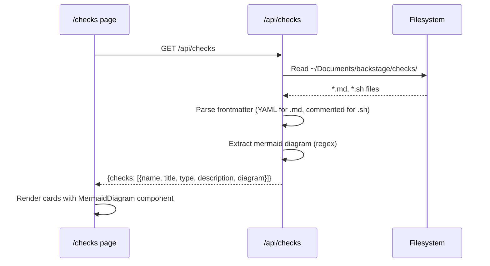
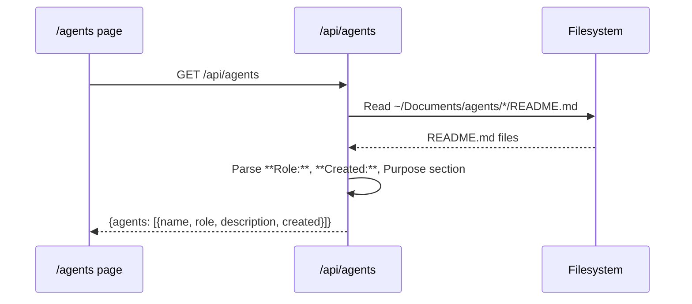
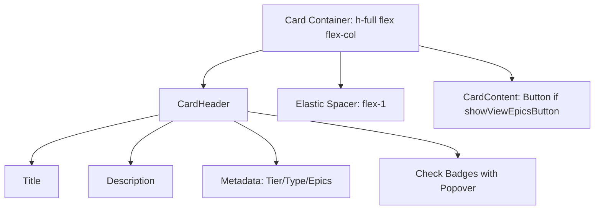
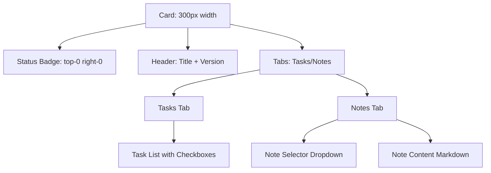
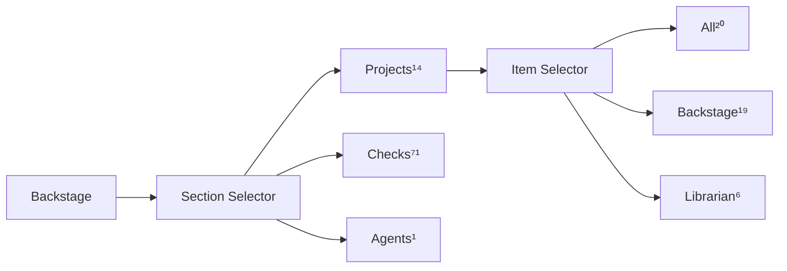
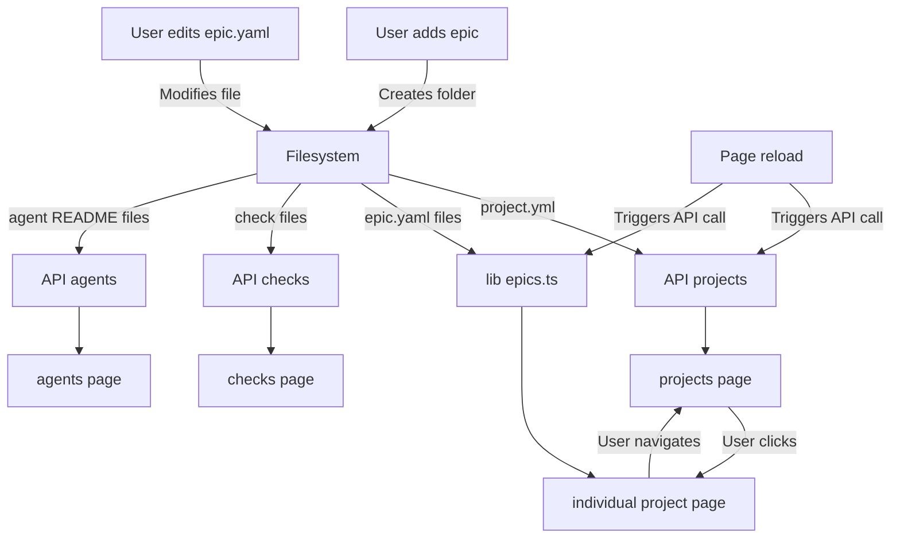

# Backstage GUI v2.1.0 - Architecture Documentation

**Last Updated:** 2026-03-04  
**Branch:** `v2.1.0`  
**Location:** `~/Documents/backstage/app`

---

## Overview

Read-only Next.js web app for browsing projects, epics, checks, and agents. Built with **shadcn/ui** components and **TailwindCSS**.

**Philosophy:**
- Filesystem = single source of truth
- No database, no cache
- API reads fresh data on every request
- Page reload = latest state

---

## Application Structure



---

## Directory Layout

```
~/Documents/backstage/app/
├── app/
│   ├── page.tsx              # Root redirect to /projects
│   ├── projects/
│   │   ├── page.tsx          # All projects list (horizontal scroll)
│   │   └── [project]/
│   │       ├── page.tsx      # Server component (loads data)
│   │       └── page-client.tsx  # Client component (interactivity)
│   ├── checks/
│   │   └── page.tsx          # All checks grid
│   ├── agents/
│   │   └── page.tsx          # All agents grid
│   ├── api/
│   │   ├── projects/route.ts  # Projects API
│   │   ├── checks/route.ts    # Checks API
│   │   └── agents/route.ts    # Agents API
│   ├── globals.css           # Shared CSS (header icon, spacing vars)
│   ├── layout.tsx            # Root layout
│   └── icon.png              # Navigation icon
├── components/
│   ├── ProjectCard.tsx       # Project display card
│   ├── EpicCard.tsx          # Epic display card
│   ├── MermaidDiagram.tsx    # Mermaid renderer
│   └── ui/                   # shadcn/ui components
├── lib/
│   ├── epics.ts              # Epic loading utilities
│   └── checks.ts             # Check loading utilities
└── public/
    └── icon.png              # Public icon asset
```

---

## Page Architecture

### Pattern: Horizontal Scroll Cards

All main pages follow the same layout:



**CSS Pattern:**
```tsx
<div className="flex-1 overflow-x-auto">
  <div className="flex items-start h-full" 
       style={{ 
         gap: 'calc(var(--spacing-unit) / 2)', 
         padding: 'var(--spacing-unit)' 
       }}>
    {items.map(item => (
      <>
        <div id={item.id} className="scroll-mt-4" />
        <Card>{/* content */}</Card>
      </>
    ))}
    <div style={{ width: 'var(--spacing-unit)', flexShrink: 0 }} />
  </div>
</div>
```

---

## Pages Deep Dive

### 1. `/projects` - All Projects

**Purpose:** Browse all projects with horizontal scroll

**Layout:**
- Header: "Backstage / Projects¹⁴ / All²⁰"
- Cards: ProjectCard components (300px fixed width)
- Button: "View epics" (outline variant, navigates to `/projects/{project}`)

**Data Flow:**


**Card Structure:**
```tsx
<Card className="h-full flex flex-col">
  <CardHeader>{/* content */}</CardHeader>
  <div className="flex-1" /> {/* Elastic spacer */}
  {showViewEpicsButton && (
    <CardContent>
      <Button variant="outline" className="w-full">
        View epics
      </Button>
    </CardContent>
  )}
</Card>
```

---

### 2. `/projects/{project}` - Individual Project

**Purpose:** Browse epics for a specific project

**Layout:**
- Header: "Backstage / Projects¹⁴ / Backstage¹⁹"
- First card: ProjectCard (no button)
- Following cards: EpicCards (tasks, notes, status badges)

**Data Flow:**


**Epic Sorting:**
```javascript
const statusOrder = { active: 1, backlog: 2, published: 3 }
sortedEpics.sort((a, b) => {
  // Sort by status first
  const statusDiff = statusOrder[a.status] - statusOrder[b.status]
  if (statusDiff !== 0) return statusDiff
  
  // Then by version (semver ascending)
  return a.version.localeCompare(b.version, undefined, { 
    numeric: true, 
    sensitivity: 'base' 
  })
})
```

---

### 3. `/checks` - All Checks

**Purpose:** Browse all checks (deterministic + probabilistic)

**Layout:**
- Header: "Backstage / Checks⁷¹"
- Cards: Grid layout (md:2 cols, lg:3 cols)
- Type badges: deterministic | probabilistic
- Mermaid diagrams: Rendered in cards (if present)

**Data Flow:**


**Mermaid Extraction:**
```javascript
// Regex: /---\n\n```mermaid\n([\s\S]*?)\n```/
const diagramMatch = content.match(/---\n\n```mermaid\n([\s\S]*?)\n```/)
if (diagramMatch) {
  check.diagram = diagramMatch[1]
}
```

---

### 4. `/agents` - All Agents

**Purpose:** Browse all agent definitions

**Layout:**
- Header: "Backstage / Agents¹"
- Cards: Grid layout (md:2 cols, lg:3 cols)
- Role badges
- Created dates

**Data Flow:**


---

## Components

### ProjectCard

**Props:**
```typescript
interface ProjectCardProps {
  projectName: string
  projectDescription: string
  projectTier: number
  projectType: string
  activeCount: number
  backlogCount: number
  publishedCount: number
  checks: Check[]
  showViewEpicsButton?: boolean  // Only true on /projects page
}
```

**Structure:**


**Check Badges:**
- Popover trigger on click
- Shows check title, type badge, description
- Aligns to start (left edge)

---

### EpicCard

**Props:**
```typescript
interface EpicCardProps {
  version: string
  name: string
  description: string
  status: 'active' | 'backlog' | 'published'
  goal: string
  tasks: Task[]
  notesCount: number
  notesList: Note[]
  activeTab: 'tasks' | 'notes'
  isActiveEpic: boolean
  selectedNote?: string
  onTabChange: (tab: 'tasks' | 'notes') => void
  onNoteChange: (noteSlug: string) => void
}
```

**Structure:**


**Tab Management:**
- URL hash changes on tab switch
- Tasks tab: Shows checkboxes (read-only)
- Notes tab: Dropdown to select note, renders markdown

---

### MermaidDiagram

**Props:**
```typescript
interface MermaidDiagramProps {
  diagram: string  // Mermaid syntax
  id: string       // Unique ID for this instance
}
```

**Implementation:**
```typescript
"use client"
import mermaid from 'mermaid'

useEffect(() => {
  mermaid.initialize({ startOnLoad: false })
  mermaid.contentLoaded()
}, [])

return <div id={id} className="mermaid">{diagram}</div>
```

**Why unique IDs:** Multiple diagrams on same page (each check card can have diagram)

---

### ReloadButton

**Location:** Root layout (`app/layout.tsx`) - appears on all pages

**Props:** None (self-contained component)

**Implementation:**
```tsx
"use client"
import { Button } from "@/components/ui/button"
import { RotateCw } from "lucide-react"

export function ReloadButton() {
  const handleReload = () => {
    window.location.reload()
  }

  return (
    <Button
      variant="outline"
      size="icon"
      onClick={handleReload}
      className="fixed bottom-4 right-4 z-50"
      aria-label="Reload page"
    >
      <RotateCw className="h-4 w-4" />
    </Button>
  )
}
```

**Features:**
- Fixed position (bottom-right corner)
- 16px spacing (Tailwind `bottom-4 right-4`)
- Icon-only (RotateCw from lucide-react)
- Outline variant (matches app style)
- High z-index (floats above all content)
- Accessible (aria-label)
- Global (appears on all pages via root layout)

**Why needed:** Quick page refresh to load latest API data (filesystem changes)

---

## API Endpoints

### `/api/projects`

**Returns:**
```json
{
  "projects": [
    {
      "name": "Backstage",
      "description": "Backstage project lorem ipsum",
      "tier": 1,
      "type": "undefined",
      "activeCount": 1,
      "backlogCount": 17,
      "publishedCount": 1,
      "checks": [
        {
          "name": "dogfooding",
          "title": "Dogfooding Check",
          "type": "probabilistic",
          "description": "..."
        }
      ]
    }
  ]
}
```

**Logic:**
1. Read `~/Documents/backstage/projects/*/project.yml`
2. Call `getProjectEpics(projectName)` → count epics by status
3. Call `getProjectChecks(projectName)` → get check filenames
4. Call `enrichProjectChecks(projectName, checkFilenames)` → load check metadata
5. Sort by tier (ascending), then name
6. Return JSON

---

### `/api/checks`

**Returns:**
```json
{
  "checks": [
    {
      "name": "arch-workflow",
      "title": "Architecture Workflow",
      "type": "probabilistic",
      "description": "...",
      "diagram": "graph TD\n  A --> B"
    }
  ]
}
```

**Logic:**
1. Read `~/Documents/backstage/checks/*` (both .md and .sh files)
2. Parse frontmatter:
   - `.md` files: YAML frontmatter
   - `.sh` files: Commented YAML (`# title: ...`)
3. Extract mermaid diagram (regex after frontmatter)
4. Return JSON

---

### `/api/agents`

**Returns:**
```json
{
  "agents": [
    {
      "name": "secretaria",
      "role": "Agent",
      "description": "Secretaria agent description",
      "created": "2026-02-24"
    }
  ]
}
```

**Logic:**
1. Read `~/Documents/agents/*/README.md`
2. Extract role (`**Role:** ...`)
3. Extract created date (`**Created:** ...`)
4. Extract description (first paragraph after `## Purpose`)
5. Return JSON

---

## Shared Utilities

### `lib/epics.ts`

**Key Functions:**

```typescript
// Load all epics for a project
function getProjectEpics(projectName: string): Epic[]

// Load specific epic
function getEpic(projectName: string, version: string): Epic

// Get check filenames for project
function getProjectChecks(projectName: string): string[]
```

**Epic Structure:**
```typescript
interface Epic {
  version: string          // e.g., "v2.1.0"
  name: string            // from epic.yaml
  description: string
  status: 'active' | 'backlog' | 'published'
  goal: string
  tasks: Task[]
  notesCount: number
  notesList: Note[]
}

interface Task {
  text: string
  checked: boolean
}

interface Note {
  slug: string
  title: string
  content: string
}
```

---

### `lib/checks.ts`

**Key Function:**

```typescript
function enrichProjectChecks(
  projectName: string, 
  checkFilenames: string[]
): Check[]
```

**Check Structure:**
```typescript
interface Check {
  name: string           // filename without extension
  title: string         // from frontmatter
  type: 'deterministic' | 'probabilistic'
  description: string
  diagram?: string      // mermaid syntax (optional)
}
```

---

## Styling System

### CSS Variables

**Defined in `globals.css`:**
```css
:root {
  --spacing-unit: 2rem;  /* Base spacing (32px) */
}
```

**Usage:**
- Card gaps: `calc(var(--spacing-unit) / 2)` (1rem = 16px)
- Container padding: `var(--spacing-unit)` (2rem = 32px)
- Spacer width: `var(--spacing-unit)` (end of horizontal scroll)

---

### Header Icon Background

**Class:** `.header-with-icon`

**CSS:**
```css
.header-with-icon {
  position: relative;
  overflow: hidden;
}

.header-with-icon::before {
  content: '';
  position: absolute;
  right: 0;
  bottom: 0;
  width: 100%;
  height: 100%;
  background-image: url(/icon.png);
  background-size: auto 100%;
  background-repeat: no-repeat;
  background-position: bottom right;
  pointer-events: none;
  z-index: 0;
}
```

**Icon:** Flipped horizontally via `sips --flip horizontal icon.png` (file-level, not CSS)

---

### Card Height System

**Pattern:**
```tsx
<Card className="h-full flex flex-col">
  <CardHeader>{/* content */}</CardHeader>
  <div className="flex-1" /> {/* Elastic spacer */}
  <CardContent>{/* button */}</CardContent>
</Card>
```

**Result:**
- All cards same height (100%)
- Content top-aligned
- Buttons bottom-aligned
- Elastic spacer fills remaining space

---

## Navigation & URLs

### URL Patterns

| URL | Purpose |
|-----|---------|
| `/` | Redirects to `/projects` |
| `/projects` | All projects list |
| `/projects/{project}` | Individual project + epics |
| `/projects/{project}#v2.1.0` | Scroll to specific epic |
| `/projects/{project}?note=slug#v2.1.0` | Epic with specific note open |
| `/checks` | All checks grid |
| `/agents` | All agents grid |

### Breadcrumb Structure



**Logic:**
- First selector: Section (Projects, Checks, Agents)
- Second selector: Item (All, or specific project)
- Counts update automatically from API

**Separator Pattern:**
- "All" above `<SelectSeparator />`
- Individual items below separator
- "All" shows aggregate count
- Items show individual counts

---

## Data Flow Architecture



**Key Principle:** Filesystem is source of truth, APIs are thin read layers, no caching

---

## Key Learnings & Patterns

### 1. Same Object = Same Structure

**Rule:** If rendering the same data type (project, epic, check), use the same component and API function.

**Examples:**
- `/projects` and `/projects/backstage` both use `ProjectCard`
- Both use `getProjectEpics()` for epic counts
- Both use `enrichProjectChecks()` for check badges

**Why:** DRY principle, single source of truth, changes propagate automatically

---

### 2. Dynamic Counts (No Hardcoding)

**Rule:** All counts come from filesystem, never hardcoded

**Pattern:**
```typescript
// ❌ Wrong
const sections = [
  { value: "projects", label: "Projects", count: 14 }
]

// ✅ Correct
const sections = [
  { value: "projects", label: "Projects" }
]
// Then in UI: projects.length (from API)
```

**Result:** Add/remove epic → refresh page → count updates automatically

---

### 3. Elastic Spacer Pattern

**Rule:** For bottom-aligned content in flexbox, use elastic spacer

**Pattern:**
```tsx
<div className="flex flex-col h-full">
  <div>{/* top content */}</div>
  <div className="flex-1" /> {/* Elastic spacer */}
  <div>{/* bottom content */}</div>
</div>
```

**Result:** Content top-aligned, bottom element at bottom, works with variable content heights

---

### 4. Scroll Anchors

**Rule:** For horizontal scroll, add anchor div before each card

**Pattern:**
```tsx
{items.map(item => (
  <>
    <div id={item.id} className="scroll-mt-4" />
    <Card>{/* content */}</Card>
  </>
))}
```

**Why:** Enables `#backstage` navigation, `scroll-mt-4` adds offset for better UX

---

### 5. Conditional Props

**Rule:** Use optional props for context-specific features

**Pattern:**
```tsx
interface ProjectCardProps {
  // ... required props
  showViewEpicsButton?: boolean  // Optional, defaults to false
}

// Usage:
<ProjectCard showViewEpicsButton={true} />  // On /projects
<ProjectCard />  // On /projects/backstage (button hidden)
```

**Result:** Same component, different contexts, no duplication

---

## Testing & Debugging

### Manual Testing Checklist

**Before claiming "done":**
1. ✅ `curl http://localhost:3002/api/projects | jq` → verify API response
2. ✅ Open page in browser → take screenshot
3. ✅ Check browser console → verify no errors
4. ✅ Test navigation → click buttons/links
5. ✅ Hard reload (Cmd+Shift+R) → verify cache-busting

**Common Issues:**
- Browser cache → hard reload
- Next.js dev server cache → restart dev server
- Missing frontmatter → check YAML syntax
- Wrong file path → verify `~/Documents/backstage/...`

---

## Future Extensions

### Potential Features (Not Implemented)

**Write operations:**
- Epic editor (modify epic.yaml)
- Task completion (toggle checkboxes)
- Note creation/editing

**Real-time updates:**
- File watcher → WebSocket → auto-refresh
- No page reload needed

**Search & Filter:**
- Search across all epics/checks
- Filter by status, tier, type

**Analytics:**
- Epic velocity (completion rate)
- Time spent per epic
- Check execution history

---

## Migration Notes

**If moving to new machine:**
1. Copy `~/Documents/backstage/app/` (entire Next.js app)
2. Verify filesystem structure intact:
   - `~/Documents/backstage/projects/`
   - `~/Documents/backstage/checks/`
   - `~/Documents/agents/`
3. Run `npm install` in app directory
4. Run `npm run dev`
5. Open http://localhost:3002

**If changing data location:**
1. Update paths in:
   - `lib/epics.ts` (BACKSTAGE_ROOT constant)
   - `app/api/projects/route.ts`
   - `app/api/checks/route.ts`
   - `app/api/agents/route.ts`

---

## Commit History Highlights

**Key commits for reference:**
- `96b9d4a` - Fix navigation icon alignment (width 100%, position right bottom)
- `9c09e98` - Redesign projects/all page with card grid layout + API endpoint
- `0714b41` - Fix API to read project.yml (YAML) instead of META.md
- `70de17f` - Change /projects to horizontal scroll layout
- `dfbb50b` - Add 'View epics' button to project cards
- `3b9440f` - Make all project cards 100% height
- `b03e7bd` - Add elastic spacer to push button to bottom
- `42c2324` - Change View epics button to outline variant

---

## Glossary

| Term | Definition |
|------|------------|
| **Epic** | A version-tagged collection of tasks and notes (e.g., v2.1.0) |
| **Project** | A top-level container for epics (e.g., Backstage, Librarian) |
| **Check** | A verification script or document (deterministic or probabilistic) |
| **Agent** | An autonomous entity with defined role and capabilities |
| **Tier** | Project priority level (1 = highest) |
| **Elastic spacer** | A `<div className="flex-1" />` that fills remaining flex space |
| **Scroll anchor** | A `<div id="...">` for hash-based navigation |
| **Frontmatter** | YAML metadata at top of markdown files (between `---` markers) |

---

## Contact & Support

**Repository:** `~/Documents/backstage/app/`  
**Branch:** `v2.1.0`  
**Framework:** Next.js 15 + shadcn/ui + TailwindCSS  
**Node Version:** v22.22.0  
**Package Manager:** npm  

**Run locally:**
```bash
cd ~/Documents/backstage/app
npm run dev
# Open http://localhost:3002
```

---

**END OF DOCUMENTATION**
