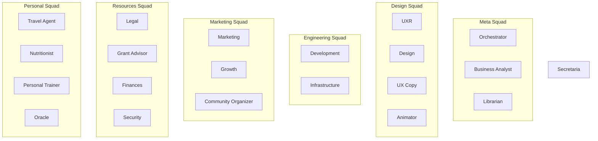

# AI Agents & Domains

**Purpose:** Agent roles, domains, responsibilities.

**Related:** [checks-marketplace.md](./checks-marketplace.md)

---

## Squad Organization

---

## Agents by Squad

<table>
<thead>
<tr style="vertical-align: top;">
<th>Squad</th>
<th>Agents</th>
<th>Library</th>
<th>Skills</th>
<th>Checks <a href="./checks-marketplace.md">ℹ️</a></th>
<th>APIs</th>
<th>Repo</th>
<th>Unsupervised LLM</th>
<th>Journal</th>
</tr>
</thead>
<tbody>
<tr style="vertical-align: top;">
<td><strong>Meta</strong></td>
<td>Orchestrator, Business Analyst, Librarian</td>
<td><a href="~/Documents/librarian/books/management/">management</a>, <a href="~/Documents/librarian/books/theory/">theory</a></td>
<td>Library Search, clawdhub, sessions, OpenProject</td>
<td>roadmap-alignment, epic-determinism</td>
<td>OpenProject, All domain APIs</td>
<td></td>
<td>Qwen 72B (default)</td>
<td>Strategy memos, Epic notes</td>
</tr>
<tr style="vertical-align: top;">
<td><strong>Design</strong></td>
<td>UXR, Design, UX Copy, Animator</td>
<td><a href="~/Documents/librarian/books/design/usability/">usability</a>, <a href="~/Documents/librarian/books/creativity/">creativity</a>, <a href="~/Documents/librarian/books/design/">design</a></td>
<td>Figma, Chrome Relay, peekaboo, user-testing, DaVinci Resolve</td>
<td>user-validation, accessibility, timing, easing</td>
<td>Figma, Survey tools, Product UI, After Effects</td>
<td></td>
<td>Qwen 72B (varies)</td>
<td>Audio, Screenshots, Revisions, Animation specs</td>
</tr>
<tr style="vertical-align: top;">
<td><strong>Engineering</strong></td>
<td>Development, Infrastructure</td>
<td><a href="~/Documents/librarian/books/technology/">technology</a></td>
<td>GitHub, Docker, CI/CD, code-review</td>
<td>code-quality, test-coverage, security</td>
<td>GitHub, Docker, NAS, CI/CD</td>
<td></td>
<td>Qwen 32B</td>
<td>Git commits, System logs</td>
</tr>
<tr style="vertical-align: top;">
<td><strong>Marketing</strong></td>
<td>Marketing, Growth, Community Organizer</td>
<td><a href="~/Documents/librarian/books/psychology/">psychology</a></td>
<td>Analytics, social-media, A/B-testing</td>
<td>engagement, conversion, retention</td>
<td>Social media, Analytics, Discord</td>
<td></td>
<td>Qwen 32B-72B</td>
<td>Briefs, Experiment logs, Community notes</td>
</tr>
<tr style="vertical-align: top;">
<td><strong>Resources</strong></td>
<td>Legal, Grant Advisor, Finances, Security</td>
<td><a href="~/Documents/librarian/books/finances/">finances</a>, <a href="~/Documents/librarian/books/cybersecurity/">cybersecurity</a></td>
<td>Compliance-checkers, legal-research, RFP-tools, Z3-verification</td>
<td>compliance, budget-alignment, policy-enforcement, attack-path</td>
<td>Legal research, Grant DBs, Financial tools, AWS security</td>
<td></td>
<td>Qwen 32B-72B</td>
<td>Case notes, Grant proposals, Ledgers, Security audits</td>
</tr>
<tr style="vertical-align: top;">
<td><strong>Personal</strong></td>
<td>Travel Agent, Nutritionist, Personal Trainer, Oracle</td>
<td><a href="~/Documents/librarian/books/health/">health</a>, <a href="~/Documents/librarian/books/fitness/">fitness</a>, <a href="~/Documents/librarian/books/travel/">travel</a>, <a href="~/Documents/librarian/books/magick/">magick</a></td>
<td>Travel planning, meal planning, workout logging, i-ching</td>
<td>safety, macro-balance, form, progression</td>
<td>Maps, Nutrition DBs, Gymera, Booking APIs</td>
<td></td>
<td>Qwen 32B-72B</td>
<td>Trip logs, Meal plans, Workout logs, Readings</td>
</tr>
<tr style="vertical-align: top;">
<td><strong>Support</strong></td>
<td>Secretaria</td>
<td><a href="~/Documents/librarian/books/management/">management</a></td>
<td>Universal (file, calendar, memory)</td>
<td>response-time, accuracy</td>
<td>Files, Calendar, Memory</td>
<td></td>
<td>Qwen 7B</td>
<td>JSONL</td>
</tr>
</tbody>
</table>

**Skills Hierarchy:**
- **Global** (all agents): File ops, calendar, memory, sessions_send, message
- **Squad** (above table): Shared within squad
- **Agent** (below table): Specific to agent
- **Project** (future): Epic-specific tools

---

## Individual Agents

| # | Agent | Squad | Domain | Library | Skills | Checks [ℹ️](./checks-marketplace.md) | APIs | Repo | Unsupervised LLM | Journal | Epic Role |
|---|-------|-------|--------|---------|--------|--------|------|------|------------------|---------|-----------|
| 1 | **Secretaria** | Support | Clerical | [management](~/Documents/librarian/books/management/), memory, gtd | Universal | response-time, accuracy | Files, Calendar, Memory | | Qwen 7B | JSONL | Fetch/Status |
| 2 | **UXR** | Design | Research | [cognition](~/Documents/librarian/books/cognition/), [psychology](~/Documents/librarian/books/psychology/), user-research | [reddit-insights](https://clawhub.ai/skills/reddit-insights), [market-research](https://clawhub.ai/skills/market-research) | validation, methodology | Survey, Analytics | | Qwen 72B | Audio | Validate |
| 3 | **Design** | Design | Visual | [design](~/Documents/librarian/books/design/), [usability](~/Documents/librarian/books/design/usability/), [creativity](~/Documents/librarian/books/creativity/) | [ui-ux-design](https://clawhub.ai/skills/ui-ux-design), [peekaboo](https://clawhub.ai/skills/peekaboo) | spacing, color, a11y, responsive | Figma, Chrome | | Qwen2-VL 72B | Screenshots | Execute |
| 4 | **UX Copy** | Design | Microcopy | [creativity](~/Documents/librarian/books/creativity/), microcopy, writing | [copywriter](https://clawhub.ai/skills/copywriter) | brevity, clarity, tone | Product UI, CMS | | Qwen 32B | Revisions | Execute |
| 5 | **Development** | Engineering | Code | [technology](~/Documents/librarian/books/technology/), [AI](~/Documents/librarian/books/AI/), architecture | [code](https://clawhub.ai/skills/code), [github](https://clawhub.ai/skills/github) | quality, coverage, compliance | GitHub, CI/CD, Docker | | Qwen 32B | Git commits | Execute |
| 6 | **Librarian** | Meta | Knowledge | All books | [markdown-converter](https://clawhub.ai/skills/markdown-converter), [whisper](https://clawhub.ai/skills/openai-whisper), Library Search | format, completeness, drift | All agents, Anna's | | Qwen 72B | Topic indexes | Context |
| 7 | **Marketing** | Marketing | Campaigns | [management](~/Documents/librarian/books/management/), [psychology](~/Documents/librarian/books/psychology/), brand | [marketing-mode](https://clawhub.ai/skills/marketing-mode) | voice, brand | Social, Analytics, Email | | Qwen 72B | Briefs | Execute |
| 8 | **Community Organizer** | Marketing | Community Building | [management](~/Documents/librarian/books/management/), [psychology](~/Documents/librarian/books/psychology/), community-org | | engagement, retention, moderation | Discord, Forum, Social | | Qwen 32B | Community notes | Engage |
| 9 | **Legal** | Resources | Compliance | contract-law, gdpr, ip | [lawyer](https://clawhub.ai/skills/lawyer), [law](https://clawhub.ai/skills/law) | completeness, compliance | Docs, Legal research | | Qwen 72B | Case notes | Review |
| 10 | **Grant Advisor** | Resources | Funding Acquisition | [finances](~/Documents/librarian/books/finances/), grant-writing, fundraising | | grant-compliance, budget-alignment | Grant databases, RFP tools | | Qwen 32B | Grant proposals | Disrupt |
| 11 | **Growth** | Marketing | Acquisition | [finances](~/Documents/librarian/books/finances/), [management](~/Documents/librarian/books/management/), analytics | [ga4-analytics](https://clawhub.ai/skills/ga4-analytics) | funnel, ab-validity | Analytics, Experiments | | Qwen 32B | Experiment logs | Execute |
| 12 | **Infrastructure** | Engineering | DevOps | [cybersecurity](~/Documents/librarian/books/cybersecurity/), [technology](~/Documents/librarian/books/technology/), devops | [devops](https://clawhub.ai/skills/devops), [automation-workflows](https://clawhub.ai/skills/automation-workflows) | backup, disk, uptime | NAS, Docker, HA | | Qwen 32B | System logs | Execute |
| 13 | **Orchestrator** | Meta | Coordination | [management](~/Documents/librarian/books/management/), [theory](~/Documents/librarian/books/theory/), [AI](~/Documents/librarian/books/AI/) | [self-improving](https://clawhub.ai/skills/self-improving-agent), [capability-evolver](https://clawhub.ai/skills/capability-evolver), [thinking-partner](https://clawhub.ai/skills/thinking-partner) | org-chart, dependencies | OpenProject, All APIs | | Qwen 72B | Strategy | Coordinate |
| 14 | **Business Analyst** | Meta | Requirements | [management](~/Documents/librarian/books/management/), [finances](~/Documents/librarian/books/finances/), product-mgmt | [clawdhub](https://clawhub.ai/skills/clawdhub), Library Search | determinism, success, gaps | OpenProject, All APIs | | Qwen 32B | Epic notes | Groom |
| 16 | **Travel Agent** | Personal | Travel Planning | [travel](~/Documents/librarian/books/travel/), logistics, geography | [travel-planner](https://clawhub.ai/skills/travel-planner) | itinerary, budget, safety | Maps, Booking APIs, Travel advisories | | Qwen 32B | Trip logs | Plan |
| 17 | **Nutritionist** | Personal | Nutrition | [health](~/Documents/librarian/books/health/), [nutrition](~/Documents/librarian/books/nutrition/), diet | [meal-planner](https://clawhub.ai/skills/meal-planner) | macro-balance, dietary-restrictions | Nutrition DBs, Recipe APIs | | Qwen 32B | Meal plans | Advise |
| 18 | **Personal Trainer** | Personal | Fitness | [fitness](~/Documents/librarian/books/fitness/), [health](~/Documents/librarian/books/health/), exercise | [gymera](https://clawhub.ai/skills/gymera), [workout-logger](https://clawhub.ai/skills/workout-logger) | form, progression, rest | Gymera, Fitness trackers | | Qwen 32B | Workout logs | Coach |
| 19 | **Oracle** | Personal | Divination | [magick](~/Documents/librarian/books/magick/), i-ching, tarot, chaos-magick | [i-ching](~/.openclaw/workspace/skills/i-ching/) | | | | Qwen 72B | Readings | Guide |
| 20 | **Security** | Resources | Security & Compliance | [cybersecurity](~/Documents/librarian/books/cybersecurity/), ai-safety, compliance | | policy-enforcement, attack-path, vulnerability | AWS, Cloud security, Z3 verification | | Qwen 72B | Security audits | Secure |
| 21 | **Animator** | Design | Animation & Motion | [design](~/Documents/librarian/books/design/), animation, motion-design | | timing, easing, fps | DaVinci Resolve, After Effects | | Qwen2-VL 72B | Animation specs | Execute |

---

## What's Missing (Global)

**All agents:**
- Repository setup (~/Documents/agents/<name>/)
- Journal workflows
- Epic participation protocol

**Per agent gaps:** See in tables (Library topics, Skills, Checks)

**BA tracks library gaps** → Librarian fills them
